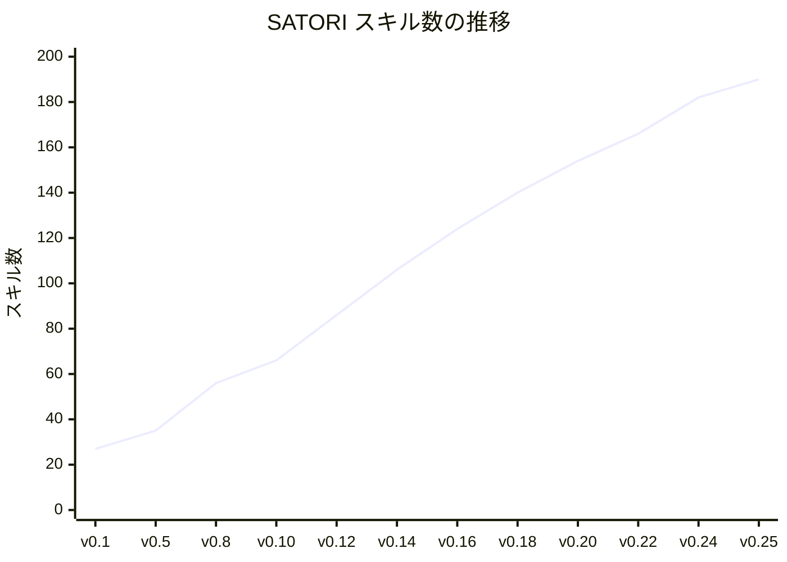
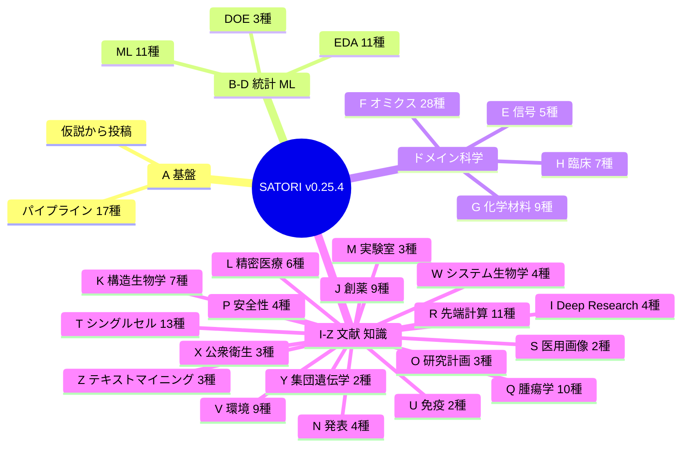
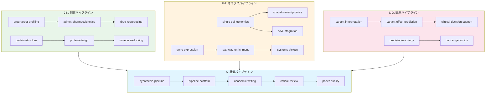
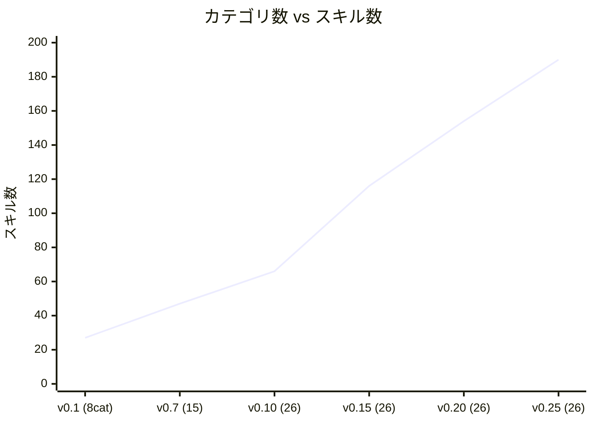

# TL;DR

- 前回の記事（v0.5.1）で SATORI を **35 スキル**の Co-scientist として紹介した。あれから **25 回のメジャーバージョンアップ**を経て、スキル数は **190** に達した。**5.4 倍の知識増幅**。

- 1,200 以上の外部科学データベースツールと連携し、131 スキルが **ToolUniverse MCP** 経由でリアルタイムに生物医学データにアクセスできるようになった。

- カテゴリは 8 → **26**。カバー範囲は「材料科学の論文」から「創薬・ゲノミクス・臨床意思決定・量子計算・疫学・科学テキストマイニング」まで **全分野横断** に拡張された。

- しかし本質は変わらない。**AI Agent は Co-scientist であり、問いを立てるのは人間の仕事だ。**


# 1. SATORI の由来 — 「悟り」が意味するもの

## 1.1 名前の起源

**SATORI（悟り）** は禅仏教における「直観的な覚醒（awakening）」を意味する。段階的な学習（漸悟）ではなく、**一瞬にしてすべてを理解する**体験だ。

この名前には二つの意図がある。

**第一に、AI Agent への知識注入のメタファー。** 人間の科学者は何年もかけてドメイン知識を蓄積するが、`npm install @nahisaho/satori` の一行で、AI Agent は **190 のスキルを一瞬で「悟る」**。教科書を 10 年読む代わりに、構造化されたスキルファイルが Agent に「悟り」を与える。

**第二に、バクロニム（逆頭字語）としての設計。**

> **S**cientific **A**nalysis **T**oolkit for **O**rganized **R**esearch **I**ntelligence

「科学分析のための、体系化された研究知能ツールキット」。名前が機能を説明し、機能が名前を体現する。

## 1.2 なぜ「悟り」なのか

v0.5.1 の記事で示したとおり、AI Agent が代替できる業務は **88%** だ。残る 12% ——研究の問いの設定、実験の意思決定、査読対応の戦略、研究倫理の判断——これらは **人間にしかできない**。

禅の「悟り」は、知識の蓄積ではない。**本質を見抜く力** だ。

SATORI は Agent に知識（88%）を与える。人間は本質（12%）を見抜く。この役割分担こそが「悟り」の構造であり、**Co-scientist** の設計原理だ。


# 2. 前回のあらすじ — v0.5.1 が証明したこと

前回の記事「[SATORI — AI Agent は Data Scientist を殺さない。増幅する。](https://qiita.com/nahisaho/items/xxx)」で報告した主要な知見を振り返る。

| 項目 | v0.5.1 の結果 |
|------|--------------|
| スキル数 | 35 |
| カテゴリ数 | 8 (A-H) |
| 実験数 | 9 本の材料科学論文 |
| 投稿可能度 | 95% |
| 業務代替度 | 88% |
| 核心発見 | **残り 12% こそが科学の本質** |

3 つの法則も提示した。

1. **スキル追加の限界改善逓減** — 52 行で +20pp、4,952 行で +5pp
2. **出版パイプラインの分解可能性** — 論文執筆は離散ステップに分解できる
3. **npm エコシステムとの親和性** — `npm install` で科学の方法論をインストールできる

v0.25.4 は、これらの法則を **極限まで推し進めた** バージョンだ。


# 3. v0.5.1 → v0.25.4 — 数字で見る進化

## 3.1 全体像

| 指標 | v0.5.1 | v0.25.4 | 倍率 |
|------|--------|---------|------|
| スキル数 | 35 | **190** | **5.4×** |
| カテゴリ数 | 8 | **26** | **3.3×** |
| ToolUniverse 連携 | 0 | **131** | — |
| 外部 DB ツール | 0 | **1,200+** | — |
| ドメインカバー | 材料科学中心 | **全科学分野** | — |
| バージョン数 | 5 | **25+** | — |

## 3.2 成長の軌跡



注目すべきは **Phase 3–7（v0.11–v0.15）** の急成長期だ。8–10 スキル/バージョンのペースで拡張し、ToolUniverse 連携と K-Dense ギャップ分析による **体系的なドメイン発見** が機能した。

## 3.3 カテゴリの進化

| Phase | バージョン | 追加カテゴリ | 累積 |
|-------|-----------|-------------|------|
| 初期 (v0.1–v0.5) | v0.1.0 | A-H (基盤〜臨床) | 8 |
| 文献 (v0.6) | v0.6.0 | I (Deep Research) | 9 |
| 専門 (v0.7) | v0.7.0 | J-O (創薬〜研究計画) | 15 |
| 先端 (v0.8) | v0.8.0 | P-S (安全性〜医用画像) | 19 |
| 生態系 (v0.10) | v0.10.0 | T-Z (シングルセル〜テキストマイニング) | **26** |
| 深化 (v0.11–v0.25) | — | 既存26カテゴリの内部拡充 | **26** |


# 4. 5 つの革命的変化

## 4.1 革命①：ToolUniverse MCP 統合 — 1,200+ 外部ツール接続

v0.9.0 で導入された最大の変革。[ToolUniverse](https://github.com/mims-harvard/ToolUniverse) は Harvard Medical School の MIMS Lab が開発した、1,200 以上の科学データベースツールを統合する **SMCP (Scientific MCP)** プラットフォームだ。

| SATORI Skill | | ToolUniverse 外部 DB |
|:---|:---:|:---|
| variant-interpretation | ──MCP→ | ClinVar / gnomAD / CADD |
| precision-oncology | ──MCP→ | OncoKB / CIViC / cBioPortal |
| drug-target-profiling | ──MCP→ | ChEMBL / BindingDB / DrugBank |
| pathway-enrichment | ──MCP→ | KEGG / Reactome / GO |
| protein-structure | ──MCP→ | RCSB PDB / AlphaFold DB |
| ensembl-genomics | ──MCP→ | Ensembl (16 endpoints) |
| ... (131 skills total) | | ... (1,200+ tools) |

これにより、SATORI はローカルのスキルファイルだけでなく、**リアルタイムの生物医学データベース** にアクセスできる Agent になった。例えば：

```python
# 以前（v0.5.1）— 静的な知識のみ
# 「BRAF V600E の臨床的意義は？」→ スキルファイルのテンプレートに基づく一般的な回答

# 現在（v0.25.4）— ToolUniverse MCP 経由でリアルタイムデータ取得
# ClinVar → 病原性分類（Pathogenic）
# OncoKB → 治療エビデンスレベル（Level 1）
# CIViC → 臨床試験データ
# cBioPortal → TCGA 変異頻度
# → すべてを統合した分子腫瘍ボードレポート生成
```

**v0.5.1 は「どう分析するか」を知っていた。v0.25.4 は「何のデータで分析するか」も知っている。**

## 4.2 革命②：26 カテゴリ × MECE 体系 — 科学の全領域をカバー

v0.5.1 の 8 カテゴリ (A-H) は材料科学・基礎統計・臨床に焦点を当てていた。v0.25.4 の 26 カテゴリ (A-Z) は **科学研究の全工程** を網羅する。



特に注目すべき新領域：

| 新カテゴリ群 | スキル例 | インパクト |
|------------|---------|----------|
| **J. 創薬** (9) | drug-target-profiling, ADMET, molecular-docking, DrugBank | 創薬パイプラインの完全自動化 |
| **R. 先端計算** (11) | quantum-computing, deep-learning, GNN, NAS, federated-learning | 最先端 AI/ML 手法の即座の適用 |
| **T. シングルセル** (13) | scRNA-seq, spatial-transcriptomics, scVI, GPU-singlecell | 次世代オミクス解析の標準化 |
| **F. オミクス** (28) | Ensembl (16 API), STRING PPI, UniProt, Reactome | ゲノミクスからプロテオミクスまで |

## 4.3 革命③：K-Dense ギャップ分析 — 科学的なスキル拡張戦略

v0.12.0 以降、スキルの追加は **感覚** ではなく **分析** に基づいて行われた。

[K-Dense-AI/claude-scientific-skills](https://github.com/K-Dense-AI/claude-scientific-skills) と ToolUniverse のカバレッジを交差分析し、**ギャップ** を特定するプロセスを導入した。

```
SATORI 既存スキル ───┐
                    ├──→ ギャップ分析 ──→ 優先度付きリスト ──→ Phase N 追加
ToolUniverse ───────┤       ↑
K-Dense Skills ─────┘   TU カバレッジ率
                        K-Dense 重複度
                        MECE 分類適合度
```

各バージョンの GAP_ANALYSIS ドキュメントが残されており、追加理由の **トレーサビリティ** が完全に保たれている。これは SATORI 自身の第 2 法則（分解可能性）をスキル開発プロセス自体に適用したものだ。

## 4.4 革命④：パイプライン統合アーキテクチャ — スキル間の有機的連携

190 のスキルはバラバラに存在するのではない。**パイプライン統合アーキテクチャ** によって有機的に連携する。



各パイプラインの出力ファイルが次のステップへ自動的に引き継がれる。例えば：

1. `variant-interpretation` が ACMG/AMP 分類を生成
2. → `variant-effect-prediction` が AlphaMissense/CADD/SpliceAI スコアを計算
3. → `clinical-decision-support` が GRADE エビデンスレベルを付与
4. → `academic-writing` が Nature Medicine 形式の論文を生成
5. → `paper-quality` が品質スコアを算定

**仮説から出版まで、一つのコマンドで。**

## 4.5 革命⑤：Phase 17 ML/AI 先端手法 — v0.25.0 の最新追加

v0.25.0（最新の Phase 17）では、ML/AI の最先端手法を追加した。

| スキル | カテゴリ | 概要 |
|--------|---------|------|
| **federated-learning** | R (先端計算) | Flower FL・FedAvg/FedProx・Opacus DP-SGD 差分プライバシー |
| **neural-architecture-search** | R | Optuna NAS・Pareto 多目的最適化（精度 vs モデルサイズ） |
| **semi-supervised-learning** | C (ML) | Self-Training・Label Propagation・Pseudo-Labeling |
| **multi-task-learning** | C | Hard Parameter Sharing MTL・GradNorm 動的タスクバランシング |
| **statistical-simulation** | B (統計) | Monte Carlo シミュレーション・Bootstrap BCa 信頼区間 |
| **streaming-analytics** | B | River オンライン学習・概念ドリフト検出 (ADWIN/DDM) |
| **radiology-ai** | S (医用画像) | MONAI CADe/CADx・CT/MRI 分類・Grad-CAM・AI-RADS |
| **adaptive-experiments** | D (DOE) | Thompson Sampling/UCB バンディット・Wald SPRT 逐次検定 |


# 5. 実装の深掘り — 代表的なスキルの内部構造

## 5.1 3 層知識アーキテクチャの進化

v0.5.1 で提示した 3 層モデルは、v0.25.4 では **4 層** に拡張された。

| 層 | v0.5.1 | v0.25.4 | 具体例 |
|---|---|---|---|
| 1 | Declarative（宣言的） | Declarative | 「自己教師あり学習はラベルなしデータの活用に有効」 |
| 2 | Procedural（手続き的） | Procedural | Self-Training の実装コード |
| 3 | Experiential（経験的） | Experiential | 「pseudo-label の閾値は 0.95 以上が安全」 |
| 4 | — | **Connective（接続的）** | ToolUniverse MCP ツール参照 + パイプライン連携先 |

第 4 層 **Connective** は v0.9.0 で導入された。各スキルが「どの外部データベースに接続できるか」「どのスキルの出力を入力として受け取るか」を明示する。これにより、Agent は **スキル単体** ではなく **スキルのネットワーク** として機能する。

## 5.2 Deep Research スキル — 科学文献の深層探索

v0.6.0 で追加されたこのスキルは、SHIKIGAMI の WebResearcher パラダイムを科学研究に適応した。

```
Think → Search → Evaluate → Synthesize（最大 15 ラウンド反復）
```

| 機能 | 内容 |
|------|------|
| 学術 DB 検索 | PubMed, Semantic Scholar, arXiv, CiNii, J-STAGE, OpenAlex |
| エビデンス階層 | Level 1a〜5 + プレプリント |
| ハルシネーション防止 | ✅ 検証済 / 📎 単一ソース / ⚠️ 未査読 / ❓ AI推定 / 🔄 古いデータ / ⚡ 矛盾 |
| 品質ゲート | Phase 1→2→3→4 の段階的フィルタリング |
| 出力 | research_report.md, evidence_table.json, search_log.md, prisma_flow.md |

## 5.3 Ensembl Genomics スキル — 16 API エンドポイントの統合

v0.15.0 で追加された `scientific-ensembl-genomics` は、ToolUniverse 連携の象徴的な例だ。

```python
# 16 の Ensembl REST API エンドポイントを統合
# 1. 遺伝子検索（lookup/symbol, lookup/id）
# 2. 配列取得（sequence/id, sequence/region）
# 3. VEP バリアント効果予測（vep/human/hgvs）
# 4. クロスリファレンス（xrefs/id, xrefs/symbol）
# 5. ホモロジー（homology/id）
# 6. 制御領域（regulatory/species/id）
# 7. 遺伝子ツリー（genetree/id）
# ... 合計 16 エンドポイント

# SATORI スキルが提供するのは：
# - 各 API の使い方（Procedural 知識）
# - どのエンドポイントをどの順序で呼ぶか（Experiential 知識）
# - VEP の結果を variant-interpretation スキルに渡す方法（Connective 知識）
```

一つのスキルが 16 の API を構造化して提供する。Agent は個々の API ドキュメントを読む必要がない。


# 6. インストールと使い方

## 6.1 インストール

```bash
# Node.js 環境で
npm install @nahisaho/satori@latest

# 190 のスキルを .github/skills/ に展開
npx @nahisaho/satori init

# バージョン確認
npx @nahisaho/satori -v
# → 0.25.4
```

> **⚠️ 注意**: npm の `satori` (Vercel の OG 画像生成ライブラリ) とは**別パッケージ**です。必ず `@nahisaho/satori` を指定してください。

## 6.2 VS Code + GitHub Copilot Agent Mode で使う

1. VS Code で `Ctrl+Shift+P` → `GitHub Copilot: Toggle Agent Mode`
2. `.github/skills/` に展開されたスキルが自動的にコンテキストにロード
3. プロンプトを書く：

```
# 材料科学の例（v0.5.1 と同じ）
薄膜6材料のPSP相関解析を実施してください。
Thornton-Anders モデルで Zone 分類し、
ML で結晶子サイズを予測してください。
論文は Elsevier 形式で。

# ゲノミクスの例（v0.25.4 の新機能）
BRAF V600E の臨床的意義を包括的に評価してください。
ClinVar, OncoKB, CIViC, cBioPortal のデータを統合し、
AMP/ASCO/CAP ティアリングを行い、
分子腫瘍ボードレポートを生成してください。

# 創薬の例（v0.25.4 の新機能）
JAK2 を標的とした PROTAC 設計可能性を評価してください。
BindingDB から結合データ、ChEMBL からバイオアクティビティ、
ADMET 予測を行い、DrugBank で既存薬との比較を実施してください。
```

## 6.3 ToolUniverse MCP との併用

ToolUniverse MCP サーバーがセットアップされている環境では、131 のスキルが自動的に外部 DB と連携する。

```json
// .vscode/mcp.json の例
{
  "servers": {
    "tooluniverse": {
      "command": "python",
      "args": ["-m", "tooluniverse.server"],
      "env": {
        "TU_API_KEY": "your-api-key"
      }
    }
  }
}
```


# 7. 25 回のバージョンアップが教えてくれたこと

## 7.1 第 4 法則 — スキルネットワーク効果

v0.5.1 では「スキル追加の限界改善逓減」を法則として提示した。v0.25.4 ではこれに新たな法則を加える。

> **第 4 法則 — スキルネットワーク効果**
> スキル同士が接続されると、個々のスキルの価値を超えた **創発的な能力** が生まれる。

190 のスキルの真の力は、190 個の独立したツールではなく、**相互接続されたネットワーク** にある。

| 構成 | 能力 |
|------|------|
| variant-interpretation（単体） | ACMG/AMP 分類 |
| + variant-effect-prediction | → in silico 予測スコア付き分類 |
| + clinical-decision-support | → GRADE エビデンスレベル付き臨床推奨 |
| + precision-oncology | → 分子腫瘍ボードレポート |
| + academic-writing | → Nature Medicine 形式の症例報告 |

5 つのスキルの組み合わせは、単純な足し算ではなく **乗算** として機能する。

## 7.2 第 5 法則 — ドメインの MECE 飽和

> **第 5 法則 — ドメインの MECE 飽和**
> カテゴリ数が臨界点（26）に達すると、新規カテゴリの追加よりも **既存カテゴリの深化** が有効になる。

v0.10.0 で 26 カテゴリ（A-Z）に到達して以降、v0.11.0〜v0.25.0 の 15 バージョンは **すべて既存カテゴリの内部拡充** に費やされた。MECE（Mutually Exclusive, Collectively Exhaustive）が達成されると、フレームワークの成長は「横への拡張」から「縦への深化」にシフトする。



カテゴリ数は v0.10.0 で飽和したが、スキル数はその後も **2.9 倍** に増加した。深化のフェーズこそが真の価値創出期間だ。

## 7.3 第 6 法則 — 外部接続の指数的価値

> **第 6 法則 — 外部接続の指数的価値**
> ToolUniverse のような外部ツール接続は、スキル数の増加よりも **桁違いの価値** をもたらす。

| 種類 | 数量 | 増加倍率（vs v0.5.1） |
|------|------|---------------------|
| スキル数 | 190 | 5.4× |
| 外部 DB ツール | 1,200+ | **∞**（v0.5.1 は 0） |
| 利用可能データ量 | ペタバイト級 | **∞** |

35 → 190 は 5.4 倍だが、0 → 1,200+ は **質的な転換** だ。SATORI はローカルの知識ファイルから、**世界中の科学データベースへのゲートウェイ** へと進化した。


# 8. TU カバレッジ率と今後の展望

## 8.1 TU連携の現状

190 スキルのうち 131 が ToolUniverse と連携しており、**TU カバレッジ率は 68.9%** だ。

| バージョン | スキル数 | TU 連携 | カバレッジ |
|-----------|---------|---------|-----------|
| v0.9.0 | 56 | 22 | 39.3% |
| v0.15.0 | 116 | 70 | 60.3% |
| v0.20.0 | 154 | 114 | 74.0% |
| v0.22.0 | 166 | 131 | 78.9% |
| v0.25.0 | 190 | 131 | **68.9%** |

v0.22.0 → v0.25.0 でカバレッジが低下しているのは、ML/AI 先端手法（連合学習、NAS、半教師あり学習など）が ToolUniverse の対象外（外部 DB ではなくアルゴリズム系）だからだ。これは **意図的な設計判断** であり、SATORI は DB 連携スキルだけでなく、**手法論スキル** も同等に重視している。

## 8.2 v0.26.0 以降のロードマップ

| Phase | 目標 | 内容 |
|-------|------|------|
| **Phase 18 (v0.26.0)** | TU カバレッジ回復 | 新規スキルの凍結、既存 59 スキルへの TU key 追加（131→143+ 目標） |
| **Phase 19+** | 品質深化 | 各スキルの Experiential 層を実験データで充実化 |
| **将来** | マルチモーダル対応 | 画像・音声・動画データへのスキル拡張 |


# 9. SATORI が変えた世界 — 再び

## 9.1 v0.5.1 の問い → v0.25.4 の答え

v0.5.1 で私はこう問いかけた。

> **ドメイン知識を AI Agent にどう注入すれば、科学者の能力を増幅できるか？**

25 回のバージョンアップを経て、答えはより具体的になった。

> **190 の構造化スキル × 1,200+ の外部ツール × 26 カテゴリの MECE 分類 × パイプライン統合 = Co-scientist**

## 9.2 変わったもの、変わらないもの

| | v0.5.1 | v0.25.4 |
|---|---|---|
| スキル数 | 35 | 190 |
| カテゴリ | 8 | 26 |
| 外部接続 | なし | 1,200+ DB ツール |
| ドメイン | 材料科学中心 | 全科学分野 |
| **核心原理** | **Co-scientist** | **Co-scientist（変わらない）** |
| **人間の役割** | **Why / What / So What** | **Why / What / So What（変わらない）** |
| **AI の役割** | **How の実行** | **How の実行（変わらない）** |

190 スキルになっても、1,200+ ツールに接続しても、**AI Agent は「何を問うべきか」を知らない**。

## 9.3 Data Scientist の新しい姿

v0.5.1 で提示した 4 つの役割は、v0.25.4 ではさらに進化した。

| 役割 | v0.5.1 の内容 | v0.25.4 の進化 |
|------|-------------|---------------|
| **Questioner** | 研究の問いを設定する | + 分野横断の問いが可能に（ゲノミクス × 材料科学 × 臨床） |
| **Curator** | スキルを体系化する | + K-Dense / ToolUniverse ギャップ分析で**科学的に**キュレーション |
| **Critic** | 結果を批判的に評価する | + 1,200+ DB との照合で**エビデンスベース**の批判が可能 |
| **Storyteller** | 発見を世界に伝える | + 26 カテゴリの知識で**分野横断的なストーリー**が可能 |


# 10. まとめ — SATORI は「悟り」を提供し続ける

## 10.1 6 つの法則（更新版）

| # | 法則 | 発見バージョン |
|---|------|--------------|
| 1 | **スキル追加の限界改善逓減** — 初期の少量追加で大きな効果 | v0.5.1 |
| 2 | **出版パイプラインの分解可能性** — 論文は離散ステップに分解できる | v0.5.1 |
| 3 | **npm エコシステムとの親和性** — `npm install` で方法論をインストール | v0.5.1 |
| 4 | **スキルネットワーク効果** — スキルの組み合わせは乗算的に機能する | v0.25.4 |
| 5 | **ドメインの MECE 飽和** — 横への拡張は飽和し、縦への深化にシフトする | v0.25.4 |
| 6 | **外部接続の指数的価値** — DB 接続は量的ではなく質的な転換をもたらす | v0.25.4 |

## 10.2 最終結論

```
v0.5.1:  "Data Scientist is Amplified"   → ✅ 35 スキルで証明
v0.25.4: "Data Scientist is Networked"   → ✅ 190 スキル + 1,200 ツールで証明
```

v0.5.1 で SATORI は Data Scientist を **増幅** した。
v0.25.4 で SATORI は Data Scientist を **ネットワーク化** した。

190 のスキルと 1,200+ の外部ツールを持つ Agent は、もはや単なる「増幅器」ではない。**世界中の科学データベースと科学者をつなぐネットワークノード** だ。

しかし、このネットワークのハブは **人間** だ。

どのノードに接続するか。どのデータを信頼するか。何を問い、何を発見するか。

**SATORI（悟り）は、AI Agent に 190 の知識を一瞬で悟らせる。**
**しかし「何を悟るべきか」を決めるのは、今も、これからも、人間だ。**

> **Data Scientist is NOT Dead.**
> **Data Scientist is Networked.**
> **And the Network's hub is YOU.**


# Appendix A: バージョン履歴一覧

| バージョン | 日付 | スキル数 | 主な追加内容 |
|-----------|------|---------|------------|
| v0.1.0 | 2025-06-12 | 27 | 初回リリース・8 カテゴリ (A-H)・CLI |
| v0.2.0 | 2025-06-12 | 27 | 図の埋め込みワークフロー |
| v0.3.0 | 2026-02-11 | 29 | critical-review・仮説パイプライン相互参照 |
| v0.4.0 | 2025-06-13 | 32 | SI 生成・LaTeX 変換・引用検証 |
| v0.5.0 | 2026-02-12 | 35 | 査読対応・改訂追跡・品質評価 |
| v0.5.2 | 2026-02-12 | 35 | AI 使用開示・バージョン参照ルール |
| v0.6.0 | 2026-02-12 | 36 | Deep Research スキル |
| v0.7.0 | 2026-02-13 | 47 | J-O カテゴリ（創薬〜研究計画） |
| v0.8.0 | 2026-02-13 | 56 | P-S カテゴリ（安全性〜医用画像） |
| v0.9.0 | 2026-02-14 | 56 | **ToolUniverse MCP 統合** (22 スキル) |
| v0.10.0 | 2026-02-15 | 66 | T-Z カテゴリ（26 カテゴリ完成） |
| v0.11.0 | 2026-02-16 | 76 | Phase 3 ドメイン拡張 (9 カテゴリ) |
| v0.12.0 | 2026-02-17 | 86 | Phase 4 ドメイン拡張 (8 カテゴリ) |
| v0.13.0 | 2026-02-18 | 96 | Phase 5 (ToolUniverse 50→59) |
| v0.14.0 | 2026-02-19 | 106 | Phase 6 (パイプライン統合図) |
| v0.15.0 | 2026-02-20 | 116 | Phase 7 (Ensembl 16 API 統合) |
| v0.16.0 | 2026-02-21 | 124 | Phase 8 (TU 70→74) |
| v0.17.0 | 2026-02-22 | 132 | Phase 9 (GEO/ENCODE/HCA) |
| v0.18.0 | 2026-02-23 | 140 | Phase 10 (TU 79→85) |
| v0.19.0 | 2025-07-24 | 148 | Phase 11 (TU 85→99) |
| v0.20.0 | 2025-07-25 | 154 | Phase 12 (TU 99→114) |
| v0.21.0 | 2025-07-26 | 160 | Phase 13 (TU 114→124) |
| v0.22.0 | 2025-07-27 | 166 | Phase 14 (TU 124→131) |
| v0.23.0 | 2025-07-27 | 174 | Phase 15 (AutoML・アンサンブル) |
| v0.24.0 | 2025-07-27 | 182 | Phase 16 (異常検知・因果 ML) |
| v0.25.0 | 2026-02-13 | 190 | Phase 17 (連合学習・NAS・半教師あり) |


# Appendix B: 全 26 カテゴリ × スキル数一覧

| カテゴリ | 名称 | スキル数 |
|---------|------|:-------:|
| A | 基盤・ワークフロー | 17 |
| B | 統計・探索的解析 | 11 |
| C | 機械学習・モデリング | 11 |
| D | 実験計画・プロセス最適化 | 3 |
| E | 信号・スペクトル・時系列 | 5 |
| F | 生命科学・オミクス | 28 |
| G | 化学・材料・イメージング | 9 |
| H | 臨床・疫学・メタ科学 | 7 |
| I | Deep Research・文献検索 | 4 |
| J | 創薬・ファーマコロジー | 9 |
| K | 構造生物学・タンパク質工学 | 7 |
| L | 精密医療・臨床意思決定 | 6 |
| M | 実験室自動化・データ管理 | 3 |
| N | 科学プレゼンテーション・図式 | 4 |
| O | 研究計画・グラント・規制 | 3 |
| P | ファーマコビジランス・薬理ゲノミクス | 4 |
| Q | 腫瘍学・疾患研究 | 10 |
| R | 量子・先端計算 | 11 |
| S | 医用イメージング | 2 |
| T | シングルセル・空間・エピゲノミクス | 13 |
| U | 免疫・感染症 | 2 |
| V | マイクロバイオーム・環境 | 9 |
| W | システム生物学 | 4 |
| X | 疫学・公衆衛生 | 3 |
| Y | 集団遺伝学 | 2 |
| Z | 科学テキストマイニング | 3 |
| | **合計** | **190** |


## 参考リンク

- [SATORI Project (GitHub)](https://github.com/nahisaho/satori)
- [SATORI (npm)](https://www.npmjs.com/package/@nahisaho/satori)
- [前回の記事: SATORI v0.5.1 — AI Agent は Data Scientist を殺さない。増幅する。](https://qiita.com/nahisaho/items/xxx)
- [ToolUniverse (Harvard MIMS Lab)](https://github.com/mims-harvard/ToolUniverse)
- [K-Dense-AI / claude-scientific-skills](https://github.com/K-Dense-AI/claude-scientific-skills)
- [GitHub Copilot Agent Mode](https://docs.github.com/en/copilot)
