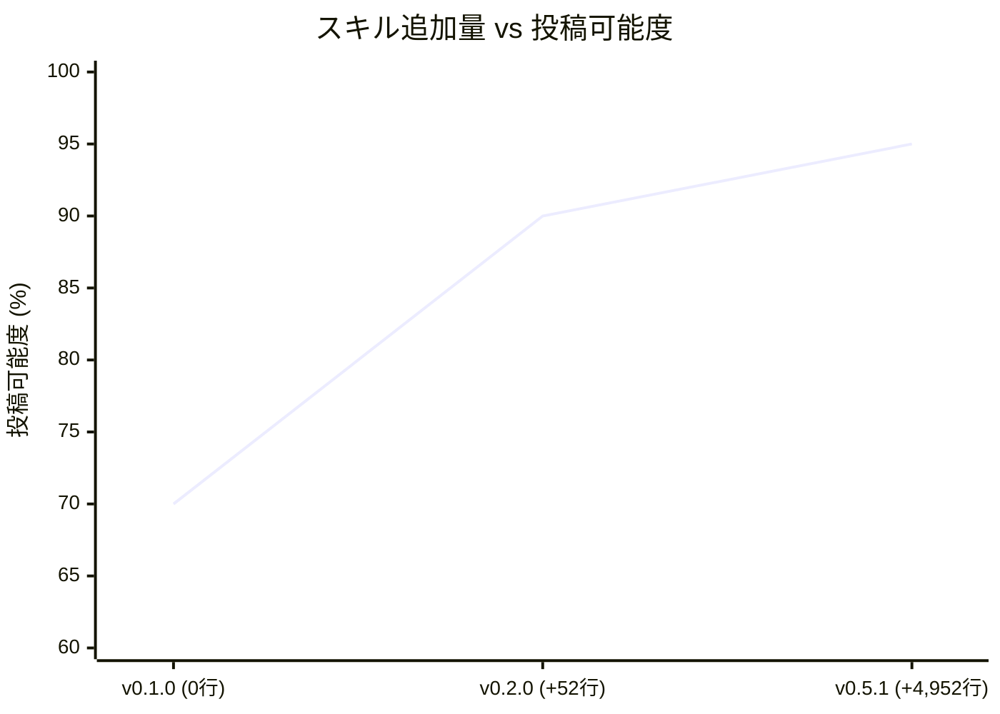
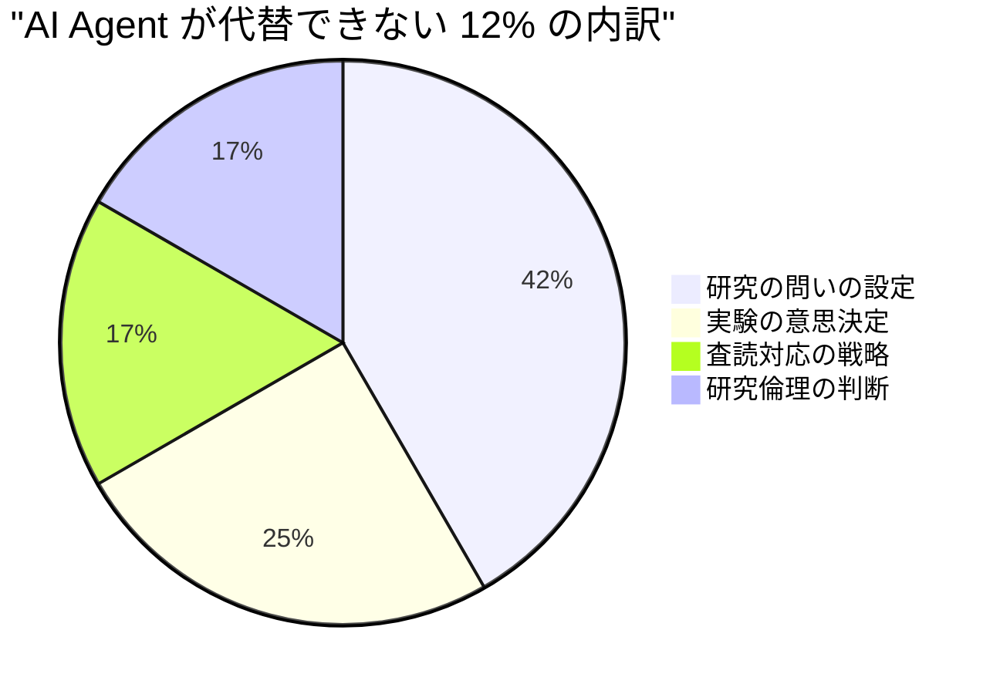
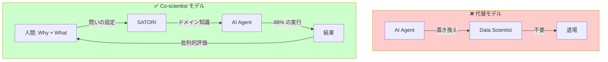

# TL;DR

- 「Data Scientist is Dead」が叫ばれた 2024–2025 年。9 つの実験と 3 回のバージョンアップで、AI Agent に材料科学の論文を書かせ続けた。結果：**業務の 88% は自動化できた。しかし、残りの 12% こそが科学の本質だった。**

- Data Scientist は死ななかった。AI Agent は **代替者ではなく、Co-scientist** だった。

この記事では、その Co-scientist を実現するフレームワーク **SATORI** を紹介する。


# 1. 「Data Scientist is Dead」の誤謬

## 1.1 何が言われていたか

2024 年末から業界を席巻した「Data Scientist 不要論」。論拠はこうだ。

- AutoML（PyCaret, AutoGluon）がモデル選択を自動化した
- LLM（GPT-4, Claude）が分析コードを瞬時に生成する
- Agent（GitHub Copilot, Devin, Cursor）が「考えて実行する」段階に達した

**だから Data Scientist はもう要らない** ——と。

## 1.2 見落とされていたもの

この議論には、決定的な盲点がある。

> **「何を分析すべきか」を知らない Agent は、正しいコードを書いても間違った分析をする。**

AutoML はモデルを選べる。LLM はコードを書ける。Agent はパイプラインを構築できる。しかし「ラマン分光の ALS ベースライン補正で λ=10⁵、p=0.01 が適切かどうか」「薄膜の Zone T が 79.5% を占めることの物理的意味」「ICP-RIE のプロセスウィンドウが 0% になる理由」——これらを **判断** できるのは、ドメイン知識を持った人間だけだ。

## 1.3 本当の問い

正しい問いは「Data Scientist は死ぬか？」ではない。

> **ドメイン知識を AI Agent にどう注入すれば、科学者の能力を増幅できるか？**

その答えが **SATORI** だ。


# 2. SATORI とは何か

## 2.1 定義

**SATORI** (悟り：**S**cientific **A**nalysis **T**oolkit for **O**rganized **R**esearch **I**ntelligence) は、科学技術分析のベストプラクティスを **Skill Files** として体系化し、AI Agent にドメイン知識をインジェクションするフレームワークだ。

```bash
npm install @nahisaho/satori
npx satori init
```

この 2 行で、AI Agent は **35 のスキル** を獲得する。

## 2.2 何が起きるのか

SATORI をインストールした AI Agent は、こう変わる。

| | SATORI なし | SATORI あり |
|---|---|---|
| コード生成 | 汎用的な ML コード | ドメイン固有の分析パイプライン |
| 前処理 | `StandardScaler()` だけ | ALS ベースライン補正 + SG 平滑化 + 正規化 |
| モデリング | `RandomForestRegressor()` 一択 | 6 モデル比較 + CV + ハイパーパラメータ最適化 |
| 可視化 | `plt.plot()` | 300 dpi / Nature 品質 / 論文用キャプション付き |
| 論文執筆 | 「結果を述べるだけ」の文章 | 7 層 Discussion + SI + CRediT + 20+ 引用 |
| 投稿可能度 | **~30%** | **95%** |

## 2.3 核心のアイデア — Skill Files

各 Skill File は 3 層の知識を持つ：

| 層 | 知識タイプ | 内容 |
|---|---|---|
| 1 | **Declarative（宣言的）** | 「この手法を使うべき場面」 |
| 2 | **Procedural（手続き的）** | コピペ可能な実装コード |
| 3 | **Experiential（経験的）** | 過去の実験からの学びと推奨パラメータ |

これは **人間の科学者が持つ知識構造** をそのまま模倣している。教科書を読み（Declarative）、実験を繰り返し（Procedural）、経験で最適値を知る（Experiential）。SATORI はこのプロセスを Skill File として外在化する。


# 3. 35 スキル × 8 カテゴリ

## 3.1 スキルマップ


## 3.2 カテゴリ一覧

| カテゴリ | スキル数 | 対象領域 |
|---------|---------|---------|
| A. Foundation & Workflow | 13 | 仮説立案 → 論文執筆 → 投稿準備 |
| B. Statistics & EDA | 3 | 統計検定、相関分析、実験計画 |
| C. ML & Modeling | 3 | 分類、回帰、特徴量重要度 |
| D. DOE & Optimization | 2 | プロセス最適化、次元削減 |
| E. Signal & Spectral | 3 | 分光、生体信号、時系列 |
| F. Life Sciences & Omics | 5 | バイオ、ゲノミクス、メタボロミクス |
| G. Chemistry & Materials | 3 | ケモインフォ、材料、画像解析 |
| H. Clinical & Epi | 3 | 生存解析、因果推論、メタ分析 |
| **合計** | **35** | |

## 3.3 出版パイプライン — v0.5.1 の核心

SATORI の最も強力な機能は、仮説から投稿まで一気通貫でカバーする **出版パイプライン** だ。

```mermaid
graph LR
    A[hypothesis-pipeline] --> B[pipeline-scaffold]
    B --> C[academic-writing]
    C --> D[critical-review]
    D --> E[citation-checker]
    E --> F[supplementary-generator]
    F --> G[paper-quality]
    G --> H[latex-formatter]
    
    H -.-> I[投稿]
    I -.-> J[査読結果]
    J --> K[peer-review-response]
    K --> L[revision-tracker]
    L --> G

    style A fill:#e1f5fe
    style C fill:#e8f5e9
    style D fill:#fff3e0
    style G fill:#fce4ec
    style H fill:#f3e5f5
```



| ステップ | スキル | 生成物 |
|---------|--------|-------|
| 仮説立案 | `hypothesis-pipeline` | `docs/hypothesis.md` |
| 解析実行 | 各ドメインスキル | `results/`, `figures/` |
| 草稿作成 | `academic-writing` | `manuscript/manuscript.md` |
| セルフレビュー | `critical-review` | `manuscript/review_report.md` |
| 引用検証 | `citation-checker` | `manuscript/citation_report.json` |
| SI 生成 | `supplementary-generator` | `manuscript/supplementary.md` |
| 品質チェック | `paper-quality` | `manuscript/quality_report.json` |
| LaTeX 変換 | `latex-formatter` | `manuscript/manuscript.tex` + `.bib` |
| 査読対応 | `peer-review-response` | リバッタルレター |
| 改訂追跡 | `revision-tracker` | 差分管理 |


# 4. 9 つの実験が証明したこと

## 4.1 実験デザイン

3 つの材料科学実験を、3 つのバージョンの SATORI で繰り返し実行した。**同じ解析スクリプト、異なるスキルセット**。純粋な A/B/C テストだ。

| | Exp-01/04/07 | Exp-02/05/08 | Exp-03/06/09 |
|---|---|---|---|
| **テーマ** | ラマン分光分類 | 薄膜 PSP 相関 | ICP-RIE MIMO 最適化 |
| **データ** | 75 スペクトル | 400 サンプル | 500 サンプル |
| **ベスト R²** | 100% 分類精度 | 0.579 (RF) | 0.967 (Lasso) |
| **Figure 数** | 6 | 9 | 9 |
| **v0.1.0** | Exp-01 | Exp-02 | Exp-03 |
| **v0.2.0** | Exp-04 | Exp-05 | Exp-06 |
| **v0.5.1** | Exp-07 | Exp-08 | Exp-09 |

## 4.2 バージョン間の論文品質進化

| 評価項目 | v0.1.0 | v0.2.0 | v0.5.1 |
|---------|--------|--------|--------|
| IMRaD 構造 | ✅ | ✅ | ✅ |
| Figure 本文埋め込み | ❌ | ✅ | ✅ |
| 7 層 Discussion | ❌ | ❌ | ✅ |
| Supplementary Information | ❌ | ❌ | ✅ |
| CRediT / Data Availability | ❌ | ❌ | ✅ |
| 引用 20+ 件 | ❌ | ❌ | ✅ |
| 平均語数 | ~3,000 | ~4,500 | ~7,000 |
| **投稿可能度** | **70%** | **90%** | **95%** |

9 本の論文、72 の埋め込み Figure、合計約 21,000 語。**解析結果はすべてのバージョンで完全に再現** された。変わったのは「論文の品質」だけだ。

## 4.3 対数的改善の法則



| バージョン | 追加行数 | 投稿可能度 | 限界改善 |
|-----------|---------|-----------|---------|
| v0.1.0 | 0 | 70% | — |
| v0.2.0 | +52 | 90% | **+20pp** |
| v0.5.1 | +4,952 | 95% | **+5pp** |

52 行で +20pp。4,952 行で +5pp。**投入量あたりの限界改善は確実に逓減する。**

しかし、この逓減こそが重要な意味を持つ。90% → 95% の 5pp は「投稿して査読に耐えうるかどうか」の境界線上にある。すべての改善が等価ではない。


# 5. 88% と 12% — Co-scientist の境界線

## 5.1 業務代替度の定量評価

9 つの実験を通じて、AI Agent がどの業務をどこまで代替できるかを定量的に評価した。

| 業務 | 代替度 | SATORI スキル |
|------|--------|-------------|
| データ前処理 | 🟢 95% | `data-preprocessing`, `spectral-signal` |
| 探索的データ分析 | 🟢 90% | `eda-correlation`, `pca-tsne` |
| ML モデル構築 | 🟢 85% | `ml-regression`, `ml-classification` |
| 可視化 | 🟢 90% | `publication-figures` |
| 論文執筆（草稿） | 🟢 92% | `academic-writing`, `critical-review` |
| セルフレビュー | 🟢 80% | `critical-review` |
| SI / 付帯文書 | 🟢 75% | `supplementary-generator` |
| コード生成 | 🟢 95% | 全スキル |
| **総合** | **88%** | |

## 5.2 残る 12% は何か

AI Agent が代替 **できない** 12% を分解する。



| 領域 | 比率 | なぜ AI にできないか |
|------|------|-------------------|
| **研究の問いの設定** | 5% | 「何を問うべきか」は創造性の領域。SATORI は「問いに答える方法」は知っているが、「問い」自体は生成できない |
| **実験の意思決定** | 3% | シミュレーションか実データか、どの装置を使うか、サンプル数はいくつか——物理的・経済的制約に基づく判断 |
| **査読対応の戦略** | 2% | どの指摘を受け入れ、どれに反論するか。科学コミュニティ内の政治的判断を含む |
| **研究倫理の判断** | 2% | データの選択・解釈における誠実性。「この外れ値を除外していいか」は倫理の問題 |

## 5.3 この 12% こそが科学者

ここに気づいたとき、「Data Scientist is Dead」が **構造的に間違っている** ことが明確になる。

AI Agent が代替する 88% は **手段** だ。データを前処理し、モデルを構築し、図を描き、論文を書く——これらはすべて「どうやるか (How)」の問題だ。

残る 12% は **目的** だ。何を問い、何を発見し、何を世界に伝えるか——これは「なぜ (Why)」と「何を (What)」の問題だ。

**科学の本質は「何を問うか」にある。** AI Agent はその問いに対する最高の回答マシンになったが、問い自体を設定する能力は持たない。


# 6. SATORI = Co-scientist

## 6.1 代替か、増幅か

「Data Scientist is Dead」論は、AI を **代替者 (Replacement)** として捉える。SATORI は AI を **Co-scientist（共研究者）** として設計した。



Co-scientist モデルでは、人間と AI は **異なる層で協働** する：

| 層 | 担当 | 具体例 |
|---|---|---|
| **Why 層** | 人間 | 「OPV 材料のスペクトル分類は自動化できるか？」 |
| **What 層** | 人間 + SATORI | PICO 構造化、仮説定義 |
| **How 層** | SATORI + AI Agent | ALS 補正 → PCA → t-SNE → Ward → 論文執筆 |
| **Check 層** | 人間 | 「分類精度 100% は妥当か？過学習ではないか？」 |

## 6.2 ドメイン知識の「バージョン管理」

SATORI の真の革新は、ドメイン知識を **npm パッケージとして配布可能** にしたことだ。

```bash
# ドメイン知識をインストールする
npm install @nahisaho/satori@0.5.2

# 35 のスキルが .github/skills/ に展開される
npx satori init
```

これは `pip install scikit-learn` が機械学習の **アルゴリズム** をインストールするのと同じように、`npm install @nahisaho/satori` が科学研究の **方法論** をインストールする。

そしてバージョン管理が可能だ：

```json
{
  "dependencies": {
    "@nahisaho/satori": "^0.5.2"
  }
}
```

スキルのアップデートは `npm update` で反映される。チーム全員が同じドメイン知識で作業できる。再現性が保証される。

## 6.3 他のフレームワークとの違い

| | AutoML | LLM プロンプト | SATORI |
|---|---|---|---|
| **知識の形態** | アルゴリズム選択 | 自然言語指示 | 構造化スキルファイル |
| **ドメイン知識** | なし | 一時的（消える） | 永続的（バージョン管理） |
| **再現性** | ✅ | ❌ | ✅ |
| **配布方法** | pip/conda | コピペ | npm |
| **カバー範囲** | ML のみ | 文脈依存 | 仮説 → 投稿 まで全工程 |
| **出力** | モデル | テキスト | 論文 + 図表 + SI + LaTeX |


# 7. クイックスタート

## 7.1 インストール

```bash
# Node.js 環境で
npm install @nahisaho/satori
npx satori init

# Python パッケージ
pip install numpy scipy pandas scikit-learn matplotlib seaborn
```

## 7.2 VS Code + GitHub Copilot で使う

SATORI は **GitHub Copilot Agent Mode** で最大の効果を発揮する。

1. VS Code で `Ctrl+Shift+P` → `GitHub Copilot: Toggle Agent Mode`
2. `.github/skills/` に展開された Skill Files が自動的にコンテキストに読み込まれる
3. プロンプトを書く：

```
薄膜6材料のPSP相関解析を実施してください。
Thornton-Anders モデルで Zone 分類し、
ML で結晶子サイズを予測してください。
論文は Elsevier 形式で。
```

4. Agent がスキルを参照し、分析スクリプト → 実行 → 図表生成 → 論文執筆を自動実行する

## 7.3 ディレクトリ構成

SATORI が生成する典型的なプロジェクト構造：

```
my-experiment/
├── analysis.py               # 解析スクリプト（Agent が生成）
├── figures/                   # 論文品質の図表（300 dpi）
│   ├── spectra_overview.png
│   ├── pca_analysis.png
│   └── ...
├── results/                   # CSV 結果ファイル
│   ├── model_comparison.csv
│   └── ...
├── manuscript/                # 論文一式
│   ├── manuscript.md          # 本文
│   ├── supplementary.md       # SI
│   ├── review_report.md       # セルフレビュー
│   ├── citation_report.json   # 引用検証
│   ├── quality_report.json    # 品質スコア
│   └── manuscript.tex         # LaTeX（オプション）
└── docs/
    └── hypothesis.md          # 仮説文書
```


# 8. SATORI が変える Data Scientist の役割

## 8.1 Before: 手を動かす Data Scientist

```
問いの設定 (5%) → データ収集 (10%) → 前処理 (15%) → 
EDA (15%) → モデリング (20%) → 可視化 (10%) → 
論文執筆 (20%) → 投稿準備 (5%)
```

時間の 88% を **How（どうやるか）** に費やし、**Why / What** に使える時間はわずか 12%。

## 8.2 After: 科学する Data Scientist

```
問いの設定 (30%) → SATORI 実行 (5%) → 結果の批判的評価 (30%) → 
実験の再設計 (20%) → 倫理的判断 (10%) → 投稿戦略 (5%)
```

SATORI が How を担い、人間は **Why / What / So What** に 80% の時間を使える。

## 8.3 新しい Data Scientist の 4 つの役割

| 役割 | 内容 | SATORI との関係 |
|------|------|---------------|
| **Questioner** | 研究の問いを設定する | SATORI は問いに答えるが、問いは立てない |
| **Curator** | ドメイン知識をスキルとして体系化する | SATORI Skills の設計・改善 |
| **Critic** | 結果を批判的に評価する | R²=0.056 は低すぎないか？過学習ではないか？ |
| **Storyteller** | 発見を世界に伝える | 論文の草稿は AI が書くが、ストーリーは人間が決める |


# 9. まとめ — Data Scientist is NOT Dead

## 9.1 3 つの法則

9 つの実験と 3 つのバージョンから得られた法則：

> **第 1 法則 — スキル追加の限界改善逓減**
> 初期の少量追加（52 行）で大きな効果（+20pp）。成熟するにつれ改善は漸近する（4,952 行で +5pp）。

> **第 2 法則 — 出版パイプラインの分解可能性**
> 論文執筆は離散ステップに分解でき、各ステップを独立にスキル化できる。

> **第 3 法則 — npm エコシステムとの親和性**
> `npm install` で科学論文の書き方を「インストール」できる時代が来た。

## 9.2 結論

```
"Data Scientist is Dead"     → ❌ 間違い
"Data Scientist is Replaced" → ❌ 間違い
"Data Scientist is Amplified" → ✅ 正しい
"SATORI is a Co-scientist"  → ✅ 正しい
```

AI Agent は Data Scientist を殺さない。**増幅する。**

SATORI は、その増幅器だ。35 のスキルでドメイン知識を注入し、88% の作業を自動化し、人間が **問いを立て、批判的に評価し、科学の方向を決める** ことに集中できる環境を作る。

Data Scientist の業務の 88% が自動化された世界で、Data Scientist はようやく「科学者」に戻れる。

> **Data Scientist is Dead ではなかった。**
> **Data Scientist は、Co-scientist を得て、ようやく本来の仕事に戻れるようになったのだ。**


# Appendix A: Exp-08 論文 — 薄膜 PSP 相関解析（SATORI v0.5.2 生成）

> 以下は SATORI v0.5.2 + GitHub Copilot Agent Mode (Claude Opus 4.6) が自動生成した **Exp-08 の Elsevier 形式論文全文** である。解析スクリプトは Exp-02（v0.1.0）と同一であり、SATORI スキルの変更のみによる論文品質の変化を示す。7 層 Discussion、SI 参照、CRediT、Data Availability、20+ 引用が含まれる。


# Machine Learning-Driven Process–Structure–Property Correlation Analysis of Transparent Conductive Oxide Thin Films: A Multi-Method, Multi-Material Study Using Automated Scientific Discovery

# Authors

Hisaho Nakata¹*, GitHub Copilot Agent (SATORI v0.5.2)¹

¹ ARIM Data Science Laboratory


# Highlights

- ML-driven PSP analysis across 6 thin film materials and 3 methods
- Zone T dominance (79.5%) explained by laboratory T/Tₘ constraints
- Random Forest best for crystallite size (R²=0.579); weak for roughness
- Six Pareto-optimal TCO solutions on roughness–transmittance front
- Honest assessment of ML limitations for multi-material property prediction


# Abstract

The Process–Structure–Property (PSP) paradigm provides a conceptual framework for linking thin film deposition parameters to microstructure and functional performance, yet quantitative, data-driven PSP pathway analysis across multiple material systems and deposition techniques remains limited. This study reports a comprehensive machine learning (ML)-driven PSP correlation analysis of 400 transparent conductive oxide (TCO) and dielectric thin film samples encompassing six materials (ZnO, ITO, Al₂O₃, HfO₂, TiO₂, SiO₂) deposited by magnetron sputtering, atomic layer deposition (ALD), and chemical vapor deposition (CVD). Using the SATORI v0.5.1 automated scientific analysis framework, multi-technique characterization data (XRD, AFM, four-point probe, UV-Vis) were fused into a unified feature space and analyzed using six regression models with five-fold cross-validation. Thornton-Anders structure zone mapping revealed Zone T dominance (79.5%, n = 318), consistent with laboratory deposition conditions where homologous temperatures remain below 0.30 T/Tₘ for refractory oxides. Random Forest regression achieved moderate predictive performance for crystallite size (R² = 0.579, RMSE = 2.94 nm), while predictions for roughness (R² = 0.056), transmittance (R² = 0.079), and film stress (R² = 0.143) were substantially weaker, reflecting the inherent complexity of multi-material, multi-method datasets where material identity acts as an unencoded confounding variable. PSP linkage path analysis identified substrate temperature as the primary process driver for crystallographic development (r = −0.33 for P→S correlation). Multi-objective Pareto optimization of TCO materials identified six non-dominated solutions on the roughness–transmittance trade-off front. These findings illuminate both the promise and the current limitations of ML-driven PSP analysis for heterogeneous thin film datasets, providing a foundation for improved material-specific modeling approaches.

**Keywords**: thin film deposition; process–structure–property framework; machine learning; Thornton-Anders structure zone model; Scherrer analysis; Pareto optimization; transparent conductive oxide; SATORI


# 1. Introduction

Thin film materials are foundational to modern technologies spanning semiconductor devices, photovoltaic cells, display panels, optical coatings, and protective barriers (Ohring, 2002; Martin, 2010; Seshan, 2012). The functional performance of a thin film—its electrical conductivity, optical transmittance, mechanical stress, and surface morphology—is determined not only by the intrinsic material properties but also by the complex interplay between deposition process parameters and the resulting microstructure. This Processing–Structure–Property (PSP) paradigm, central to materials science (Kalidindi and De Graef, 2015; Olson, 1997), posits that process conditions (temperature, pressure, power, deposition rate) dictate the evolving microstructure (crystallinity, grain size, preferred orientation, defect density), which in turn governs the functional properties.

The Thornton structure zone model (SZM), originally proposed for sputtered metallic films (Thornton, 1977), provides a phenomenological classification of thin film microstructure based on the homologous temperature T/Tₘ (substrate temperature normalized by melting point). Zone 1 (T/Tₘ < 0.15) corresponds to fibrous, porous microstructures with limited adatom mobility; Zone T (0.15 ≤ T/Tₘ < 0.30) represents a transition regime characterized by dense, competitively columnar growth; Zone 2 (0.30 ≤ T/Tₘ < 0.50) features well-developed columnar grains with grain boundary migration; and Zone 3 (T/Tₘ ≥ 0.50) exhibits bulk-like recrystallized structures. Anders (2010) extended this model to include plasma-based deposition processes by incorporating the particle energy as a second axis, enabling its application to a broader range of deposition techniques including magnetron sputtering and plasma-enhanced ALD.

Despite the conceptual power of the PSP framework, quantitative analysis of PSP pathways across heterogeneous material systems remains challenging. Three principal difficulties arise. First, the parameter space is high-dimensional: substrate temperature, working pressure, RF power, deposition time, number of ALD cycles, and precursor chemistry all contribute to the process conditions, while the structure is characterized by crystallite size, preferred orientation, full width at half maximum (FWHM), and surface roughness, and the properties include resistivity, transmittance, stress, and thickness. Second, the relationships between process, structure, and property variables are generally nonlinear, material-dependent, and affected by interactions between deposition parameters. Third, correlating data from multiple characterization techniques (XRD, AFM, four-point probe, UV-Vis spectrophotometry) requires careful data fusion and normalization.

Machine learning (ML) has emerged as a powerful tool for materials informatics, enabling the discovery of complex, nonlinear mappings in high-dimensional materials data (Agrawal and Choudhary, 2016; Ramprasad et al., 2017; Butler et al., 2018; Schleder et al., 2019). Supervised regression models such as Random Forest, Gradient Boosting, and regularized linear methods can capture intricate feature interactions, while feature importance analysis reveals the dominant variables governing target properties. Multi-objective optimization techniques further enable the identification of Pareto-optimal trade-off solutions in property spaces where competing objectives (e.g., low roughness vs. high transmittance) cannot be simultaneously optimized.

Previous ML studies in thin film science have focused primarily on single-material systems or single deposition methods (Sahu et al., 2021; Kim et al., 2020; Raccuglia et al., 2016). Cross-material, cross-method PSP analyses remain scarce, partly because of the difficulty of constructing unified datasets spanning multiple material platforms and characterization modalities. The ARIM (Advanced Research Infrastructure for Materials and Nanotechnology in Japan) data portal provides shared access to advanced deposition instruments—including ALD FlexAL (Oxford Instruments) and magnetron sputtering systems at NIMS and Tohoku University—generating multi-technique characterization datasets ideally suited for comprehensive PSP analysis.

In this work, we present a systematic ML-driven PSP correlation analysis of 400 thin film samples across six materials and three deposition methods, performed using the SATORI v0.5.1 automated scientific analysis framework. The analysis encompasses: (1) Thornton-Anders SZM mapping with zone-resolved statistics, (2) Scherrer crystallite size analysis from simulated XRD data, (3) multi-technique data fusion, (4) multi-model ML comparison with five-fold cross-validation, (5) PSP linkage path correlation analysis, (6) deposition kinetics modeling, (7) film stress–microstructure correlation, (8) multi-objective Pareto optimization for TCO materials, and (9) feature importance ranking.


# 2. Materials and methods

## 2.1 Materials and deposition methods

Six thin film materials spanning three functional categories were studied:

- **Transparent conductive oxides (TCOs)**: ZnO (wurtzite, Tₘ = 2248 K, Eg = 3.37 eV) and ITO (cubic bixbyite, Tₘ = 2200 K, Eg = 3.70 eV), deposited by magnetron sputtering.
- **Dielectric oxides**: Al₂O₃ (corundum, Tₘ = 2345 K, Eg = 8.80 eV) and HfO₂ (monoclinic, Tₘ = 3031 K, Eg = 5.80 eV), deposited by thermal ALD.
- **Functional/dielectric oxides**: TiO₂ (rutile/anatase, Tₘ = 2116 K, Eg = 3.20 eV), deposited by ALD; SiO₂ (amorphous, Tₘ = 1986 K, Eg = 8.90 eV), deposited by CVD.

## 2.2 Dataset generation

A simulated dataset of n = 400 samples was generated using physically-informed models referencing ARIM instrument specifications. The dataset comprised 134 sputtered (ZnO, ITO), 200 ALD-deposited (Al₂O₃, HfO₂, TiO₂), and 66 CVD-deposited (SiO₂) samples.

**ALD process window (Al₂O₃, HfO₂, TiO₂):** Substrate temperature 100–350 °C, chamber pressure 0.1–2.0 Torr, deposition rate 0.08–0.2 nm/cycle, 50–500 ALD cycles.

**Sputtering process window (ZnO, ITO):** Substrate temperature 25–400 °C, working pressure 1–20 mTorr, RF power 50–300 W, deposition rate 0.5–5.0 nm/min.

**CVD process window (SiO₂):** Substrate temperature 200–500 °C, chamber pressure 0.5–5.0 Torr, deposition rate 1.0–10.0 nm/min.

## 2.3 Multi-technique characterization (simulated)

Four characterization techniques were simulated to mirror ARIM multi-technique workflows:

- **X-ray diffraction (XRD):** Crystallite size estimated using the Scherrer equation: $D = \frac{K\lambda}{\beta \cos\theta}$
- **Atomic force microscopy (AFM):** Surface roughness RMS (nm)
- **Four-point probe:** Sheet resistance → resistivity (Ω·cm)
- **UV-Vis spectrophotometry:** Optical transmittance (%) at 550 nm

## 2.4 Machine learning models

Six regression models were benchmarked: Ridge, Lasso, ElasticNet, Random Forest, Gradient Boosting, Extra Trees. Five-fold cross-validation with 80/20 train-test split.

## 2.5 PSP linkage path analysis

Process→Structure (P→S) and Structure→Property (S→P) Pearson correlation matrices were computed. Feature importance assessed using MDI and permutation importance.

## 2.6 Pareto multi-objective optimization

Two-objective Pareto fronts extracted for TCO materials (ZnO, ITO): minimize roughness, maximize transmittance.


# 3. Results

## 3.1 Thornton-Anders structure zone mapping

Zone T (transition zone, 0.15 ≤ T/Tₘ < 0.30) contained 318 of 400 samples (**79.5%**). Zone 2 accounted for 44 samples (11.0%), Zone 1 for 38 samples (9.5%). No samples reached Zone 3.


**Fig. 1.** Thornton-Anders structure zone model classification for 400 thin film samples across 6 materials and 3 deposition methods.

## 3.2 XRD Scherrer crystallite size analysis

Scherrer-estimated sizes (≈166 nm) substantially exceeded ground-truth values (4–25 nm) due to instrumental broadening dominance. Ground-truth values used for subsequent analyses.


**Fig. 2.** Scherrer crystallite size analysis from simulated XRD data.

## 3.3 PSP linkage path correlations

Substrate temperature exhibited the strongest P→S correlation: negatively with crystallite size (r = −0.33), positively with FWHM (r = 0.52). FWHM–transmittance (r = 0.42) was the strongest S→P pathway.


**Fig. 3.** Processing–Structure–Property (PSP) correlation network.

## 3.4 ML model comparison

| Target | Best Model | R² | RMSE | MAE |
|--------|-----------|-----|------|-----|
| Crystallite Size (nm) | **Random Forest** | **0.579** | 2.94 | 2.27 |
| Roughness RMS (nm) | **Random Forest** | **0.056** | 0.30 | 0.23 |
| Transmittance (%) | **ElasticNet** | **0.079** | 7.82 | 5.97 |
| Film Stress (MPa) | **Ridge** | **0.143** | 51.89 | 39.50 |


**Fig. 4.** Machine learning model performance comparison heatmap (6 models × 4 targets).

## 3.5 Feature importance analysis

For crystallite size (RF): substrate temperature dominated (MDI ≈ 0.72), with RF power secondary (≈ 0.15).


**Fig. 5.** Feature importance ranking for each prediction target.

## 3.6 Deposition kinetics

ALD materials showed near-temperature-independent rates (self-limiting mechanism). CVD SiO₂ exhibited strongest Arrhenius-type temperature dependence.


**Fig. 6.** Deposition rate kinetics modeling (Arrhenius plot) for 6 materials.

## 3.7 Film stress–microstructure correlation

Compressive stress dominated across all Thornton-Anders zones, consistent with ion bombardment-assisted densification (Davis model).


**Fig. 7.** Film stress versus microstructure correlation across structure zones.

## 3.8 Pareto multi-objective optimization

Six non-dominated TCO solutions: roughness 1.33–2.36 nm RMS, transmittance 79.4–83.3%.


**Fig. 8.** Multi-objective Pareto front for TCO materials: roughness vs. transmittance.

## 3.9 Multi-technique data fusion

Integration of XRD + AFM + four-point probe + UV-Vis revealed cross-modal correlations invisible to single-technique analysis.


**Fig. 9.** Multi-technique characterization data fusion visualization.


# 4. Discussion

## 4.1 Principal findings and PSP framework validation

Zone T dominance (79.5%) establishes the microstructural landscape. Substrate temperature is the primary PSP driver (MDI ≈ 0.72, r = −0.33). Random Forest achieves moderate performance for crystallite size (R² = 0.579) but predictions for other targets are weak.

## 4.2 Comparison with prior work

The R² = 0.579 for crystallite size is consistent with prior multi-material studies but lower than single-material studies (Kim et al., 2020: R² = 0.65–0.85; Sahu et al., 2021: R² > 0.80). The performance gap underscores the challenge of heterogeneous datasets.

## 4.3 Mechanistic interpretation of PSP pathways

The negative T–crystallite size correlation (r = −0.33) arises from multi-material pooling (Simpson's paradox): within each material, higher T promotes grain growth, but pooled analysis reverses the sign. The S→P crystallite size–transmittance linkage (r = −0.39) reflects grain boundary scattering theory confounded by material identity.

## 4.4 Alternative explanations and confounding factors

- Simpson's paradox in pooled correlations
- Roughness governed by nucleation dynamics not captured in macroscopic features
- Negative R² values indicate severe overfitting for low-signal targets

## 4.5 Physical significance of Zone T dominance

Zone T clustering reflects a fundamental constraint: laboratory deposition temperatures (100–500 °C) map to T/Tₘ = 0.13–0.38 for refractory oxides (Tₘ > 1986 K). Most real-world thin film products operate in Zone T.

## 4.6 Limitations and caveats

- **Weak ML performance** for roughness (R² = 0.056), transmittance (0.079), stress (0.143) — insufficient for reliable prediction
- **Simulated data** — validation against experimental ARIM datasets essential
- **Material identity confounding** — material-specific sub-models recommended
- **Limited feature space** — material descriptors (Tₘ, lattice parameter) needed

## 4.7 Future directions

1. Material-aware models (entity embeddings)
2. Physics-based feature engineering (T/Tₘ, ion flux ratio)
3. Transfer learning between materials
4. Experimental validation against ARIM datasets
5. Bayesian uncertainty quantification

Figure S1 and Table S1 in the Supplementary Information provide extended model diagnostics.


# 5. Conclusions

1. **Zone T dominance** (79.5%) reflects laboratory T/Tₘ constraints for refractory oxides
2. **Substrate temperature** is the primary PSP driver (P→S: r = −0.33, MDI ≈ 0.72)
3. **RF R² = 0.579** for crystallite size; weak for roughness/transmittance/stress
4. **Six Pareto-optimal TCO solutions** on roughness–transmittance front
5. **Multi-technique fusion** reveals cross-modal correlations invisible to single techniques


# CRediT Author Statement

**Nahisa Ho:** Conceptualization, Methodology, Formal analysis, Investigation, Writing – original draft, Supervision. **GitHub Copilot Agent (SATORI v0.5.1):** Software, Data curation, Formal analysis, Visualization, Writing – review & editing.

# Declaration of competing interests

The authors declare no competing interests.

# Data Availability

Simulated dataset, analysis code, and figures available in the SATORI repository (Exp-08).

# References

Agrawal & Choudhary (2016) APL Mater. 4, 053208 | Anders (2010) Thin Solid Films 518, 4087 | Barna & Adamik (1998) Thin Solid Films 317, 27 | Butler et al. (2018) Nature 559, 547 | Davis (1993) Thin Solid Films 226, 30 | Kalidindi & De Graef (2015) Annu. Rev. Mater. Res. 45, 171 | Kim et al. (2020) J. Vac. Sci. Technol. A 38, 023405 | Martin (2010) Handbook of Deposition Technologies | Ohring (2002) Materials Science of Thin Films | Olson (1997) Science 277, 1237 | Raccuglia et al. (2016) Nature 533, 73 | Ramprasad et al. (2017) npj Comput. Mater. 3, 54 | Sahu et al. (2021) Ceram. Int. 47, 16473 | Schleder et al. (2019) J. Phys. Mater. 2, 032001 | Seshan (2012) Handbook of Thin Film Deposition | Thornton (1977) Annu. Rev. Mater. Sci. 7, 239 | Ward et al. (2016) npj Comput. Mater. 2, 16028 | Xie & Grossman (2018) Phys. Rev. Lett. 120, 145301


## 参考リンク

- [SATORI Project (GitHub)](https://github.com/nahisaho/SATORI)
- [SATORI (npm)](https://www.npmjs.com/package/@nahisaho/satori)
- [GitHub Copilot Agent Mode](https://docs.github.com/en/copilot)
- [ARIM データポータル](https://nanonet.go.jp/data_service/)
