# SATORI パイプライン例集

> **SATORI v0.28.1** — 190 スキル + 50 パイプラインの連携レシピ集

| 項目 | 内容 |
|---|---|
| 生成日 | 2026-02-15 |
| 対象バージョン | v0.28.1 |
| 掲載パイプライン数 | 26 ドメイン + 15 クロスドメイン + 5 インダストリー + 4 メソドロジー = **50** |
| スキル総数 | 190 (`src/.github/skills/scientific-*/SKILL.md`) |
| ToolUniverse キー数 | 325 (ユニーク) |

---

## 目次

- [使い方ガイド](#使い方ガイド)
- [パイプライン一覧](#パイプライン一覧)
  - [1. 仮説駆動型研究パイプライン](#1-仮説駆動型研究パイプライン)
  - [2. 創薬パイプライン](#2-創薬パイプライン)
  - [3. シングルセル・空間オミクスパイプライン](#3-シングルセル空間オミクスパイプライン)
  - [4. 精密医療パイプライン](#4-精密医療パイプライン)
  - [5. 疫学・コホートパイプライン](#5-疫学コホートパイプライン)
  - [6. エビデンス合成パイプライン](#6-エビデンス合成パイプライン)
  - [7. 疾患研究パイプライン](#7-疾患研究パイプライン)
  - [8. 機械学習解析パイプライン](#8-機械学習解析パイプライン)
  - [9. 環境・生態学パイプライン](#9-環境生態学パイプライン)
  - [10. 計算材料科学パイプライン](#10-計算材料科学パイプライン)
  - [11. 医薬品安全性パイプライン](#11-医薬品安全性パイプライン)
  - [12. システム生物学パイプライン](#12-システム生物学パイプライン)
  - [13. がんゲノミクスパイプライン](#13-がんゲノミクスパイプライン)
  - [14. ゲノム・エピゲノム解析パイプライン](#14-ゲノムエピゲノム解析パイプライン)
  - [15. トランスクリプトミクス・アトラスパイプライン](#15-トランスクリプトミクスアトラスパイプライン)
  - [16. プロテオミクス・構造生物学パイプライン](#16-プロテオミクス構造生物学パイプライン)
  - [17. メタボロミクス・脂質・糖鎖パイプライン](#17-メタボロミクス脂質糖鎖パイプライン)
  - [18. マイクロバイオーム・進化・多様性パイプライン](#18-マイクロバイオーム進化多様性パイプライン)
  - [19. パスウェイ・ナレッジグラフパイプライン](#19-パスウェイナレッジグラフパイプライン)
  - [20. 化合物スクリーニング・薬理パイプライン](#20-化合物スクリーニング薬理パイプライン)
  - [21. 臨床情報学・ヘルスケア AI パイプライン](#21-臨床情報学ヘルスケア-ai-パイプライン)
  - [22. 高度 ML・AI パイプライン](#22-高度-mlai-パイプライン)
  - [23. 実験計画・統計基盤パイプライン](#23-実験計画統計基盤パイプライン)
  - [24. 科学的可視化・ダッシュボードパイプライン](#24-科学的可視化ダッシュボードパイプライン)
  - [25. 学術出版ワークフローパイプライン](#25-学術出版ワークフローパイプライン)
  - [26. ラボ自動化・運用・計算基盤パイプライン](#26-ラボ自動化運用計算基盤パイプライン)
- [クロスドメインパイプライン](#クロスドメインパイプライン)
  - [A. ゲノム創薬統合パイプライン](#a-ゲノム創薬統合パイプライン)
  - [B. AI 駆動臨床意思決定パイプライン](#b-ai-駆動臨床意思決定パイプライン)
  - [C. 研究自動化パイプライン](#c-研究自動化パイプライン)
  - [D. マルチオミクス疾患解明パイプライン](#d-マルチオミクス疾患解明パイプライン)
  - [E. 個別化薬物療法パイプライン](#e-個別化薬物療法パイプライン)
  - [F. バイオインフォマティクス完全パイプライン](#f-バイオインフォマティクス完全パイプライン)
  - [G. がん精密医療 End-to-End パイプライン](#g-がん精密医療-end-to-end-パイプライン)
  - [H. マルチオミクス縦断統合パイプライン](#h-マルチオミクス縦断統合パイプライン)
  - [I. 環境メタボ・マイクロバイオーム One Health パイプライン](#i-環境メタボマイクロバイオーム-one-health-パイプライン)
  - [J. AI 駆動マテリアルズインフォマティクスパイプライン](#j-ai-駆動マテリアルズインフォマティクスパイプライン)
  - [K. 研究ライフサイクル完全自動化パイプライン](#k-研究ライフサイクル完全自動化パイプライン)
  - [L. AI 駆動エビデンス合成パイプライン](#l-ai-駆動エビデンス合成パイプライン)
  - [M. がんマルチレイヤーゲノム創薬パイプライン](#m-がんマルチレイヤーゲノム創薬パイプライン)
  - [N. 臨床→規制→出版バリューチェーンパイプライン](#n-臨床規制出版バリューチェーンパイプライン)
  - [O. シングルセルプロテオーム統合パイプライン](#o-シングルセルプロテオーム統合パイプライン)
- [インダストリーパイプライン](#インダストリーパイプライン)
  - [①. 製薬企業レギュラトリーパイプライン](#-製薬企業レギュラトリーパイプライン)
  - [②. 農業バイオテクノロジーパイプライン](#-農業バイオテクノロジーパイプライン)
  - [③. 臨床検査室ワークフロー](#-臨床検査室ワークフロー)
  - [④. 食品安全・毒性評価パイプライン](#-食品安全毒性評価パイプライン)
  - [⑤. 法医・公衆衛生パイプライン](#-法医公衆衛生パイプライン)
- [メソドロジーパイプライン](#メソドロジーパイプライン)
  - [α. ベイズ推論ワークフロー](#α-ベイズ推論ワークフロー)
  - [β. 因果推論パイプライン](#β-因果推論パイプライン)
  - [γ. 時系列予測パイプライン](#γ-時系列予測パイプライン)
  - [δ. テキストマイニング・NLP パイプライン](#δ-テキストマイニングnlp-パイプライン)
- [スキル連携マップ（全体図）](#スキル連携マップ全体図)
- [パイプライン設計のガイドライン](#パイプライン設計のガイドライン)

---

## 使い方ガイド

### パイプラインの読み方

各パイプラインは以下の構成で記載されています。

1. **概要** — パイプラインの目的と適用シナリオ
2. **フロー図** — Mermaid 形式のスキル連携フロー
3. **ステップ詳細** — 各スキルの役割と入出力
4. **トリガープロンプト例** — パイプラインを起動する自然言語プロンプト
5. **期待される成果物** — 生成されるファイル一覧

### パイプラインの実行方法

SATORI のスキルは **トリガーフレーズ** で自動発火します。パイプラインを実行するには、最初のスキルをトリガーしてから、各ステップの出力を次のスキルに引き渡します。

```
ユーザー: 「○○の仮説を立てて検証して」
  → hypothesis-pipeline が発火
  → pipeline-scaffold が構造化
  → statistical-testing で検証
  → publication-figures で可視化
  → academic-writing で論文化
```

### 凡例

| 記号 | 意味 |
|---|---|
| `→` | 順序依存（前のスキルの出力が必要） |
| `↔` | 双方向（相互参照可能） |
| `a/b/c` | 並列実行可能なサブステップ（ステップ詳細テーブルの Step 列） |
| 🔧 | ToolUniverse 連携あり（フロー図ノード名に付記） |

---

## パイプライン一覧

---

### 1. 仮説駆動型研究パイプライン

**目的**: 研究仮説の定義から統計検証、論文化までの完全な研究ワークフロー

**適用シナリオ**:
- 新しい研究テーマで仮説を構築し検証したい
- 再現性のある解析パイプラインを構築したい
- 研究成果を論文として出版したい

#### フロー図

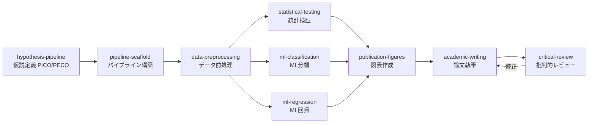

#### ステップ詳細

| Step | スキル | 役割 | 主要出力 |
|---|---|---|---|
| 1 | `hypothesis-pipeline` | PICO/PECO フレームワークで仮説定義、検証可能な研究課題を構造化 | `hypothesis.json` |
| 2 | `pipeline-scaffold` | StepLogger 付きパイプライン骨格構築、ディレクトリ構造・JSON サマリー | `pipeline_summary.json` |
| 3 | `data-preprocessing` | 欠損値補完・エンコーディング・スケーリング・外れ値処理 | クリーンな DataFrame |
| 4a | `statistical-testing` | t 検定・ANOVA・Fisher 正確検定・多重比較補正 | `statistical_tests.csv` |
| 4b | `ml-classification` | 複数モデル比較 (LR/RF/SVM/XGBoost)、StratifiedKFold CV | `classification_metrics.csv` |
| 4c | `ml-regression` | マルチターゲット回帰、モデル比較 (Ridge/Lasso/RF/GB) | `model_metrics.csv` |
| 5 | `publication-figures` | Nature/Science レベルの図表作成 (300 DPI, rcParams 設定) | `figures/*.png` |
| 6 | `academic-writing` | IMRaD 形式の論文草稿、ジャーナルテンプレート適用 | `manuscript/manuscript.md` |
| 7 | `critical-review` | 5 パスレビュー（構造→論理→データ→文章→修正） | `manuscript/manuscript_revised.md` |

#### トリガープロンプト例

```
「○○が△△に与える影響について仮説を立てて、統計的に検証して論文化して」
「PICO フレームワークで研究計画を立てて、データ解析パイプラインを構築して」
「この実験データに対して仮説検証 → 可視化 → 論文執筆のパイプラインを実行して」
```

#### 期待される成果物

```
project/
├── results/
│   ├── hypothesis.json
│   ├── pipeline_summary.json
│   ├── preprocessed_data.csv
│   ├── preprocessing_summary.json
│   ├── statistical_tests.csv
│   ├── classification_metrics.csv
│   └── model_metrics.csv
├── figures/
│   ├── roc_curves.png
│   ├── confusion_matrices.png
│   ├── volcano_plot.png
│   └── kaplan_meier.png
└── manuscript/
    ├── manuscript.md
    ├── manuscript_revised.md
    ├── cover_letter.md
    ├── supplementary.md
    └── figures/
```

---

### 2. 創薬パイプライン

**目的**: ターゲット同定からリード化合物の ADMET 最適化までの創薬プロセス

**適用シナリオ**:
- 新規創薬ターゲットのプロファイリングから開始する場合
- 既存化合物ライブラリのバーチャルスクリーニング
- ドラッグリポジショニング候補の探索

#### フロー図

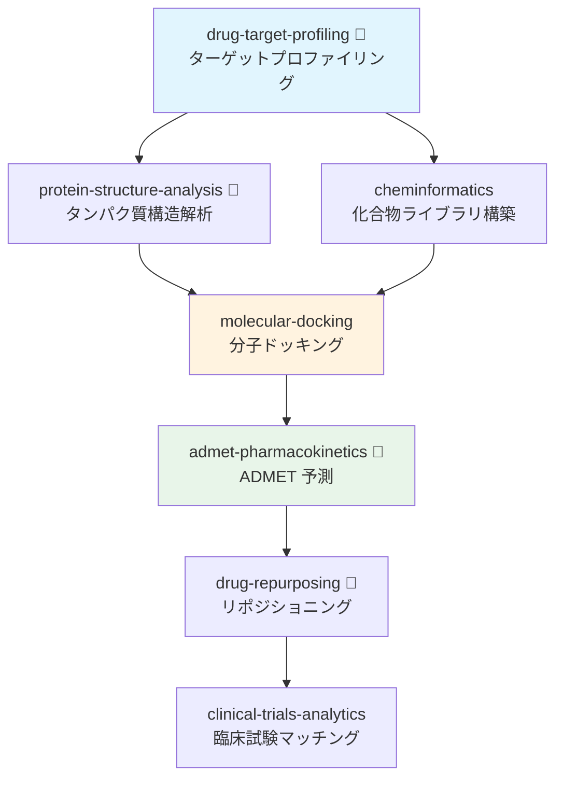

#### ステップ詳細

| Step | スキル | 役割 | TU ツール | 主要出力 |
|---|---|---|---|---|
| 1 | `drug-target-profiling` | 9 パス戦略でターゲット情報収集（UniProt/ChEMBL/OpenTargets） | `dgidb` | `target_profile.json` |
| 2a | `protein-structure-analysis` | PDB/AlphaFold 構造検索、結合部位検出、品質評価 | `proteinsplus` | 構造ファイル + 結合部位情報 |
| 2b | `cheminformatics` | SMILES → 記述子 → フィンガープリント → Lipinski/PAINS フィルタ | — | `molecular_properties.csv` |
| 3 | `molecular-docking` | DiffDock/Vina/GNINA によるバーチャルスクリーニング | — | `docking_results.csv` |
| 4 | `admet-pharmacokinetics` | 5 ステップ ADMET プロファイル（A→D→M→E→T） | `pubchem` | `admet_profile.json` |
| 5 | `drug-repurposing` | 7 戦略（Target/Compound/Disease/Mechanism/Network/Phenotype/Structure） | `pharos` | リポジショニング候補リスト |
| 6 | `clinical-trials-analytics` | ClinicalTrials.gov API v2 で臨床試験マッチング | — | 試験マッチング結果 |

#### トリガープロンプト例

```
「EGFR をターゲットとした創薬パイプラインを実行して」
「この化合物ライブラリに対してバーチャルスクリーニングとADMET予測をして」
「○○のドラッグリポジショニング候補を探索して」
```

#### 期待される成果物

```
project/
├── results/
│   ├── target_profile.json
│   ├── target_profile_report.md
│   ├── druggability_matrix.json
│   ├── molecular_properties.csv
│   ├── similarity_heatmap.csv
│   ├── docking_results.csv
│   ├── virtual_screening.csv
│   ├── admet_profile.json
│   └── admet_report.md
└── figures/
    ├── similarity_heatmap.png
    └── docking_poses.png
```

---

### 3. シングルセル・空間オミクスパイプライン

**目的**: シングルセル RNA-seq から空間トランスクリプトミクスまでの統合解析

**適用シナリオ**:
- scRNA-seq データの品質管理から細胞型アノテーションまで
- 空間遺伝子発現パターンの解析
- マルチオミクス統合による細胞状態解明

#### フロー図

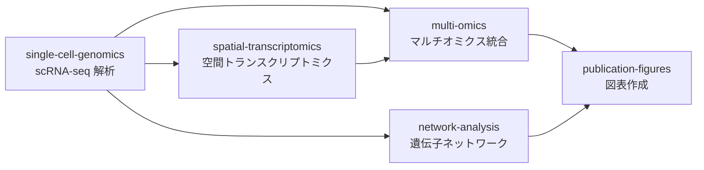

#### ステップ詳細

| Step | スキル | 役割 | 主要出力 |
|---|---|---|---|
| 1 | `single-cell-genomics` | QC → 正規化 → PCA/UMAP/Leiden → DEG → RNA velocity → CellChat | `adata.h5ad`, UMAP/Violin plots |
| 2a | `spatial-transcriptomics` | Visium/MERFISH/Slide-seq 空間パターン解析、空間可変遺伝子検出 | 空間発現マップ |
| 2b | `multi-omics` | MOFA+ / WNN / DIABLO によるマルチモーダル統合 | 統合 embedding |
| 3 | `network-analysis` | GRN 推定 (GENIE3/SCENIC)、中心性解析、コミュニティ検出 | `centrality_measures.csv` |
| 4 | `publication-figures` | Nature/Cell レベル図表 (マルチパネル UMAP, Spatial map) | `figures/*.png` |

#### トリガープロンプト例

```
「このシングルセル RNA-seq データを解析して、細胞型を同定して」
「scRNA-seq と空間トランスクリプトミクスを統合解析して」
「遺伝子制御ネットワークを構築して可視化して」
```

#### 期待される成果物

```
project/
├── results/
│   ├── cell_type_markers.csv
│   ├── deg_results.csv
│   ├── spatial_variable_genes.csv
│   ├── centrality_measures.csv
│   └── mofa_factors.csv
└── figures/
    ├── umap_clusters.png
    ├── umap_celltype.png
    ├── spatial_expression.png
    ├── violin_markers.png
    └── network_visualization.png
```

---

### 4. 精密医療パイプライン

**目的**: バリアント解釈から治療推奨までの臨床ゲノミクスワークフロー

**適用シナリオ**:
- がんゲノムプロファイリング結果の解釈
- 患者特異的な治療オプション探索
- 精密腫瘍学レポート作成

#### フロー図

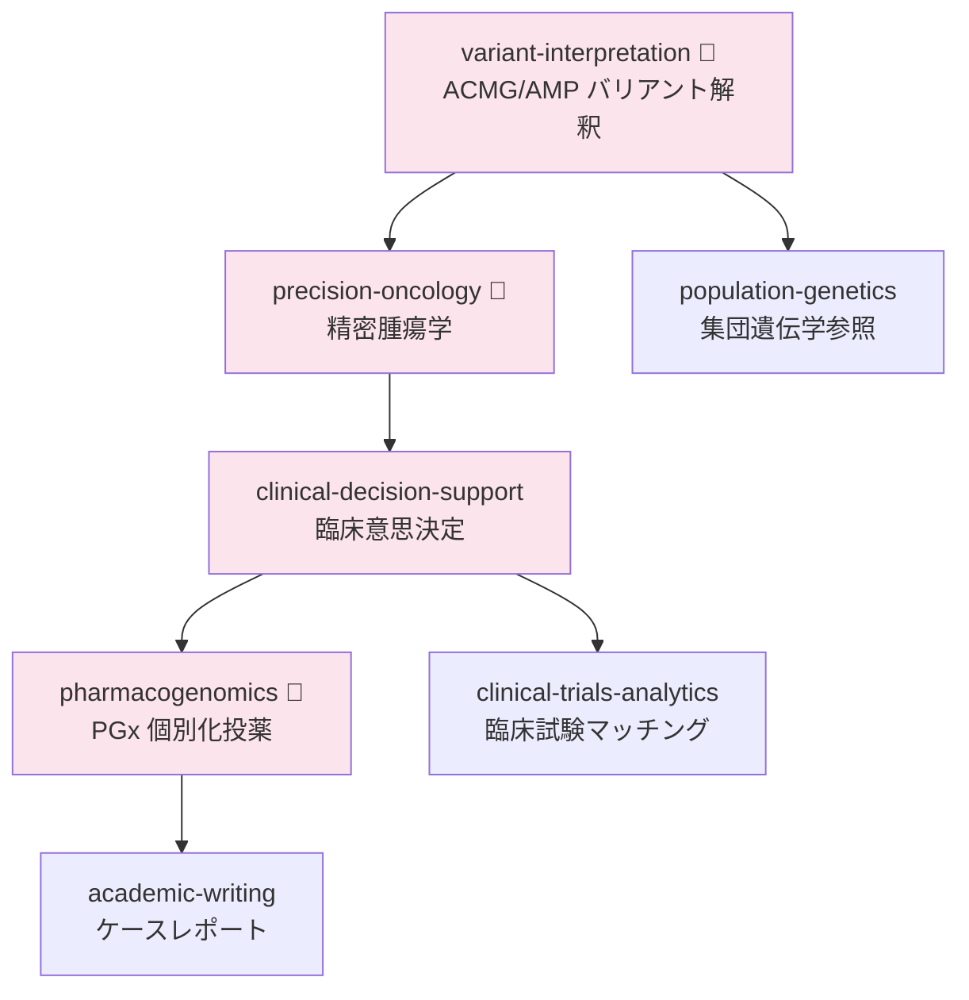

#### ステップ詳細

| Step | スキル | 役割 | TU ツール | 主要出力 |
|---|---|---|---|---|
| 1 | `variant-interpretation` | ACMG/AMP 28 基準分類、ClinVar/gnomAD/CADD/REVEL 参照 | `clinvar` | バリアント分類レポート |
| 2 | `precision-oncology` | TMB/MSI 評価、CIViC/OncoKB Tier 分類、アクショナブル変異同定 | `oncokb` | Actionable targets リスト |
| 3 | `clinical-decision-support` | GRADE エビデンス評価、リスク-ベネフィット分析、治療推奨 | — | `clinical_decision_report.md` |
| 4 | `pharmacogenomics` | Star アレル → 代謝型判定 → CPIC 投与量レコメンデーション | `fda_pharmacogenomic_biomarkers` | `pgx_report.json` |
| 5 | `clinical-trials-analytics` | ClinicalTrials.gov 適格基準マッチング | — | `trial_matches.json` |
| 6 | `population-genetics` | gnomAD/1000 Genomes 集団頻度参照、HWE 検定 | — | 集団遺伝学アノテーション |
| 7 | `academic-writing` | ケースレポート / 臨床報告の論文化 | — | `case_report.md` |

#### トリガープロンプト例

```
「このバリアントリストを ACMG 基準で分類して、治療推奨を作成して」
「BRAF V600E 変異陽性メラノーマの精密医療レポートを作成して」
「患者のゲノムプロファイルに基づいた臨床試験をマッチングして」
```

#### 期待される成果物

```
project/
├── results/
│   ├── variant_classification.json
│   ├── actionable_targets.csv
│   ├── clinical_decision_report.md
│   ├── clinical_recommendation.json
│   ├── pgx_report.json
│   ├── dosing_recommendations.csv
│   └── trial_matches.json
└── figures/
    └── pgx_phenotype_summary.png
```

---

### 5. 疫学・コホートパイプライン

**目的**: 大規模コホートデータを用いた疫学研究と因果推論

**適用シナリオ**:
- UK Biobank / BBJ / All of Us のデータ解析
- GWAS → PheWAS の統合パイプライン
- メンデルランダム化による因果推論

#### フロー図

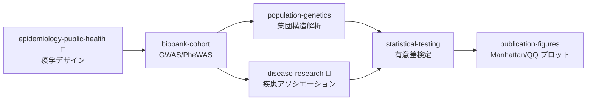

#### ステップ詳細

| Step | スキル | 役割 | TU ツール | 主要出力 |
|---|---|---|---|---|
| 1 | `epidemiology-public-health` | コホート/症例対照/横断/生態学的研究デザイン設計 | — | 疫学指標 (RR/OR/HR) |
| 2 | `biobank-cohort` | フェノタイプ辞書検索、GWAS サマリー統計処理、PheWAS | — | `gwas_significant.csv` |
| 3a | `population-genetics` | PCA/ADMIXTURE 集団構造、Fst 分化、選択圧検出 | — | `pca_eigenvec.csv` |
| 3b | `disease-research` | GWAS Catalog/DisGeNET/HPO 疾患アソシエーション | `disgenet` | 疾患関連遺伝子リスト |
| 4 | `statistical-testing` | 多重比較補正 (Bonferroni/BH)、エンリッチメント解析 | — | `statistical_tests.csv` |
| 5 | `publication-figures` | Manhattan プロット、QQ プロット、PCA 散布図 | — | `figures/*.png` |

#### トリガープロンプト例

```
「UK Biobank のデータで 2 型糖尿病の GWAS を実行して」
「PheWAS で rs12345 の全表現型アソシエーションを調べて」
「集団構造を PCA で解析して Manhattan プロットを作成して」
```

#### 期待される成果物

```
project/
├── results/
│   ├── gwas_significant.csv
│   ├── manhattan_data.csv
│   ├── phenotype_dict.csv
│   ├── pca_eigenvec.csv
│   ├── admixture_Q.csv
│   └── allele_frequencies.csv
└── figures/
    ├── manhattan_plot.png
    ├── qq_plot.png
    ├── pca_populations.png
    └── admixture_barplot.png
```

---

### 6. エビデンス合成パイプライン

**目的**: 文献検索からシステマティックレビュー、メタ解析、論文出版までの完全なエビデンス合成

**適用シナリオ**:
- PRISMA 2020 準拠のシステマティックレビュー
- メタ解析（Forest プロット・出版バイアス評価）
- レビュー論文の執筆と出版

#### フロー図

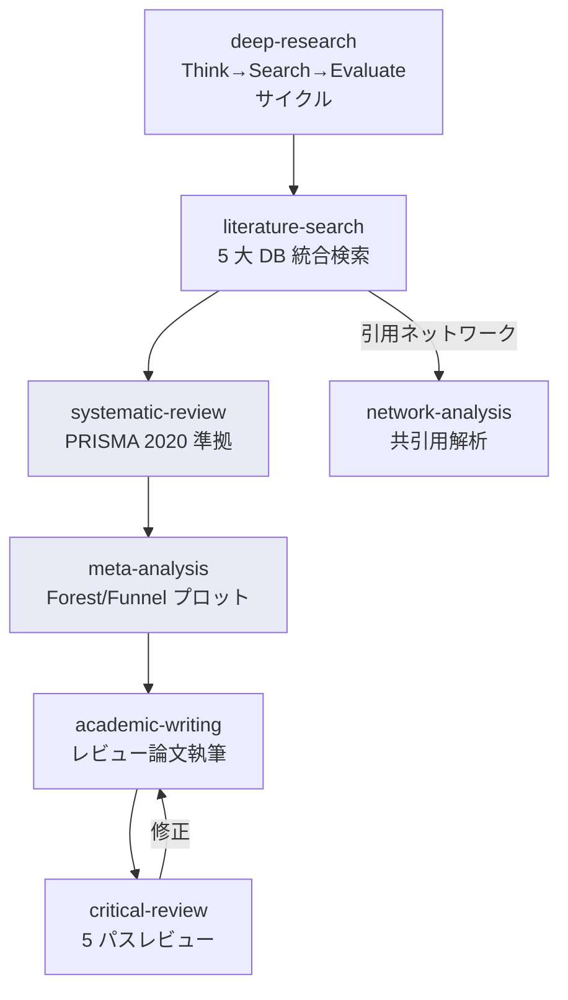

#### ステップ詳細

| Step | スキル | 役割 | 主要出力 |
|---|---|---|---|
| 1 | `deep-research` | Think→Search→Evaluate→Synthesize サイクル (最大 15 ラウンド) | 最新エビデンス要約 |
| 2 | `literature-search` | PubMed/Semantic Scholar/OpenAlex/EuropePMC/CrossRef 統合検索 (29 TU ツール) | `pubmed_search.csv` |
| 3 | `systematic-review` | PICO → 検索戦略 → スクリーニング → RoB 2/ROBINS-I 評価 → PRISMA フロー図 | `prisma_flow.mmd` |
| 4 | `meta-analysis` | 固定/ランダム効果モデル、I²/τ²、出版バイアス (Egger/Begg) | `forest_plot.png` |
| 5 | `academic-writing` | IMRaD / レビュー形式の論文草稿 | `manuscript/manuscript.md` |
| 6 | `critical-review` | 構造→論理→データ→文章→修正の 5 パスレビュー | `manuscript_revised.md` |
| 7 | `network-analysis` | 共引用・書誌結合ネットワーク構築、中心性解析 | `citation_network.png` |

#### トリガープロンプト例

```
「○○に対する△△の有効性についてシステマティックレビューを実施して」
「PRISMA 準拠でメタ解析を行い、Forest プロットを作成して」
「この研究テーマの最新エビデンスを深掘りして、レビュー論文にまとめて」
```

#### 期待される成果物

```
project/
├── results/
│   ├── search_strategy.json
│   ├── screening_records.csv
│   ├── risk_of_bias.csv
│   ├── data_extraction.csv
│   ├── meta_analysis_summary.csv
│   ├── effect_sizes.csv
│   └── publication_bias_tests.csv
├── figures/
│   ├── prisma_flow.mmd
│   ├── prisma_flow.svg
│   ├── forest_plot.png
│   ├── funnel_plot.png
│   ├── cumulative_meta.png
│   └── citation_network.png
└── manuscript/
    ├── manuscript.md
    └── manuscript_revised.md
```

---

### 7. 疾患研究パイプライン

**目的**: 疾患関連遺伝子の同定からネットワーク解析、治療候補探索まで

**適用シナリオ**:
- 疾患の遺伝的基盤解明
- 疾患ネットワーク構築と創薬ターゲット探索
- 希少疾患の原因遺伝子候補同定

#### フロー図

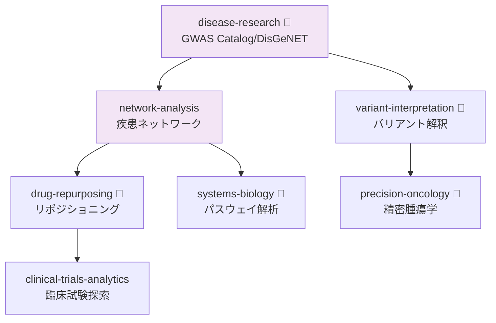

#### ステップ詳細

| Step | スキル | 役割 | TU ツール | 主要出力 |
|---|---|---|---|---|
| 1 | `disease-research` | GWAS Catalog/DisGeNET/HPO/Orphanet/OMIM 統合照会 | `disgenet` | 疾患関連遺伝子リスト |
| 2a | `network-analysis` | PPI ネットワーク (STRING/IntAct)、中心性・コミュニティ検出 | — | `network_visualization.png` |
| 2b | `variant-interpretation` | ACMG/AMP 分類、ClinVar/CADD/REVEL | `clinvar` | バリアント分類 |
| 3a | `drug-repurposing` | 7 戦略によるリポジショニング候補探索 | `pharos` | 候補化合物リスト |
| 3b | `systems-biology` | ODE シミュレーション、FBA、GRN 推定 | `bigg_models` | パスウェイモデル |
| 3c | `precision-oncology` | TMB/MSI 評価、CIViC/OncoKB Tier 分類 | `oncokb` | アクショナブル変異リスト |
| 4 | `clinical-trials-analytics` | ClinicalTrials.gov API で治療試験探索 | — | 試験マッチング結果 |

#### トリガープロンプト例

```
「アルツハイマー病の疾患関連遺伝子を網羅的に調べて」
「疾患ネットワークを構築して、ドラッグリポジショニング候補を探索して」
「DisGeNET で疾患-遺伝子アソシエーションを取得して、PPI ネットワークを構築して」
```

#### 期待される成果物

```
project/
├── results/
│   ├── disease_gene_associations.csv
│   ├── centrality_measures.csv
│   ├── edge_list.csv
│   ├── variant_classification.json
│   └── drug_repurposing_candidates.csv
└── figures/
    ├── network_visualization.png
    └── psp_path_diagram.png
```

---

### 8. 機械学習解析パイプライン

**目的**: データ前処理から ML モデル構築、説明可能性の確保までの完全な ML ワークフロー

**適用シナリオ**:
- 科学データに対する予測モデル構築
- モデルの説明可能性（XAI）の確保
- 特徴量選択と重要度分析

#### フロー図

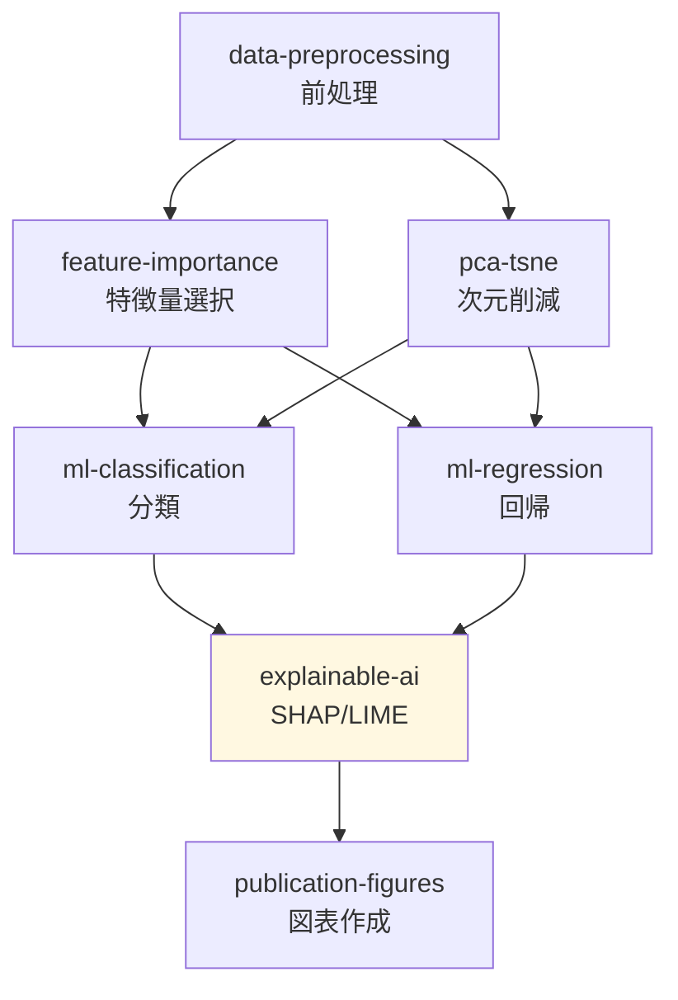

#### ステップ詳細

| Step | スキル | 役割 | 主要出力 |
|---|---|---|---|
| 1 | `data-preprocessing` | 欠損値補完・外れ値処理・スケーリング・エンコーディング | クリーンな DataFrame |
| 1b | `pca-tsne` | PCA/t-SNE/UMAP 次元削減、クラスタリング前処理 | embedding 座標 |
| 2 | `feature-importance` | Tree MDI + Permutation Importance + PDP | `feature_importance.csv` |
| 3a | `ml-classification` | LR/RF/SVM/XGBoost、StratifiedKFold CV、ROC/PR 曲線 | `classification_metrics.csv` |
| 3b | `ml-regression` | Ridge/Lasso/RF/GB/ET、KFold CV、R² 比較 | `model_metrics.csv` |
| 4 | `explainable-ai` | SHAP (TreeSHAP/DeepSHAP) + LIME + 反実仮想説明 + 公平性監査 | `xai_report.json` |
| 5 | `publication-figures` | SHAP summary/waterfall、ROC 曲線、混同行列 | `figures/*.png` |

#### トリガープロンプト例

```
「このデータセットに対して ML 分類モデルを構築し、SHAP で説明して」
「特徴量重要度を分析して、最適な予測モデルを選択して」
「モデルの予測を LIME で説明して、公平性監査を実施して」
```

#### 期待される成果物

```
project/
├── results/
│   ├── preprocessed_data.csv
│   ├── preprocessing_summary.json
│   ├── feature_importance.csv
│   ├── classification_metrics.csv
│   ├── model_metrics.csv
│   └── xai_report.json
└── figures/
    ├── feature_importance_panel.png
    ├── roc_curves.png
    ├── confusion_matrices.png
    ├── shap_summary.png
    ├── shap_waterfall.png
    └── shap_interaction.png
```

---

### 9. 環境・生態学パイプライン

**目的**: 生物多様性評価から種分布モデリング、時系列トレンド解析まで

**適用シナリオ**:
- 生物多様性指標の算出と群集構造解析
- 種分布モデリング (SDM) によるハビタット予測
- 環境モニタリングデータの時系列分析

#### フロー図

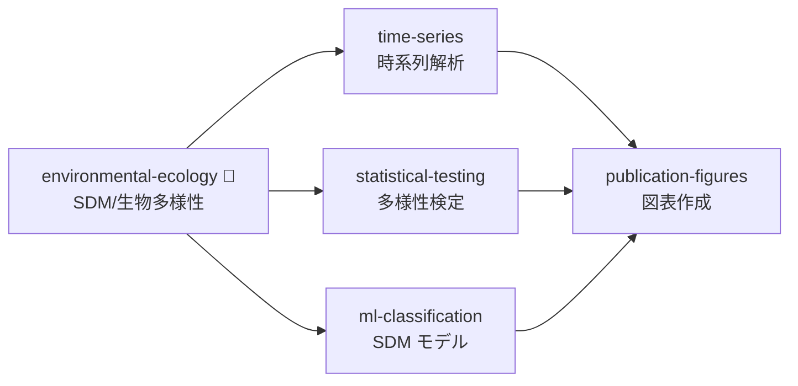

#### ステップ詳細

| Step | スキル | 役割 | TU ツール | 主要出力 |
|---|---|---|---|---|
| 1 | `environmental-ecology` | SDM (MaxEnt/RF/GBM)、α/β/γ 多様性、NMDS/CCA/RDA | `gbif` | `sdm_predictions.tif` |
| 2a | `time-series` | STL 分解、ARIMA/Prophet、変化点検出、Granger 因果性 | — | `forecast_results.csv` |
| 2b | `statistical-testing` | 多様性指標の有意差検定、多重比較 | — | `statistical_tests.csv` |
| 2c | `ml-classification` | SDM 用 RF/GBM モデル構築 | — | `classification_metrics.csv` |
| 3 | `publication-figures` | SDM マップ、NMDS プロット、多様性比較図 | — | `figures/*.png` |

#### トリガープロンプト例

```
「GBIF データを使って ○○ の種分布モデリングをして」
「この群集データの α/β 多様性を計算して群集構造を解析して」
「環境モニタリングデータの時系列トレンドと変化点を検出して」
```

#### 期待される成果物

```
project/
├── results/
│   ├── sdm_predictions.tif
│   ├── biodiversity_indices.csv
│   ├── ordination_scores.csv
│   ├── conservation_priority.csv
│   ├── forecast_results.csv
│   └── changepoints.csv
└── figures/
    ├── sdm_map.png
    ├── nmds_plot.png
    ├── diversity_comparison.png
    ├── stl_decomposition.png
    └── time_series_forecast.png
```

---

### 10. 計算材料科学パイプライン

**目的**: 結晶構造解析からバンド構造計算、高スループットスクリーニングまで

**適用シナリオ**:
- 新規材料のスクリーニングと物性予測
- 電子構造計算（バンド構造・DOS）
- 材料データベース (Materials Project) からの検索と解析

#### フロー図

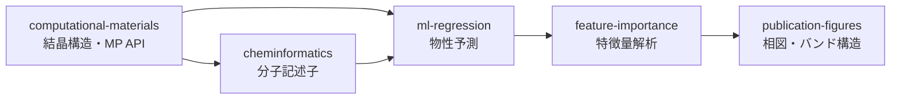

#### ステップ詳細

| Step | スキル | 役割 | 主要出力 |
|---|---|---|---|
| 1 | `computational-materials` | 結晶構造操作 (pymatgen)、MP API 照会、相図・凸包解析、バンド構造/DOS | `structure.cif`, `band_structure.png` |
| 2 | `cheminformatics` | 分子記述子・フィンガープリント生成（RDKit） | `molecular_properties.csv` |
| 3 | `ml-regression` | 物性予測モデル (Ridge/RF/GB)、KFold CV | `model_metrics.csv` |
| 4 | `feature-importance` | 物性パラメータの重要度分析、PDP | `feature_importance.csv` |
| 5 | `publication-figures` | 相図・バンド構造・DOS の出版品質可視化 | `figures/*.png` |

#### トリガープロンプト例

```
「Materials Project でバンドギャップ 1-2 eV の材料を検索して」
「この結晶構造の電子バンド構造と状態密度を計算して」
「材料データベースから候補を絞り込んで物性を予測して」
```

#### 期待される成果物

```
project/
├── results/
│   ├── structure.cif
│   ├── materials_query.csv
│   ├── model_metrics.csv
│   └── feature_importance.csv
├── figures/
│   ├── phase_diagram.png
│   ├── band_structure.png
│   ├── dos.png
│   └── model_comparison_r2.png
└── vasp_inputs/
```

---

### 11. 医薬品安全性パイプライン

**目的**: 市販後安全性シグナル検出から規制対応までのファーマコビジランスワークフロー

**適用シナリオ**:
- FAERS データを用いた安全性シグナル検出
- 不均衡分析（PRR/ROR/IC）と因果関係評価
- 規制当局への報告書作成

#### フロー図

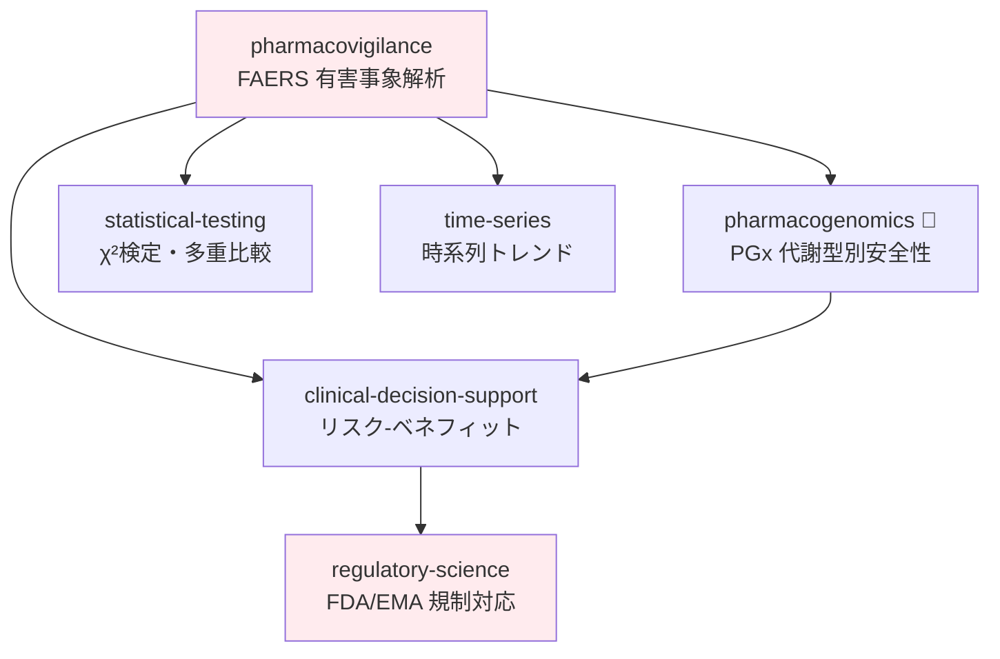

#### ステップ詳細

| Step | スキル | 役割 | TU ツール | 主要出力 |
|---|---|---|---|---|
| 1 | `pharmacovigilance` | FAERS 不均衡分析 (PRR/ROR/IC/EBGM)、MedDRA コーディング、7 フェーズ解析 | FAERS, FDA, DailyMed | `pv_signal_report.json` |
| 2a | `pharmacogenomics` | 代謝型別安全性評価、CYP 多型→有害事象リスク | `fda_pharmacogenomic_biomarkers` | `pgx_report.json` |
| 2b | `statistical-testing` | シグナル有意差検定、多重比較補正 | — | `statistical_tests.csv` |
| 2c | `time-series` | 四半期トレンド、変化点検出、Time-to-Onset 分析 | — | `changepoints.csv` |
| 3 | `clinical-decision-support` | リスク-ベネフィット評価、NNH 推定 | — | `clinical_recommendation.json` |
| 4 | `regulatory-science` | PBRER/PSUR 作成、添付文書改訂案、Orange Book 照会 | — | `fda_orange_book.json` |

#### トリガープロンプト例

```
「○○の有害事象をFAERSデータで解析して安全性シグナルを検出して」
「PRR/ROR 不均衡分析を実行して、MedDRA SOC レベルで集計して」
「安全性シグナルに基づいて規制当局への報告書を作成して」
```

#### 期待される成果物

```
project/
├── results/
│   ├── pv_signal_report.json
│   ├── pv_signal_report.md
│   ├── pgx_report.json
│   ├── statistical_tests.csv
│   ├── changepoints.csv
│   ├── clinical_recommendation.json
│   └── fda_orange_book.json
└── figures/
    ├── pv_temporal_trend.png
    └── pv_demographics.png
```

---

### 12. システム生物学パイプライン

**目的**: 生物学的ネットワークのモデリング、シミュレーション、マルチオミクス統合

**適用シナリオ**:
- 遺伝子制御ネットワーク (GRN) の推定
- 代謝フラックス解析 (FBA)
- マルチオミクスデータからのシステムレベル理解

#### フロー図

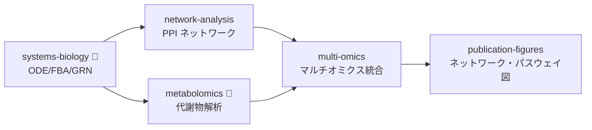

#### ステップ詳細

| Step | スキル | 役割 | TU ツール | 主要出力 |
|---|---|---|---|---|
| 1 | `systems-biology` | ODE/SBML シミュレーション、FBA/pFBA/FVA (COBRApy)、GRN (GENIE3/SCENIC) | `bigg_models`, `complex_portal`, `wikipathways` | フラックス分布、GRN |
| 2a | `network-analysis` | STRING/IntAct PPI、中心性解析、Louvain コミュニティ検出 | — | `centrality_measures.csv` |
| 2b | `metabolomics` | LC-MS/GC-MS 前処理、代謝パスウェイマッピング | — | 代謝物プロファイル |
| 3 | `multi-omics` | MOFA+ / WNN / DIABLO 統合、因子発見 | — | 統合因子スコア |
| 4 | `publication-figures` | ネットワーク図、パスウェイ図、ヒートマップ | — | `figures/*.png` |

#### トリガープロンプト例

```
「代謝ネットワークの FBA シミュレーションを実行して」
「GRN を GENIE3 で推定して、ネットワーク可視化して」
「転写 + 代謝 + タンパク質データを統合して系統的に解析して」
```

#### 期待される成果物

```
project/
├── results/
│   ├── flux_distribution.csv
│   ├── grn_network.csv
│   ├── centrality_measures.csv
│   └── mofa_factors.csv
└── figures/
    ├── network_visualization.png
    ├── pathway_map.png
    └── heatmap.png
```

---

### 13. がんゲノミクスパイプライン

**目的**: がんゲノムデータベース横断のバリアントプロファイリングから機能依存性解析、臨床エビデンス照合まで

**適用シナリオ**:
- TCGA/GDC/ICGC 等のがんゲノムデータの統合解析
- DepMap CRISPR 依存性スコアによる必須遺伝子同定
- 変異シグネチャー解析と臨床的意義評価

#### フロー図

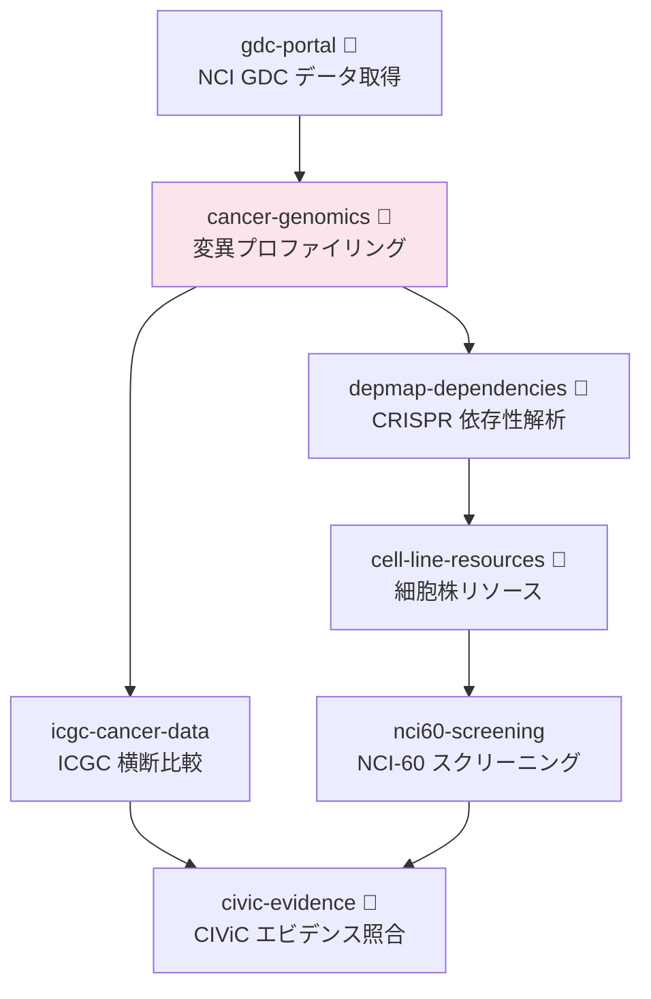

#### ステップ詳細

| Step | スキル | 役割 | TU ツール | 主要出力 |
|---|---|---|---|---|
| 1 | `gdc-portal` | NCI GDC REST API でプロジェクト横断検索・ケースメタデータ取得 | `gdc` | GDC クエリ結果 |
| 2 | `cancer-genomics` | COSMIC/cBioPortal 変異シグネチャー・ドライバー変異解析 | `cosmic`, `cbioportal` | 変異プロファイル |
| 3a | `icgc-cancer-data` | ICGC 横断がん種比較 | — | 比較結果 |
| 3b | `depmap-dependencies` | DepMap CRISPR/RNAi 依存性スコア・薬剤感受性 | `depmap` | 依存性スコア |
| 4 | `cell-line-resources` | 細胞株選定・実験系設計 | — | 細胞株リスト |
| 5 | `nci60-screening` | NCI-60 バーチャルスクリーニング | — | スクリーニング結果 |
| 6 | `civic-evidence` | CIViC 臨床エビデンスレベル照合 | — | エビデンスレポート |

#### トリガープロンプト例

```
「TCGA 乳がんデータでドライバー変異を同定して変異シグネチャーを解析して」
「DepMap で ○○ 遺伝子の依存性スコアを調べて、必須ながん種を特定して」
「cBioPortal のデータで変異頻度を比較して CIViC エビデンスを照合して」
```

#### 期待される成果物

```
project/
├── results/
│   ├── gdc_query_results.json
│   ├── mutation_signatures.csv
│   ├── depmap_dependency_scores.csv
│   ├── cell_line_selection.csv
│   └── civic_evidence_report.json
└── figures/
    ├── mutation_signature_plot.png
    ├── oncoplot.png
    └── dependency_heatmap.png
```

---

### 14. ゲノム・エピゲノム解析パイプライン

**目的**: ゲノム配列解析からエピゲノム制御領域同定、CRISPR 機能検証設計まで

**適用シナリオ**:
- WGS/WES バリアント検出と機能影響予測
- ChIP-seq/ATAC-seq によるクロマチン状態・制御領域の解析
- 希少疾患の原因バリアント同定
- CRISPR ガイド RNA 設計

#### フロー図

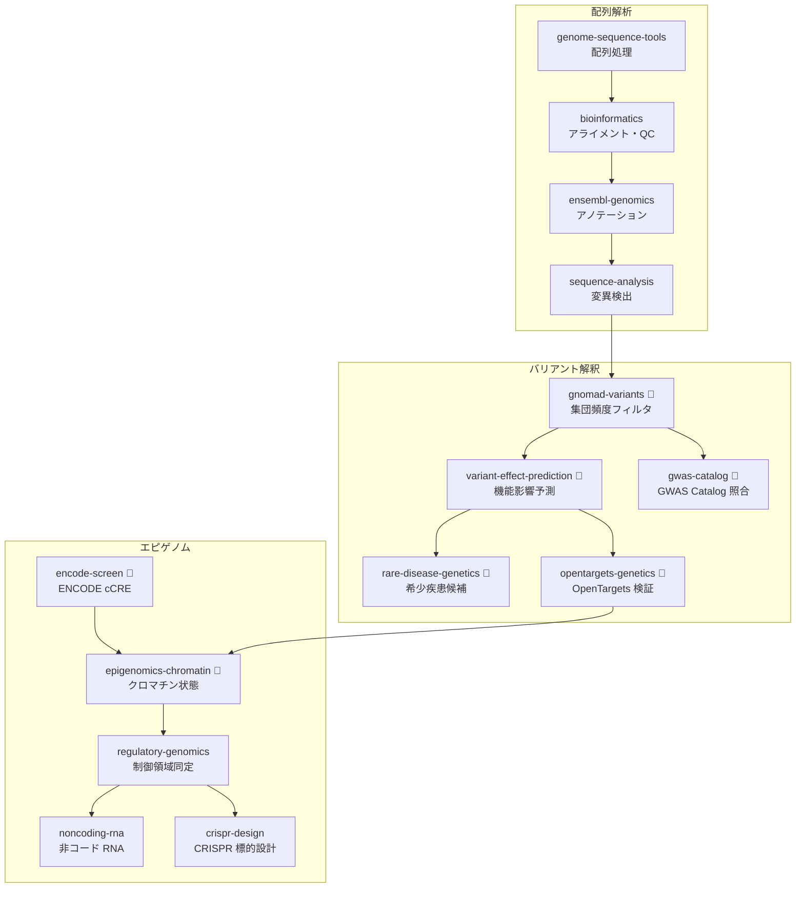

#### ステップ詳細

| Step | スキル | 役割 | TU ツール | 主要出力 |
|---|---|---|---|---|
| 1 | `genome-sequence-tools` | FASTA/FASTQ 処理、配列操作 | — | 処理済み配列 |
| 2 | `bioinformatics` | BWA/STAR アライメント、FastQC/MultiQC | — | BAM/VCF |
| 3 | `ensembl-genomics` | Ensembl アノテーション、遺伝子モデル | — | アノテーション付き VCF |
| 4 | `sequence-analysis` | 変異検出・構造変異 | — | バリアントリスト |
| 5 | `gnomad-variants` | gnomAD 集団アレル頻度フィルタ | — | フィルタ済みバリアント |
| 6a | `variant-effect-prediction` | CADD/REVEL/SpliceAI 機能影響予測 | — | スコア付きバリアント |
| 6b | `gwas-catalog` | GWAS Catalog 既知アソシエーション照合 | — | GWAS ヒットリスト |
| 7a | `rare-disease-genetics` | OMIM/Orphanet 希少疾患遺伝子マッチング | `orphanet` | 候補遺伝子リスト |
| 7b | `opentargets-genetics` | OpenTargets V2G/L2G 統合スコア | — | ターゲットスコア |
| 7c | `encode-screen` | ENCODE cCRE エレメント検索・ChIP-Atlas エンリッチメント | `encode`, `chipatlas` | cCRE アノテーション |
| 8 | `epigenomics-chromatin` | ChIP-seq/ATAC-seq ピーク検出、ChromHMM | `chipatlas` | クロマチン状態マップ |
| 9 | `regulatory-genomics` | エンハンサー/プロモーター/インスレーター同定 | — | 制御領域アノテーション |
| 10a | `noncoding-rna` | lncRNA/miRNA/piRNA 同定、ncRNA ファミリー分類 | — | ncRNA アノテーション |
| 10b | `crispr-design` | Cas9/Cas12a gRNA 設計、オフターゲットスコア | — | gRNA ライブラリ |

#### トリガープロンプト例

```
「WES データからバリアントを検出して、gnomAD フィルタと機能影響予測をして」
「ChIP-seq/ATAC-seq データでクロマチン状態を解析して制御領域を同定して」
「希少疾患の原因バリアント候補を絞り込んで CRISPR 検証実験を設計して」
```

#### 期待される成果物

```
project/
├── results/
│   ├── aligned_reads.bam
│   ├── variants_filtered.vcf
│   ├── variant_scores.csv
│   ├── rare_disease_candidates.csv
│   ├── chromatin_states.bed
│   ├── regulatory_regions.csv
│   └── grna_library.csv
└── figures/
    ├── chromatin_state_heatmap.png
    └── variant_impact_summary.png
```

---

### 15. トランスクリプトミクス・アトラスパイプライン

**目的**: 大規模シングルセルアトラスの統合、バルク発現解析、摂動応答解析まで

**適用シナリオ**:
- CellxGene/HCA アトラスデータの大規模クエリ
- GPU 加速シングルセル解析と scVI 統合
- GEO/ArrayExpress/GTEx の発現比較
- CRISPR スクリーニング摂動応答解析

#### フロー図

```mermaid
graph TD
    subgraph アトラス統合
        A[cellxgene-census 🔧<br/>CellxGene Census] --> B[human-cell-atlas 🔧<br/>HCA 参照]
        B --> C[gpu-singlecell<br/>GPU 加速解析]
        C --> D[scvi-integration<br/>scVI 統合]
        D --> E[scatac-signac<br/>scATAC-seq]
        E --> F[spatial-multiomics<br/>空間マルチオミクス]
        F --> G[squidpy-advanced<br/>Squidpy 高度解析]
    end
    subgraph バルク発現
        H[geo-expression 🔧<br/>GEO 発現] --> I[arrayexpress-expression 🔧<br/>ArrayExpress]
        I --> J[gtex-tissue-expression 🔧<br/>GTEx 組織発現]
        J --> K[gene-expression-transcriptomics<br/>発現定量]
        K --> L[expression-comparison<br/>発現比較]
        L --> M[perturbation-analysis<br/>摂動解析]
    end
```

#### ステップ詳細

| Step | スキル | 役割 | TU ツール | 主要出力 |
|---|---|---|---|---|
| 1 | `cellxgene-census` | CZ CELLxGENE Census メタデータ検索・発現クエリ | `cellxgene_census` | アトラスデータ |
| 2 | `human-cell-atlas` | HCA 参照アトラスとの統合 | — | 参照マッピング |
| 3 | `gpu-singlecell` | RAPIDS/cuML GPU 加速 scRNA-seq 前処理 | — | 高速処理結果 |
| 4 | `scvi-integration` | scVI/scANVI バッチ統合・潜在空間学習 | — | 統合 embedding |
| 5 | `scatac-signac` | scATAC-seq Signac 解析・モチーフエンリッチメント | — | ピーク・モチーフ |
| 6 | `spatial-multiomics` | 空間マルチオミクス統合 | — | 空間統合マップ |
| 7 | `squidpy-advanced` | Squidpy 近傍エンリッチメント・リガンド受容体推定 | — | 空間統計量 |
| 8 | `geo-expression` | GEO 発現データ取得 | — | 発現マトリクス |
| 9 | `arrayexpress-expression` | ArrayExpress/BioStudies 発現データ取得 | — | 発現マトリクス |
| 10 | `gtex-tissue-expression` | GTEx 組織別発現パターン | — | 組織発現プロファイル |
| 11 | `gene-expression-transcriptomics` | RNA-seq/マイクロアレイ発現定量パイプライン | — | 正規化発現マトリクス |
| 12 | `expression-comparison` | 差次発現・条件間比較 | — | DEG リスト |
| 13 | `perturbation-analysis` | 摂動応答 (Perturb-seq) 解析 | — | 摂動効果スコア |

#### トリガープロンプト例

```
「CellxGene Census から○○組織のシングルセルデータを取得して scVI で統合して」
「GEO と GTEx のデータで組織間発現比較をして」
「CRISPR スクリーニングの摂動応答を解析して」
```

#### 期待される成果物

```
project/
├── results/
│   ├── atlas_query.h5ad
│   ├── scvi_latent.csv
│   ├── scatac_peaks.bed
│   ├── spatial_neighbors.csv
│   ├── gtex_expression.csv
│   ├── deg_results.csv
│   └── perturbation_scores.csv
└── figures/
    ├── umap_integrated.png
    ├── spatial_multiomics.png
    └── perturbation_heatmap.png
```

---

### 16. プロテオミクス・構造生物学パイプライン

**目的**: 質量分析プロテオミクスから構造解析、de novo タンパク質設計まで

**適用シナリオ**:
- LC-MS/MS データの定量プロテオミクス解析
- AlphaFold/PDB 構造取得と分子動力学シミュレーション
- タンパク質言語モデルによる de novo タンパク質設計

#### フロー図

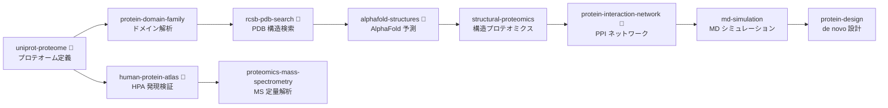

#### ステップ詳細

| Step | スキル | 役割 | 主要出力 |
|---|---|---|---|
| 1a | `uniprot-proteome` | UniProt プロテオーム参照、配列取得 | プロテオーム FASTA |
| 1b | `human-protein-atlas` | HPA 組織/細胞タンパク質発現・RNA 発現プロファイル検証 | HPA 発現データ |
| 2 | `protein-domain-family` | Pfam/InterPro ドメイン・ファミリー解析 | ドメインアノテーション |
| 3 | `rcsb-pdb-search` | RCSB PDB 構造検索（配列/構造類似性） | PDB エントリリスト |
| 4 | `alphafold-structures` | AlphaFold DB 予測構造取得・pLDDT 評価 | 構造ファイル |
| 5 | `structural-proteomics` | 構造-機能解析・リガンド結合部位予測 | 構造アノテーション |
| 6 | `protein-interaction-network` | PPI ネットワーク構築（STRING/IntAct 拡張） | PPI グラフ |
| 7 | `md-simulation` | GROMACS/OpenMM 分子動力学シミュレーション | トラジェクトリ・RMSD |
| 8 | `protein-design` | ESM 言語モデル de novo 設計・安定性予測 | 設計配列・構造 |
| 9 | `proteomics-mass-spectrometry` | LC-MS/MS LFQ/TMT 定量、PTM 同定 | 定量プロテオミクス結果 |

#### トリガープロンプト例

```
「○○タンパク質の構造を AlphaFold で取得して MD シミュレーションをして」
「LC-MS/MS データで定量プロテオミクスを実行して PTM を同定して」
「ESM モデルでタンパク質を de novo 設計して安定性を予測して」
```

#### 期待される成果物

```
project/
├── results/
│   ├── proteome_sequences.fasta
│   ├── domain_annotations.csv
│   ├── pdb_hits.csv
│   ├── alphafold_structures/
│   ├── ppi_network.graphml
│   ├── md_trajectory.xtc
│   ├── designed_sequences.fasta
│   └── proteomics_quantification.csv
└── figures/
    ├── domain_architecture.png
    ├── structure_alignment.png
    ├── rmsd_plot.png
    └── ppi_network.png
```

---

### 17. メタボロミクス・脂質・糖鎖パイプライン

**目的**: 代謝物 DB 照合からフラックス解析、リピドミクス・グライコミクス統合まで

**適用シナリオ**:
- メタボロームデータの代謝パスウェイマッピング
- ゲノムスケール代謝モデリング (GEM)
- 脂質・糖鎖の構造同定とパスウェイ解析

#### フロー図

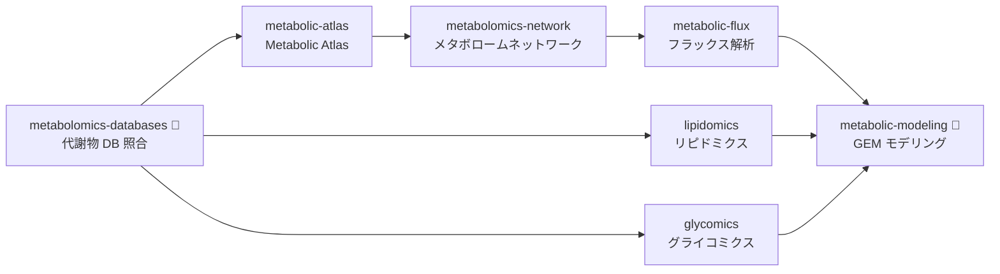

#### ステップ詳細

| Step | スキル | 役割 | 主要出力 |
|---|---|---|---|
| 1 | `metabolomics-databases` | HMDB/KEGG/MetaCyc 代謝物照合・同定 | 同定代謝物リスト |
| 2 | `metabolic-atlas` | Human Metabolic Atlas マッピング | 代謝マップ |
| 3 | `metabolomics-network` | 代謝物相関ネットワーク構築 | ネットワークグラフ |
| 4 | `metabolic-flux` | 13C-MFA / FBA フラックス推定 | フラックス分布 |
| 5 | `metabolic-modeling` | GEM (CBM) ゲノムスケール代謝モデル | モデルファイル |
| 6 | `lipidomics` | LipidMAPS/SwissLipids 脂質同定・パスウェイ | 脂質プロファイル |
| 7 | `glycomics` | 糖鎖構造・GlyGen 照合 | 糖鎖アノテーション |

#### トリガープロンプト例

```
「メタボロームデータを HMDB で照合して代謝パスウェイにマッピングして」
「ゲノムスケール代謝モデルを構築してフラックス解析をして」
「リピドミクスデータで脂質種を同定してパスウェイエンリッチメントをして」
```

#### 期待される成果物

```
project/
├── results/
│   ├── metabolite_identification.csv
│   ├── metabolic_network.graphml
│   ├── flux_distribution.csv
│   ├── gem_model.xml
│   ├── lipid_species.csv
│   └── glycan_annotations.csv
└── figures/
    ├── metabolic_pathway_map.png
    ├── flux_heatmap.png
    └── lipid_class_composition.png
```

---

### 18. マイクロバイオーム・進化・多様性パイプライン

**目的**: メタゲノムからの微生物群集プロファイリング、系統解析、多様な生態系研究

**適用シナリオ**:
- 16S/ショットガンメタゲノム解析
- MAG 再構成と系統樹構築
- 海洋・植物・寄生虫ゲノミクス

#### フロー図

```mermaid
graph TD
    subgraph メタゲノム解析
        A[microbiome-metagenomics 🔧<br/>16S/ショットガン] --> B[rrna-taxonomy<br/>分類学プロファイリング]
        A --> C[metagenome-assembled-genomes<br/>MAG 再構成]
        C --> D[phylogenetics<br/>系統樹構築]
        D --> E[model-organism-db 🔧<br/>モデル生物 DB]
    end
    subgraph 生態・多様性
        F[marine-ecology 🔧<br/>海洋生態学]
        G[plant-biology<br/>植物生物学]
        H[parasite-genomics<br/>寄生虫ゲノミクス]
        I[paleobiology 🔧<br/>古生物学]
    end
    subgraph 環境データ
        J[environmental-geodata<br/>環境地理データ]
        K[geospatial-analysis<br/>地理空間解析]
        L[toxicology-env<br/>環境毒性学]
    end

    D --> F
    D --> G
    D --> H
    E --> I
    F --> J
    J --> K
    K --> L
```

#### ステップ詳細

| Step | スキル | 役割 | TU ツール | 主要出力 |
|---|---|---|---|---|
| 1 | `microbiome-metagenomics` | DADA2 / MetaPhlAn / HUMAnN 群集プロファイリング | `mgnify` | 分類組成テーブル |
| 2 | `rrna-taxonomy` | 16S/18S/ITS 分類学的同定 | — | 分類学アサインメント |
| 3 | `metagenome-assembled-genomes` | MAG 再構成・品質評価 (CheckM) | — | MAG セット |
| 4 | `phylogenetics` | ete3 系統樹構築・可視化・分子時計 | — | 系統樹 (Newick) |
| 5 | `model-organism-db` | FlyBase/WormBase/ZFIN/MGI 参照 | — | オルソログ情報 |
| 6 | `marine-ecology` | 海洋生態系モデリング | — | 海洋生態データ |
| 7 | `plant-biology` | 植物ゲノム・トランスクリプトーム | — | 植物形質データ |
| 8 | `parasite-genomics` | 寄生虫ゲノム解析 | — | 寄生虫遺伝子リスト |
| 9 | `paleobiology` | 古生物学的系統解析・化石記録照合 | — | 古生物学的推定 |
| 10 | `environmental-geodata` | 環境地理データ取得 (DEM/気候/土地被覆) | — | 環境変数ラスタ |
| 11 | `geospatial-analysis` | GIS 空間解析・地理統計 (Kriging/IDW) | — | 空間解析結果 |
| 12 | `toxicology-env` | 環境毒性評価・生態リスク解析 | — | 毒性リスク評価 |

#### トリガープロンプト例

```
「腸内メタゲノムデータで 16S プロファイリングと MAG 再構成をして」
「系統樹を構築して分子時計で分岐年代を推定して」
「海洋メタゲノムの群集構造を解析して多様性を比較して」
```

#### 期待される成果物

```
project/
├── results/
│   ├── taxonomy_profile.tsv
│   ├── functional_pathways.tsv
│   ├── mag_quality.csv
│   ├── mag_quality_summary.csv
│   ├── mag_taxonomy.csv
│   ├── mag_pipeline_summary.json
│   ├── representative_mags.fasta
│   ├── phylogenetic_tree.nwk
│   └── ortholog_mapping.csv
└── figures/
    ├── taxonomy_barplot.png
    ├── phylogenetic_tree.png
    └── diversity_comparison.png
```

---

### 19. パスウェイ・ナレッジグラフパイプライン

**目的**: 遺伝子 ID 標準化からパスウェイ富化、オントロジー統合、ネットワーク可視化まで

**適用シナリオ**:
- 遺伝子リストのパスウェイエンリッチメント解析
- マルチ DB 横断のナレッジグラフ構築
- ID マッピングとオントロジー標準化

#### フロー図


#### ステップ詳細

| Step | スキル | 役割 | 主要出力 |
|---|---|---|---|
| 1 | `hgnc-nomenclature` | HGNC 公式遺伝子シンボル標準化 | 標準化遺伝子リスト |
| 2 | `biothings-idmapping` | Entrez/Ensembl/UniProt 間 ID 変換 | ID マッピングテーブル |
| 3 | `ebi-databases` | EBI 横断検索（UniProt/InterPro/ChEMBL 等） | 統合アノテーション |
| 4 | `ontology-enrichment` | GO (BP/MF/CC) エンリッチメント解析 | GO 富化結果 |
| 5 | `monarch-ontology` | Monarch Initiative 疾患-遺伝子-表現型 | 疾患関連情報 |
| 6 | `pathway-enrichment` | KEGG/Reactome/WikiPathways ORA + GSEA | パスウェイ富化結果 |
| 7 | `reactome-pathways` | Reactome 階層パスウェイ詳細解析 | パスウェイマップ |
| 8 | `string-network-api` | STRING DB PPI スコア取得 | PPI エッジリスト |
| 9 | `stitch-chemical-network` | STITCH 化合物-タンパク質相互作用 | 化合物ネットワーク |
| 10 | `network-visualization` | Cytoscape-style ネットワーク可視化 | ネットワーク図 |
| 11 | `biomedical-pubtator` | PubTator 遺伝子/疾患/化合物 NER | 文献マイニング結果 |

#### トリガープロンプト例

```
「この遺伝子リストの GO エンリッチメントと KEGG パスウェイ解析をして」
「遺伝子 ID を Ensembl/UniProt 間で変換して STRING PPI を取得して」
「パスウェイ解析結果をナレッジグラフとして可視化して」
```

#### 期待される成果物

```
project/
├── results/
│   ├── id_mapping.csv
│   ├── go_enrichment.csv
│   ├── pathway_enrichment.csv
│   ├── reactome_pathways.json
│   ├── string_ppi.csv
│   ├── stitch_network.csv
│   └── pubtator_entities.csv
└── figures/
    ├── go_dotplot.png
    ├── pathway_barplot.png
    └── knowledge_graph.png
```

---

### 20. 化合物スクリーニング・薬理パイプライン

**目的**: 化合物ライブラリスクリーニングから薬理プロファイル、臨床薬理評価まで

**適用シナリオ**:
- 大規模バーチャル化合物スクリーニング
- ChEMBL アッセイマイニングと薬理ターゲット評価
- DrugBank/PharmGKB を用いた既知薬剤照合

#### フロー図

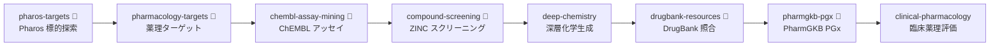

#### ステップ詳細

| Step | スキル | 役割 | TU ツール | 主要出力 |
|---|---|---|---|---|
| 1 | `pharos-targets` | Pharos 標的プロテオーム探索 (Tdark/Tbio/Tchem/Tclin) | — | 標的リスト |
| 2 | `pharmacology-targets` | 薬理学ターゲット優先順位付け | — | 優先ターゲット |
| 3 | `chembl-assay-mining` | ChEMBL アッセイデータマイニング・IC50/Ki 分析 | — | アッセイ結果 |
| 4 | `compound-screening` | ZINC 購入可能化合物検索・バーチャルスクリーニング | `zinc` | スクリーニング結果 |
| 5 | `deep-chemistry` | 深層生成モデルによる化合物設計 | — | 生成化合物 |
| 6 | `drugbank-resources` | DrugBank 既知薬剤・適応症照合 | — | 薬剤情報 |
| 7 | `pharmgkb-pgx` | PharmGKB 薬理遺伝学アノテーション | — | PGx アノテーション |
| 8 | `clinical-pharmacology` | 臨床薬理評価・PK/PD モデリング | — | 臨床薬理レポート |

#### トリガープロンプト例

```
「Pharos で○○標的の開発状況を調べて ChEMBL のアッセイデータを分析して」
「ZINC から購入可能な化合物をスクリーニングして」
「DrugBank で既知薬剤を照合して PharmGKB の PGx 情報を取得して」
```

#### 期待される成果物

```
project/
├── results/
│   ├── pharos_targets.json
│   ├── chembl_assays.csv
│   ├── zinc_screening.csv
│   ├── generated_compounds.smi
│   ├── drugbank_matches.csv
│   └── clinical_pharma_report.md
└── figures/
    ├── dose_response_curves.png
    └── pk_model.png
```

---

### 21. 臨床情報学・ヘルスケア AI パイプライン

**目的**: 臨床データ標準化から NLP 抽出、ヘルスケア AI 予測、生存解析まで

**適用シナリオ**:
- EHR データの構造化と FHIR/OMOP 標準化
- 臨床テキストからの NER・情報抽出
- 生存時間解析と臨床予測モデル構築
- 感染症サーベイランスと免疫インフォマティクス

#### フロー図

```mermaid
graph TD
    subgraph 臨床データ AI
        A[clinical-standards 🔧<br/>FHIR/OMOP 標準化] --> B[clinical-nlp<br/>臨床NLP]
        B --> C[clinical-reporting<br/>臨床レポート生成]
        C --> D[healthcare-ai<br/>臨床予測モデル]
        D --> E[survival-clinical<br/>生存解析]
        E --> F[public-health-data 🔧<br/>公衆衛生データ]
    end
    subgraph 医用画像・生体信号
        G[medical-imaging<br/>医用画像前処理] --> H[radiology-ai<br/>放射線AI]
        I[biosignal-processing<br/>生体信号処理] --> J[neuroscience-electrophysiology<br/>電気生理]
    end
    subgraph 感染症・免疫
        K[infectious-disease<br/>感染症解析] --> L[immunoinformatics 🔧<br/>免疫インフォマティクス]
        L --> M[clingen-curation 🔧<br/>ClinGen キュレーション]
    end

    H --> D
    J --> D
    M --> C
```

#### ステップ詳細

| Step | スキル | 役割 | TU ツール | 主要出力 |
|---|---|---|---|---|
| 1 | `clinical-standards` | FHIR/OMOP/HL7 データ標準化 | `loinc`, `icd` | 標準化データ |
| 2 | `clinical-nlp` | MedSpaCy/scispaCy NER・否定文検出 | — | 抽出エンティティ |
| 3 | `clinical-reporting` | 構造化臨床レポート生成 | — | 臨床レポート |
| 4 | `healthcare-ai` | PyHealth 臨床 ML・EHR 予測モデル | — | 予測スコア |
| 5 | `survival-clinical` | Kaplan-Meier・Cox PH・NNT/NNH | — | 生存曲線 |
| 5b | `public-health-data` | NHANES/MedlinePlus/ODPHP 公衆衛生データ統合 | `nhanes`, `medlineplus`, `odphp` | 公衆衛生指標 |
| 6 | `medical-imaging` | DICOM/NIfTI 医用画像前処理 | — | 処理済み画像 |
| 7 | `radiology-ai` | 放射線画像 AI 診断支援 | — | AI 診断結果 |
| 8 | `biosignal-processing` | ECG/EEG/EMG 信号処理 | — | 信号特徴量 |
| 9 | `neuroscience-electrophysiology` | 神経電気生理解析・スパイクソーティング | — | 神経活動データ |
| 10 | `infectious-disease` | 病原体ゲノム・AMR・SIR/SEIR モデル | — | 疫学モデル |
| 11 | `immunoinformatics` | エピトープ予測・TCR/BCR レパトア | `iedb`, `imgt`, `sabdab` | エピトープリスト |
| 12 | `clingen-curation` | ClinGen 遺伝子-疾患キュレーション | — | キュレーション結果 |

#### トリガープロンプト例

```
「EHR データを OMOP 標準化して臨床 NLP で情報抽出して」
「臨床予測モデルを構築して Kaplan-Meier 生存解析をして」
「エピトープ予測と TCR レパトア解析で免疫応答を評価して」
```

#### 期待される成果物

```
project/
├── results/
│   ├── standardized_ehr.json
│   ├── nlp_entities.csv
│   ├── clinical_report.md
│   ├── prediction_scores.csv
│   ├── survival_analysis.csv
│   ├── epitope_predictions.csv
│   └── amr_genes.csv
└── figures/
    ├── kaplan_meier.png
    ├── roc_clinical.png
    └── sir_model.png
```

---

### 22. 高度 ML・AI パイプライン

**目的**: AutoML から深層学習、因果推論、GNN、連合学習までの先端 AI 手法

**適用シナリオ**:
- AutoML/NAS による最適モデル自動探索
- 因果推論 (PSM/IPW/DID) による観察データからの因果効果推定
- GNN による分子特性予測・知識グラフ推論
- 連合学習によるプライバシー保護モデル構築

#### フロー図

```mermaid
graph TD
    subgraph モデル最適化
        A[automl<br/>AutoML] --> B[neural-architecture-search<br/>NAS]
        B --> C[deep-learning<br/>深層学習]
        C --> D[transfer-learning<br/>転移学習]
        D --> E[multi-task-learning<br/>マルチタスク]
        E --> F[ensemble-methods<br/>アンサンブル]
        F --> G[uncertainty-quantification<br/>不確実性定量]
    end
    subgraph 因果・特殊手法
        H[causal-inference<br/>因果推論] --> I[causal-ml<br/>因果 ML]
        J[active-learning<br/>能動学習] --> K[semi-supervised-learning<br/>半教師あり]
        L[reinforcement-learning<br/>強化学習]
        M[graph-neural-networks<br/>GNN]
        N[anomaly-detection<br/>異常検知]
        O[federated-learning<br/>連合学習]
    end

    G --> N
    I --> M
    K --> C
```

#### ステップ詳細

| Step | スキル | 役割 | 主要出力 |
|---|---|---|---|
| 1 | `automl` | Optuna/FLAML ハイパーパラメータ最適化 | 最適 HP 設定 |
| 2 | `neural-architecture-search` | NAS 構造最適化 | 最適アーキテクチャ |
| 3 | `deep-learning` | PyTorch Lightning DNN 設計・訓練 | モデルウェイト |
| 4 | `transfer-learning` | ドメイン適応・ファインチューニング | 適応モデル |
| 5 | `multi-task-learning` | 共有表現マルチタスク学習・Hard/Soft パラメータ共有 | MTL モデル |
| 6 | `ensemble-methods` | スタッキング・ブレンディング・投票 | アンサンブルモデル |
| 7 | `uncertainty-quantification` | MC Dropout/Deep Ensembles/Conformal | 不確実性推定 |
| 8 | `causal-inference` | PSM/IPW/DID/RDD/DAG | 因果効果推定値 |
| 9 | `causal-ml` | CATE/HTE 異質的処置効果 | 因果 ML モデル |
| 10 | `active-learning` | 不確実性/多様性サンプリング・プール型能動学習 | AL 選択サンプル |
| 11 | `semi-supervised-learning` | Self-training/MixMatch/FixMatch 半教師あり学習 | 半教師ありモデル |
| 12 | `reinforcement-learning` | DQN/PPO/SAC 方策最適化 | RL エージェント |
| 13 | `graph-neural-networks` | GCN/GAT/SchNet 分子グラフ学習 | GNN 予測結果 |
| 14 | `anomaly-detection` | Isolation Forest/LOF/Autoencoder | 異常スコア |
| 15 | `federated-learning` | Flower/PySyft 連合学習 | 連合モデル |

#### トリガープロンプト例

```
「AutoML でモデル選択とハイパーパラメータ最適化をして」
「観察データから PSM と DID で因果効果を推定して」
「GNN で分子特性を予測して不確実性を定量化して」
```

#### 期待される成果物

```
project/
├── results/
│   ├── automl_best_params.json
│   ├── nas_architecture.json
│   ├── model_weights.pt
│   ├── causal_estimates.csv
│   ├── gnn_predictions.csv
│   ├── anomaly_scores.csv
│   └── uncertainty_intervals.csv
└── figures/
    ├── optuna_optimization.png
    ├── causal_dag.png
    └── calibration_plot.png
```

---

### 23. 実験計画・統計基盤パイプライン

**目的**: データプロファイリングから実験計画法、ベイズ統計、適応的実験設計まで

**適用シナリオ**:
- 新しいデータセットの品質評価と探索的データ解析
- DOE（実験計画法）による効率的な実験設計
- ベイズ推論による不確実性を考慮した統計解析
- シミュレーションによるパワー分析と検出力評価

#### フロー図

```mermaid
graph LR
    A[data-profiling<br/>データプロファイリング] --> B[eda-correlation<br/>EDA・相関解析]
    B --> C[missing-data-analysis<br/>欠測データ分析]
    C --> D[data-simulation<br/>データシミュレーション]
    D --> E[statistical-simulation<br/>統計シミュレーション]
    E --> F[bayesian-statistics<br/>ベイズ統計]
    F --> G[doe<br/>実験計画法]
    G --> H[adaptive-experiments<br/>適応的実験設計]
```

#### ステップ詳細

| Step | スキル | 役割 | 主要出力 |
|---|---|---|---|
| 1 | `data-profiling` | データ品質メトリクス・型推定・分布要約 | プロファイルレポート |
| 2 | `eda-correlation` | 変数間相関・散布図行列・VIF 多重共線性 | 相関マトリクス |
| 3 | `missing-data-analysis` | 欠測パターン解析 (MCAR/MAR/MNAR)・多重代入 | 欠測パターン分析 |
| 4 | `data-simulation` | パラメトリック/ノンパラメトリックデータ生成 | シミュレーションデータ |
| 5 | `statistical-simulation` | モンテカルロ・ブートストラップ・パワー分析 | シミュレーション結果 |
| 6 | `bayesian-statistics` | PyMC/Stan ベイズ回帰・階層モデル・MCMC | 事後分布サンプル |
| 7 | `doe` | 直交配列表・CCD・Box-Behnken・RSM | 実験計画マトリクス |
| 8 | `adaptive-experiments` | ベイズ最適化・逐次実験設計 | 次回実験条件推奨 |

#### トリガープロンプト例

```
「このデータセットの品質プロファイルを作成して EDA をして」
「Box-Behnken 計画で実験を設計して応答曲面を解析して」
「ベイズ階層モデルで個体差を考慮した推定をして」
```

#### 期待される成果物

```
project/
├── results/
│   ├── data_profile.html
│   ├── correlation_matrix.csv
│   ├── missing_pattern.csv
│   ├── simulation_results.csv
│   ├── bayesian_posterior.csv
│   ├── doe_design_matrix.csv
│   └── adaptive_recommendations.json
└── figures/
    ├── correlation_heatmap.png
    ├── missing_pattern.png
    ├── posterior_distributions.png
    └── response_surface.png
```

---

### 24. 科学的可視化・ダッシュボードパイプライン

**目的**: 高度な科学的可視化、インタラクティブダッシュボード、プレゼンテーション設計

**適用シナリオ**:
- 3D 可視化・アニメーション付き科学図表
- Streamlit/Dash によるインタラクティブダッシュボード構築
- 学会発表用スライド・科学的模式図の設計

#### フロー図

```mermaid
graph LR
    A[advanced-imaging<br/>高度イメージング] --> B[image-analysis<br/>画像解析]
    B --> C[spectral-signal<br/>スペクトル信号]
    C --> D[advanced-visualization<br/>Plotly 3D/Altair]
    D --> E[interactive-dashboard<br/>Streamlit/Dash]
    D --> F[scientific-schematics<br/>科学的模式図]
    F --> G[presentation-design<br/>プレゼンテーション]
```

#### ステップ詳細

| Step | スキル | 役割 | 主要出力 |
|---|---|---|---|
| 1 | `advanced-imaging` | 高度イメージング取得・前処理 | 処理済み画像 |
| 2 | `image-analysis` | 画像セグメンテーション・物体検出・定量化 | 定量結果 |
| 3 | `spectral-signal` | スペクトル信号処理 (IR/Raman/NMR/UV-Vis) | スペクトルデータ |
| 4 | `advanced-visualization` | Plotly 3D/Altair 宣言的可視化・アニメーション | インタラクティブ図 |
| 5 | `interactive-dashboard` | Streamlit/Dash/Panel ダッシュボード構築 | ダッシュボードアプリ |
| 6 | `scientific-schematics` | Mermaid/TikZ 科学的模式図・ワークフロー図 | 模式図 |
| 7 | `presentation-design` | 学会スライド・ポスターデザイン | スライドデッキ |

#### トリガープロンプト例

```
「この実験データの 3D 可視化とインタラクティブダッシュボードを作成して」
「研究ワークフローの科学的模式図を作成して」
「学会発表用のスライドを設計して」
```

#### 期待される成果物

```
project/
├── figures/
│   ├── 3d_visualization.html
│   ├── spectral_analysis.png
│   ├── schematic_diagram.svg
│   └── poster.pdf
├── dashboard/
│   ├── app.py
│   └── requirements.txt
└── presentation/
    └── slides.md
```

---

### 25. 学術出版ワークフローパイプライン

**目的**: 研究方法論設計から文献管理、論文投稿、査読対応、グラント申請まで

**適用シナリオ**:
- 論文投稿の品質チェックと LaTeX フォーマッティング
- 査読対応と改訂追跡
- グラント申請書 (NIH/NSF/JSPS) の作成
- データリポジトリへの提出

#### フロー図

```mermaid
graph TD
    subgraph 文献・引用
        A[research-methodology<br/>研究方法論] --> B[text-mining-nlp<br/>テキストマイニング]
        B --> C[semantic-scholar 🔧<br/>Semantic Scholar]
        C --> D[citation-checker<br/>引用チェック]
        D --> E[crossref-metadata 🔧<br/>CrossRef メタデータ]
    end
    subgraph 論文品質
        E --> F[latex-formatter<br/>LaTeX フォーマット]
        F --> G[paper-quality<br/>論文品質チェック]
        G --> H[supplementary-generator<br/>補足資料生成]
        H --> I[reproducible-reporting<br/>再現性レポート]
    end
    subgraph 投稿・申請
        I --> J[data-submission<br/>データ提出]
        J --> K[preprint-archive<br/>プレプリント公開]
        G --> L[peer-review-response<br/>査読対応]
        L --> M[revision-tracker<br/>改訂追跡]
        A --> N[grant-writing<br/>グラント申請]
    end
```

#### ステップ詳細

| Step | スキル | 役割 | 主要出力 |
|---|---|---|---|
| 1 | `research-methodology` | 研究デザイン設計・方法論選択 | 研究計画書 |
| 2 | `text-mining-nlp` | 文献テキストマイニング・トピック分析 | トピック分析結果 |
| 3 | `semantic-scholar` | Semantic Scholar API 文献検索 | 文献リスト |
| 4 | `citation-checker` | 引用整合性チェック・書式検証 | 引用チェックレポート |
| 5 | `crossref-metadata` | CrossRef DOI メタデータ検証 | メタデータ検証結果 |
| 6 | `latex-formatter` | LaTeX/BibTeX テンプレート・数式フォーマット | LaTeX ソース |
| 7 | `paper-quality` | 論文品質スコアリング・改善提案 | 品質レポート |
| 8 | `supplementary-generator` | 補足情報・Extended Data 自動生成 | 補足資料 |
| 9 | `reproducible-reporting` | Jupyter/Quarto 再現性レポート | 再現性レポート |
| 10 | `data-submission` | GEO/SRA/Zenodo データ提出支援 | 提出メタデータ |
| 11 | `preprint-archive` | bioRxiv/arXiv プレプリント投稿 | プレプリント |
| 12 | `peer-review-response` | 査読コメント point-by-point 回答 | 回答文書 |
| 13 | `revision-tracker` | 改訂トラッキング・差分管理 | 改訂ログ |
| 14 | `grant-writing` | NIH R01/NSF/JSPS 科研費申請書作成 | 申請書草稿 |

#### トリガープロンプト例

```
「この論文草稿の引用整合性をチェックして LaTeX フォーマットにして」
「査読コメントに対する point-by-point の回答を作成して」
「NIH R01 形式のグラント申請書を作成して」
```

#### 期待される成果物

```
project/
├── manuscript/
│   ├── manuscript.tex
│   ├── references.bib
│   ├── supplementary.tex
│   └── response_to_reviewers.md
├── results/
│   ├── citation_check.json
│   ├── paper_quality_score.json
│   ├── revision_log.json
│   └── submission_metadata.json
└── grant/
    ├── specific_aims.md
    └── research_strategy.md
```

---

### 26. ラボ自動化・運用・計算基盤パイプライン

**目的**: ラボ自動化プロトコルから運用モニタリング、プロセス最適化まで

**適用シナリオ**:
- 液体ハンドリングロボットのプロトコル設計
- LIMS/ELN データ管理体制の構築
- ML モデルの本番運用モニタリング
- 量子計算・数式処理の研究応用

#### フロー図

```mermaid
graph TD
    subgraph ラボ運用
        A[lab-automation<br/>ラボ自動化] --> B[lab-data-management<br/>LIMS/ELN 管理]
        B --> C[process-optimization<br/>プロセス最適化]
        C --> D[streaming-analytics<br/>ストリーミング解析]
        D --> E[model-monitoring<br/>モデル監視]
    end
    subgraph 計算基盤
        F[symbolic-mathematics<br/>数式処理] --> G[quantum-computing<br/>量子計算]
        H[materials-characterization<br/>材料キャラクタリゼーション]
        I[time-series-forecasting<br/>時系列予測]
    end

    E --> I
    C --> H
```

#### ステップ詳細

| Step | スキル | 役割 | 主要出力 |
|---|---|---|---|
| 1 | `lab-automation` | PyLabRobot/Opentrons 液体ハンドリング自動化 | プロトコルスクリプト |
| 2 | `lab-data-management` | LIMS/ELN データ管理・トレーサビリティ | データ管理計画 |
| 3 | `process-optimization` | 製造プロセス最適化・SPC | 最適パラメータ |
| 4 | `streaming-analytics` | リアルタイムストリーミングデータ処理 | ストリーミングパイプライン |
| 5 | `model-monitoring` | データドリフト・パフォーマンス劣化検出 | 監視ダッシュボード |
| 6 | `symbolic-mathematics` | SymPy 数式処理・解析解導出 | 数式変換結果 |
| 7 | `quantum-computing` | Qiskit/Cirq 量子回路・VQE | 量子計算結果 |
| 8 | `materials-characterization` | XRD/SEM/TEM 実験特性評価 | キャラクタリゼーション結果 |
| 9 | `time-series-forecasting` | Prophet/NeuralProphet 高度時系列予測 | 予測結果 |

#### トリガープロンプト例

```
「Opentrons 用の液体ハンドリングプロトコルを設計して」
「本番 ML モデルのデータドリフト監視パイプラインを構築して」
「量子回路で VQE 最適化を実行して」
```

#### 期待される成果物

```
project/
├── protocols/
│   └── opentrons_protocol.py
├── results/
│   ├── process_optimization.csv
│   ├── drift_report.json
│   ├── symbolic_derivation.tex
│   └── quantum_results.json
└── monitoring/
    └── dashboard_config.yaml
```

---

## クロスドメインパイプライン

複数のドメインパイプラインを組み合わせた高度なワークフローです。

---

### A. ゲノム創薬統合パイプライン

**パイプライン 5 + 7 + 2 の統合**

```mermaid
graph TD
    subgraph 疫学・コホート
        A[biobank-cohort<br/>GWAS] --> B[population-genetics<br/>集団構造]
    end
    subgraph 疾患研究
        B --> C[disease-research 🔧<br/>疾患遺伝子]
        C --> D[network-analysis<br/>疾患ネットワーク]
    end
    subgraph 創薬
        D --> E[drug-target-profiling 🔧<br/>ターゲット]
        E --> F[molecular-docking<br/>ドッキング]
        F --> G[admet-pharmacokinetics 🔧<br/>ADMET]
    end
```

**シナリオ**: 「UK Biobank の GWAS から疾患関連遺伝子を同定し、ネットワーク解析で創薬ターゲットを絞り込み、バーチャルスクリーニングで候補化合物を評価する」

**トリガープロンプト例**:
```
「GWAS で同定した疾患遺伝子を創薬ターゲットとして評価し、
 化合物ライブラリからリード候補をスクリーニングして」
```

---

### B. AI 駆動臨床意思決定パイプライン

**パイプライン 4 + 8 + 11 の統合**

```mermaid
graph TD
    subgraph ML 解析
        A[data-preprocessing] --> B[ml-classification<br/>予測モデル]
        B --> C[explainable-ai<br/>SHAP/LIME]
    end
    subgraph 精密医療
        C --> D[clinical-decision-support<br/>治療推奨]
        D --> E[pharmacogenomics 🔧<br/>個別化投薬]
    end
    subgraph 安全性
        E --> F[pharmacovigilance<br/>安全性監視]
        F --> G[regulatory-science<br/>規制報告]
    end
```

**シナリオ**: 「患者データから AI モデルで予後を予測し、説明可能性を確保した上で治療推奨を生成、個別化投薬と安全性監視まで一気通貫で行う」

**トリガープロンプト例**:
```
「患者コホートデータで予後予測モデルを構築し、SHAP で説明して、
 治療推奨と個別化投薬レコメンデーションを生成して」
```

---

### C. 研究自動化パイプライン

**パイプライン 1 + 6 の統合**

```mermaid
graph TD
    subgraph 仮説構築
        A[deep-research<br/>文献調査] --> B[hypothesis-pipeline<br/>PICO 仮説定義]
    end
    subgraph 解析実行
        B --> C[pipeline-scaffold<br/>パイプライン構築]
        C --> D[data-preprocessing<br/>前処理]
        D --> E[statistical-testing<br/>統計検証]
    end
    subgraph 出版
        E --> F[publication-figures<br/>図表]
        F --> G[academic-writing<br/>論文執筆]
        G --> H[systematic-review<br/>レビュー統合]
    end
```

**シナリオ**: 「文献調査で最新の知見を把握し、仮説を構築、解析パイプラインを自動構築して検証、論文化まで自動で進める」

**トリガープロンプト例**:
```
「○○の最新研究を深掘りして仮説を立て、データ解析から論文化まで
 自動パイプラインを構築して実行して」
```

---

### D. マルチオミクス疾患解明パイプライン

**パイプライン 3 + 7 + 12 の統合**

```mermaid
graph TD
    subgraph シングルセル
        A[single-cell-genomics<br/>scRNA-seq] --> B[spatial-transcriptomics<br/>空間発現]
    end
    subgraph 疾患解明
        A --> C[disease-research 🔧<br/>疾患遺伝子]
        B --> D[systems-biology 🔧<br/>GRN/FBA]
    end
    subgraph 統合解析
        C --> E[multi-omics<br/>MOFA+ 統合]
        D --> E
        E --> F[network-analysis<br/>統合ネットワーク]
    end
```

**シナリオ**: 「シングルセルと空間トランスクリプトミクスの統合データで疾患メカニズムを解明し、システム生物学的解析で治療標的を同定する」

**トリガープロンプト例**:
```
「scRNA-seq データで細胞型を同定し、疾患遺伝子との重ね合わせで
 治療標的候補を GRN/FBA モデルから抽出して」
```

---

### E. 個別化薬物療法パイプライン

**パイプライン 2 + 4 + 11 の統合**

```mermaid
graph TD
    subgraph ゲノム解析
        A[variant-interpretation 🔧<br/>バリアント解釈] --> B[pharmacogenomics 🔧<br/>Star アレル分類]
    end
    subgraph 創薬
        A --> C[drug-target-profiling 🔧<br/>ターゲット]
        C --> D[admet-pharmacokinetics 🔧<br/>ADMET]
    end
    subgraph 臨床適用
        B --> E[clinical-decision-support<br/>投与量最適化]
        D --> E
        E --> F[pharmacovigilance<br/>安全性 Follow-up]
    end
```

**シナリオ**: 「患者のゲノム変異を解釈し、PGx に基づく個別化投薬を設計、ADMET で安全性を評価した上で投与量を最適化する」

**トリガープロンプト例**:
```
「患者のバリアントを ACMG 分類し、CYP 代謝型に応じた投与量を
 ADMET 安全性評価込みで最適化して」
```

---

### F. バイオインフォマティクス完全パイプライン

**パイプライン 3 + 5 + 12 + 14 + 1 の統合** — 最も網羅的なパイプライン

```mermaid
graph TD
    subgraph データ生成
        A[bioinformatics<br/>配列解析] --> B[single-cell-genomics<br/>scRNA-seq]
        A --> C[biobank-cohort<br/>GWAS]
    end
    subgraph 解析
        B --> D[multi-omics<br/>統合]
        C --> E[population-genetics<br/>集団構造]
        D --> F[systems-biology 🔧<br/>ネットワーク]
        E --> F
    end
    subgraph 出版
        F --> G[hypothesis-pipeline<br/>仮説定義]
        G --> H[academic-writing<br/>論文化]
        H --> I[critical-review<br/>レビュー]
    end
```

**シナリオ**: 「生データの配列解析からシングルセル・GWAS 解析、マルチオミクス統合、システム生物学モデリング、仮説検証、論文化まで全工程を実行する」

**トリガープロンプト例**:
```
「FASTQ から配列解析し、シングルセル・GWAS・マルチオミクス統合、
 システム生物学モデリングを経て論文化まで全工程を実行して」
```

---

### G. がん精密医療 End-to-End パイプライン

**パイプライン 13 + 20 + 4 + 21 の統合**

がんゲノムプロファイリングから化合物スクリーニング、臨床意思決定、ヘルスケア AI 予測まで一気通貫。

```mermaid
graph TD
    subgraph がんゲノミクス
        A[gdc-portal 🔧<br/>GDC データ取得] --> B[cancer-genomics 🔧<br/>変異シグネチャー]
        B --> C[depmap-dependencies 🔧<br/>依存性解析]
        B --> D[civic-evidence 🔧<br/>エビデンス照合]
    end
    subgraph 化合物スクリーニング
        C --> E[pharos-targets 🔧<br/>標的探索]
        E --> F[compound-screening 🔧<br/>ZINC スクリーニング]
        F --> G[deep-chemistry<br/>深層化学生成]
    end
    subgraph 精密医療・臨床
        D --> H[precision-oncology 🔧<br/>精密腫瘍学]
        G --> H
        H --> I[clinical-decision-support<br/>治療推奨]
        I --> J[healthcare-ai<br/>臨床予測モデル]
        J --> K[survival-clinical<br/>生存解析]
    end
```

**シナリオ**: 「TCGA/GDC のがんゲノムデータからドライバー変異を同定し、DepMap で必須遺伝子を検証、化合物スクリーニングでリード候補を発見、精密腫瘍学レポートと生存予測まで実行する」

**トリガープロンプト例**:
```
「TCGA 乳がんデータでドライバー変異を同定し、DepMap 依存性を検証して、
 化合物スクリーニングから精密医療レポート・生存解析まで one-shot で」
```

---

### H. マルチオミクス縦断統合パイプライン

**パイプライン 14 + 15 + 16 + 19 の統合**

ゲノム→エピゲノム→トランスクリプトーム→プロテオーム→パスウェイの全層を縦断統合。

```mermaid
graph TD
    subgraph ゲノム・エピゲノム層
        A[genome-sequence-tools<br/>配列処理] --> B[bioinformatics<br/>アライメント]
        B --> C[variant-effect-prediction 🔧<br/>バリアント予測]
        C --> D[epigenomics-chromatin 🔧<br/>クロマチン状態]
        D --> E[regulatory-genomics<br/>制御領域]
    end
    subgraph トランスクリプトーム層
        E --> F[cellxgene-census 🔧<br/>CellxGene Census]
        F --> G[scvi-integration<br/>scVI 統合]
        G --> H[expression-comparison<br/>発現比較]
    end
    subgraph プロテオーム層
        H --> I[uniprot-proteome 🔧<br/>プロテオーム]
        I --> J[alphafold-structures 🔧<br/>AlphaFold 構造]
        J --> K[protein-interaction-network 🔧<br/>PPI]
    end
    subgraph パスウェイ統合
        K --> L[pathway-enrichment<br/>パスウェイ富化]
        L --> M[reactome-pathways 🔧<br/>Reactome 詳細]
        M --> N[network-visualization<br/>ナレッジグラフ]
    end
```

**シナリオ**: 「WES バリアントからエピゲノム制御領域を同定し、シングルセル発現変動を検証、プロテオームで機能を確認、パスウェイ統合で全体像を可視化する」

**トリガープロンプト例**:
```
「バリアントのエピゲノム影響を評価し、シングルセル発現・プロテオーム変動を
 追跡して、パスウェイレベルで統合的に可視化して」
```

---

### I. 環境メタボ・マイクロバイオーム One Health パイプライン

**パイプライン 9 + 18 + 17 の統合**

環境生態学→マイクロバイオーム→メタボロミクスの One Health 統合解析。

```mermaid
graph TD
    subgraph 環境・生態学
        A[environmental-ecology 🔧<br/>SDM/生物多様性] --> B[environmental-geodata<br/>環境地理データ]
        B --> C[geospatial-analysis<br/>地理空間解析]
    end
    subgraph マイクロバイオーム
        C --> D[microbiome-metagenomics 🔧<br/>16S/ショットガン]
        D --> E[metagenome-assembled-genomes<br/>MAG 再構成]
        E --> F[phylogenetics<br/>系統樹構築]
    end
    subgraph メタボロミクス
        D --> G[metabolomics-databases 🔧<br/>代謝物同定]
        G --> H[metabolomics-network<br/>代謝ネットワーク]
        H --> I[metabolic-modeling 🔧<br/>GEM モデリング]
        F --> I
    end
    subgraph One Health 統合
        C --> J[toxicology-env<br/>環境毒性評価]
        I --> J
        J --> K[publication-figures<br/>One Health 可視化]
    end
```

**シナリオ**: 「環境サンプルの種分布モデリングから微生物群集を解析し、メタボロームで機能プロファイリング、環境毒性評価を統合して One Health レポートを作成する」

**トリガープロンプト例**:
```
「土壌/水質サンプルの微生物群集をプロファイリングし、代謝機能を
 メタボロームで解析して、環境毒性リスクと統合した One Health レポートを」
```

---

### J. AI 駆動マテリアルズインフォマティクスパイプライン

**パイプライン 10 + 22 + 23（+ 24, 26）の統合**

計算材料科学→高度 ML/AI→実験計画法の統合で材料探索を自動化。可視化（24）と材料キャラクタリゼーション（26）を橋渡し。

```mermaid
graph TD
    subgraph 計算材料科学
        A[computational-materials<br/>結晶構造・MP API] --> B[cheminformatics<br/>記述子計算]
    end
    subgraph 高度 ML/AI
        B --> C[automl<br/>AutoML 最適化]
        C --> D[graph-neural-networks<br/>GNN 物性予測]
        D --> E[uncertainty-quantification<br/>不確実性定量]
        E --> F[active-learning<br/>能動学習]
    end
    subgraph 実験計画
        F --> G[doe<br/>実験計画法]
        G --> H[bayesian-statistics<br/>ベイズ最適化]
        H --> I[adaptive-experiments<br/>適応的実験]
        I -->|再探索| A
    end
    subgraph 検証
        E --> J[materials-characterization<br/>材料キャラクタリゼーション]
        J --> K[advanced-visualization<br/>3D 可視化]
    end
```

**シナリオ**: 「Materials Project から候補材料を検索し、GNN で物性を予測、不確実性に基づく能動学習で次の合成実験を設計、適応的に材料探索ループを回す」

**トリガープロンプト例**:
```
「Materials Project の結晶構造データで GNN 物性予測モデルを構築し、
 能動学習と実験計画法で最適な次回合成条件を提案して」
```

---

### K. 研究ライフサイクル完全自動化パイプライン

**パイプライン 26 + 24 + 25（+ 23）の統合**

ラボ実験→データプロファイリング（23）→可視化→論文投稿→グラント申請の研究ライフサイクルを自動化。

```mermaid
graph TD
    subgraph ラボ運用
        A[lab-automation<br/>液体ハンドリング] --> B[lab-data-management<br/>LIMS/ELN]
        B --> C[streaming-analytics<br/>リアルタイム解析]
        C --> D[model-monitoring<br/>モデル監視]
    end
    subgraph 可視化・解析
        D --> E[data-profiling<br/>データプロファイリング]
        E --> F[advanced-visualization<br/>Plotly 3D/Altair]
        F --> G[interactive-dashboard<br/>Streamlit ダッシュボード]
        F --> H[scientific-schematics<br/>模式図作成]
    end
    subgraph 出版・申請
        G --> I[reproducible-reporting<br/>再現性レポート]
        H --> J[paper-quality<br/>論文品質チェック]
        I --> K[latex-formatter<br/>LaTeX フォーマット]
        J --> K
        K --> L[peer-review-response<br/>査読対応]
        K --> M[grant-writing<br/>グラント申請]
        L --> N[preprint-archive<br/>プレプリント公開]
    end
```

**シナリオ**: 「Opentrons でハイスループット実験を自動化し、LIMS でデータ管理、インタラクティブダッシュボードで結果を共有、論文品質チェックから査読対応・グラント申請まで自動化する」

**トリガープロンプト例**:
```
「ラボ実験データを LIMS 管理し、インタラクティブダッシュボードで可視化して、
 論文化から査読対応・グラント申請まで自動ワークフローを構築して」
```

---

### L. AI 駆動エビデンス合成パイプライン

**パイプライン 6 + 8 + 22（+ 25）の統合**

テキストマイニング（25）→深層学習フィルタリング→系統的レビュー・メタアナリシスの AI 自動化。

```mermaid
graph TD
    subgraph 文献探索
        A[deep-research<br/>文献深掘り] --> B[literature-search<br/>包括検索]
        B --> C[text-mining-nlp<br/>テキストマイニング]
    end
    subgraph AI エビデンス評価
        C --> D[deep-learning<br/>文書分類 DL]
        D --> E[transfer-learning<br/>事前学習転移]
        E --> F[automl<br/>最適モデル選択]
    end
    subgraph 合成・レポート
        F --> G[meta-analysis<br/>メタアナリシス]
        G --> H[explainable-ai<br/>判定根拠可視化]
        H --> I[systematic-review<br/>系統的レビュー]
        I --> J[academic-writing<br/>論文化]
    end
```

**シナリオ**: 「数千件の文献から深層学習で関連論文をフィルタリングし、AutoML で最適スクリーニングモデルを構築、メタアナリシスで効果量を統合して SHAP で判定根拠を提示する」

**トリガープロンプト例**:
```
「○○に関する文献を包括検索し、DL でスクリーニングして
 メタアナリシスから系統的レビュー・論文化まで自動で」
```

---

### M. がんマルチレイヤーゲノム創薬パイプライン

**パイプライン 13 + 14 + 20 の統合**

がんゲノミクス→ゲノム・エピゲノムアノテーション→化合物ターゲティングの多層ゲノム創薬。

```mermaid
graph TD
    subgraph がんゲノミクス
        A[gdc-portal 🔧<br/>GDC データ取得] --> B[cancer-genomics 🔧<br/>変異プロファイル]
        B --> C[icgc-cancer-data<br/>ICGC 統合]
    end
    subgraph ゲノム・エピゲノム層
        C --> D[ensembl-genomics<br/>アノテーション]
        D --> E[variant-effect-prediction 🔧<br/>VEP]
        E --> F[epigenomics-chromatin 🔧<br/>クロマチン状態]
        F --> G[gwas-catalog 🔧<br/>GWAS 照合]
    end
    subgraph 化合物ターゲティング
        G --> H[pharos-targets 🔧<br/>標的評価]
        H --> I[chembl-assay-mining 🔧<br/>アッセイマイニング]
        I --> J[compound-screening 🔧<br/>化合物スクリーニング]
    end
```

**シナリオ**: 「GDC/ICGC のがんゲノムデータにゲノム・エピゲノムアノテーションを重ね、GWAS エビデンスで検証後、Pharos/ChEMBL 経由で治療候補化合物を探索する」

**トリガープロンプト例**:
```
「TCGA 肺がんデータのドライバー変異にエピゲノム文脈を付加して、
 GWAS サポートのある標的を ChEMBL/ZINC でスクリーニングして」
```

---

### N. 臨床→規制→出版バリューチェーンパイプライン

**パイプライン 21 + 11 + 25 の統合**

臨床データ→安全性評価→規制報告→学術出版のバリューチェーン一気通貫。

```mermaid
graph TD
    subgraph 臨床情報学
        A[clinical-standards 🔧<br/>HL7/FHIR 準拠] --> B[clinical-nlp<br/>EHR テキスト抽出]
        B --> C[clinical-reporting<br/>臨床レポート]
        C --> D[healthcare-ai<br/>予測モデル]
    end
    subgraph 安全性・規制
        D --> E[pharmacovigilance<br/>安全性監視]
        E --> F[regulatory-science<br/>規制報告書]
    end
    subgraph 学術出版
        F --> G[reproducible-reporting<br/>再現性レポート]
        G --> H[paper-quality<br/>品質チェック]
        H --> I[latex-formatter<br/>LaTeX 組版]
        I --> J[peer-review-response<br/>査読対応]
    end
```

**シナリオ**: 「EHR から臨床テキストを構造化し、AI 予測モデルで有害事象を検出、規制報告書を作成した後、再現性レポートと学術論文として出版する」

**トリガープロンプト例**:
```
「臨床データで有害事象予測モデルを構築し、安全性監視→規制報告書を作成、
 再現性レポートとして論文化・査読対応まで一気通貫で」
```

---

### O. シングルセルプロテオーム統合パイプライン

**パイプライン 3 + 16 + 17（+ 12）の統合**

シングルセル→プロテオーム→メタボローム→システム生物学（12）の生体分子階層統合。

```mermaid
graph TD
    subgraph シングルセル層
        A[single-cell-genomics<br/>scRNA-seq] --> B[spatial-transcriptomics<br/>空間発現]
    end
    subgraph プロテオーム層
        B --> C[proteomics-mass-spectrometry<br/>質量分析]
        C --> D[structural-proteomics<br/>構造プロテオミクス]
        D --> E[alphafold-structures 🔧<br/>構造予測]
    end
    subgraph メタボローム・統合
        E --> F[metabolomics-databases 🔧<br/>代謝物同定]
        F --> G[metabolic-modeling 🔧<br/>代謝モデル]
        G --> H[systems-biology 🔧<br/>GRN/FBA]
        H --> I[multi-omics<br/>MOFA+ 統合]
    end
```

**シナリオ**: 「scRNA-seq と空間トランスクリプトミクスの細胞型情報をプロテオーム・メタボロームで検証し、システム生物学モデルで統合的な生体分子ネットワークを構築する」

**トリガープロンプト例**:
```
「scRNA-seq で同定した細胞型マーカーをプロテオーム・メタボロームで
 検証し、MOFA+ で統合したシステムモデルを構築して」
```

---

## インダストリーパイプライン

特定の産業セクターに特化した実務ワークフローです。

---

### ①. 製薬企業レギュラトリーパイプライン

創薬前段→臨床開発→規制申請（CTD）のレギュラトリーサイエンス全工程。

```mermaid
graph TD
    subgraph 創薬前段
        A[drug-target-profiling 🔧<br/>標的同定] --> B[molecular-docking<br/>バーチャルスクリーニング]
        B --> C[admet-pharmacokinetics 🔧<br/>ADMET 予測]
    end
    subgraph 臨床開発
        C --> D[clinical-trials-analytics<br/>試験デザイン・解析]
        D --> E[pharmacovigilance<br/>安全性監視]
    end
    subgraph 規制申請
        E --> F[regulatory-science<br/>CTD モジュール作成]
        F --> G[reproducible-reporting<br/>再現性文書]
        G --> H[paper-quality<br/>品質チェック]
    end
```

**シナリオ**: 「標的タンパク質へのドッキングシミュレーションから ADMET 予測、臨床試験解析、安全性監視、CTD 申請文書作成まで一気に自動化する」

**トリガープロンプト例**:
```
「リード化合物の ADMET を評価し、臨床試験デザイン→安全性監視→
 規制申請文書（CTD）まで自動パイプラインを構築して」
```

---

### ②. 農業バイオテクノロジーパイプライン

土壌環境→マイクロバイオーム→植物ゲノム編集→圃場最適化の農業バイオ。

```mermaid
graph TD
    subgraph 土壌・環境
        A[environmental-ecology 🔧<br/>SDM/環境] --> B[microbiome-metagenomics 🔧<br/>土壌微生物]
        B --> C[geospatial-analysis<br/>圃場 GIS]
    end
    subgraph 植物ゲノム
        C --> D[plant-biology<br/>植物遺伝資源]
        D --> E[crispr-design<br/>ゲノム編集設計]
        E --> F[gene-expression-transcriptomics<br/>発現解析]
    end
    subgraph 最適化・報告
        F --> G[doe<br/>実験計画法]
        G --> H[publication-figures<br/>成果可視化]
    end
```

**シナリオ**: 「土壌微生物群集をプロファイリングし、圃場 GIS データと統合、植物ゲノム編集で耐性形質を付与、実験計画法で最適栽培条件を設計する」

**トリガープロンプト例**:
```
「土壌マイクロバイオームを解析して有用菌を同定し、植物ゲノム編集で
 耐性形質を設計、圃場実験の最適配置を DOE で計画して」
```

---

### ③. 臨床検査室ワークフロー

NGS シーケンシング→バリアント解釈→PGx→臨床レポートの検査室業務フロー。

```mermaid
graph TD
    subgraph シーケンシング
        A[genome-sequence-tools<br/>NGS QC] --> B[variant-interpretation 🔧<br/>ACMG 分類]
    end
    subgraph 臨床判定
        B --> C[pharmacogenomics 🔧<br/>PGx 解釈]
        C --> D[clinical-decision-support<br/>治療推奨]
    end
    subgraph レポーティング
        D --> E[clinical-standards 🔧<br/>HL7/FHIR 準拠]
        E --> F[clinical-nlp<br/>所見抽出]
        F --> G[clinical-reporting<br/>臨床レポート出力]
    end
```

**シナリオ**: 「NGS パネル検査データの QC からバリアント ACMG 分類、PGx に基づく投薬推奨、HL7/FHIR 準拠の臨床レポートを自動生成する」

**トリガープロンプト例**:
```
「NGS パネルデータで ACMG バリアント分類を行い、CYP 代謝型に応じた
 投薬推奨を含む HL7/FHIR 臨床レポートを自動生成して」
```

---

### ④. 食品安全・毒性評価パイプライン

食品微生物検査→残留物質分析→毒性評価→規制適合性報告のフードセーフティ。

```mermaid
graph TD
    subgraph 微生物検査
        A[microbiome-metagenomics 🔧<br/>食品微生物] --> B[rrna-taxonomy<br/>種同定]
    end
    subgraph 化学分析
        B --> C[metabolomics-databases 🔧<br/>残留物質同定]
        C --> D[metabolomics-network<br/>代謝経路]
        D --> E[toxicology-env<br/>毒性評価]
    end
    subgraph 規制報告
        E --> F[data-profiling<br/>データ品質確認]
        F --> G[regulatory-science<br/>基準適合性判定]
        G --> H[publication-figures<br/>報告図表]
    end
```

**シナリオ**: 「食品サンプルの微生物コンタミネーションを 16S で検査し、LC-MS で残留農薬・添加物を同定、毒性スコアを算出して規制基準との適合性レポートを作成する」

**トリガープロンプト例**:
```
「食品サンプルの微生物汚染と残留化学物質を同時スクリーニングし、
 毒性評価と規制基準適合性レポートを自動生成して」
```

---

### ⑤. 法医・公衆衛生パイプライン

個人識別→感染症疫学→伝播経路推定→サーベイランスの法医・公衆衛生統合。

```mermaid
graph TD
    subgraph 検体ゲノム
        A[variant-interpretation 🔧<br/>STR/SNP 解析] --> B[population-genetics<br/>集団帰属推定]
    end
    subgraph 感染症疫学
        B --> C[infectious-disease<br/>病原体同定]
        C --> D[phylogenetics<br/>伝播経路推定]
        D --> E[immunoinformatics 🔧<br/>免疫プロファイル]
    end
    subgraph 公衆衛生
        E --> F[epidemiology-public-health 🔧<br/>疫学統計]
        F --> G[public-health-data 🔧<br/>サーベイランス]
        G --> H[biobank-cohort<br/>コホート統合]
    end
```

**シナリオ**: 「法医学的 STR/SNP 解析で個人識別を行い、病原体の系統樹から伝播経路を推定、免疫プロファイリングと疫学統計を統合してアウトブレイクレポートを作成する」

**トリガープロンプト例**:
```
「アウトブレイク検体のゲノム解析で病原体を同定し、系統樹で伝播経路を
 推定、集団免疫プロファイルと疫学データを統合レポートにして」
```

---

## メソドロジーパイプライン

対象ドメインに依存しない分析手法中心のワークフローです。

---

### α. ベイズ推論ワークフロー

事前分布設計→MCMC→事後分布→実験計画のベイズ推論サイクル。

```mermaid
graph TD
    A[data-preprocessing<br/>データ準備] --> B[bayesian-statistics<br/>事前分布設計]
    B --> C[statistical-simulation<br/>MCMC サンプリング]
    C --> D[uncertainty-quantification<br/>事後分布・UQ]
    D --> E[doe<br/>最適実験計画]
    E --> F[adaptive-experiments<br/>逐次適応]
    F -->|再推定| B
```

**シナリオ**: 「事前知識を組み込んだベイズモデルを構築し、MCMC で事後分布を推定、不確実性に基づいて次の実験を逐次的に設計する」

**トリガープロンプト例**:
```
「ベイズモデルで事後分布を推定し、不確実性定量に基づいて
 次の実験条件を適応的に設計して」
```

---

### β. 因果推論パイプライン

DAG 設計→傾向スコア→CATE 推定→感度分析の因果推論ワークフロー。

```mermaid
graph TD
    A[data-preprocessing<br/>データ準備] --> B[missing-data-analysis<br/>欠測処理]
    B --> C[causal-inference<br/>DAG / 傾向スコア]
    C --> D[causal-ml<br/>CATE 推定]
    D --> E[explainable-ai<br/>SHAP 因果寄与]
    E --> F[statistical-testing<br/>感度分析]
    F --> G[publication-figures<br/>因果ダイアグラム]
```

**シナリオ**: 「観察データの欠測を処理し、DAG で因果構造を仮定、傾向スコアで交絡を調整後、CATE で因果効果を推定して感度分析で頑健性を検証する」

**トリガープロンプト例**:
```
「観察データで因果推論を実行し、DAG → 傾向スコア → CATE 推定 →
 SHAP 因果寄与分析 → 感度分析まで一気に」
```

---

### γ. 時系列予測パイプライン

時系列分解→予測→異常検知→リアルタイム推論→ドリフト監視のループ。

```mermaid
graph TD
    A[data-preprocessing<br/>時系列前処理] --> B[time-series<br/>分解・特徴抽出]
    B --> C[time-series-forecasting<br/>Prophet/ARIMA/LSTM]
    C --> D[anomaly-detection<br/>異常検知]
    D --> E[streaming-analytics<br/>リアルタイム推論]
    E --> F[model-monitoring<br/>ドリフト監視]
    F -->|再学習| C
```

**シナリオ**: 「時系列データを分解・特徴抽出し、Prophet/LSTM で予測モデルを構築、異常検知でアラートを設定、リアルタイム推論とドリフト監視で運用する」

**トリガープロンプト例**:
```
「センサー時系列データの予測モデルを構築し、異常検知とリアルタイム推論、
 モデルドリフト監視を含む運用パイプラインを」
```

---

### δ. テキストマイニング・NLP パイプライン

文献探索→エンティティ抽出→PubTator 注釈→引用ネットワークの NLP ワークフロー。

```mermaid
graph TD
    A[deep-research<br/>文献深掘り] --> B[literature-search<br/>包括検索]
    B --> C[text-mining-nlp<br/>エンティティ抽出]
    C --> D[biomedical-pubtator<br/>PubTator 注釈]
    D --> E[clinical-nlp<br/>臨床テキスト解析]
    E --> F[semantic-scholar 🔧<br/>引用ネットワーク]
    F --> G[citation-checker<br/>引用検証]
```

**シナリオ**: 「PubMed から文献を包括検索し、NER でエンティティを抽出、PubTator で自動注釈、Semantic Scholar で引用ネットワークを構築して引用整合性を検証する」

**トリガープロンプト例**:
```
「○○に関する文献を NLP でエンティティ抽出し、PubTator 注釈→
 引用ネットワーク構築→引用検証まで自動で」
```

---

## スキル連携マップ（全体図）

```mermaid
graph TB
    subgraph 基盤スキル
        PREP[data-preprocessing]
        STAT[statistical-testing]
        FIG[publication-figures]
        NET[network-analysis]
        TS[time-series]
        DP[data-profiling]
        EDA[eda-correlation]
        DSIM[data-simulation]
    end

    subgraph 研究プロセス
        HYP[hypothesis-pipeline]
        SCAF[pipeline-scaffold]
        DEEP[deep-research]
        LIT[literature-search]
        SR[systematic-review]
        META[meta-analysis]
        WRITE[academic-writing]
        CRIT[critical-review]
        GW[grant-writing]
        PRR[peer-review-response]
        PQ[paper-quality]
        REPR[reproducible-reporting]
    end

    subgraph ゲノミクス・疫学
        BIO[bioinformatics]
        SC[single-cell-genomics]
        SPAT[spatial-transcriptomics]
        MO[multi-omics]
        VAR[variant-interpretation]
        POP[population-genetics]
        BBC[biobank-cohort]
        DR[disease-research]
        EPI[epidemiology-public-health]
    end

    subgraph がんゲノミクス
        CG[cancer-genomics]
        GDC[gdc-portal]
        ICGC[icgc-cancer-data]
        DEPMAP[depmap-dependencies]
        CLR[cell-line-resources]
        NCI60[nci60-screening]
        CIVIC[civic-evidence]
    end

    subgraph ゲノム・エピゲノム
        GST[genome-sequence-tools]
        ENS[ensembl-genomics]
        GNO[gnomad-variants]
        VEP[variant-effect-prediction]
        RDG[rare-disease-genetics]
        OTG[opentargets-genetics]
        SEQA[sequence-analysis]
        CRIS[crispr-design]
        REGG[regulatory-genomics]
        EPIG[epigenomics-chromatin]
        ENC[encode-screen]
        NCR[noncoding-rna]
        GWAS[gwas-catalog]
    end

    subgraph アトラス・発現
        CXG[cellxgene-census]
        HCA[human-cell-atlas]
        GPU[gpu-singlecell]
        SVI[scvi-integration]
        SIG[scatac-signac]
        SPMM[spatial-multiomics]
        SQP[squidpy-advanced]
        GEO[geo-expression]
        AEX[arrayexpress-expression]
        GTX[gtex-tissue-expression]
        GET[gene-expression-transcriptomics]
        ECM[expression-comparison]
        PTB[perturbation-analysis]
    end

    subgraph プロテオミクス
        PROT[proteomics-mass-spectrometry]
        SPRX[structural-proteomics]
        PDES[protein-design]
        PDOM[protein-domain-family]
        PINT[protein-interaction-network]
        AF[alphafold-structures]
        PDB[rcsb-pdb-search]
        UNI[uniprot-proteome]
        HPA[human-protein-atlas]
        MDS[md-simulation]
    end

    subgraph メタボロミクス
        METDB[metabolomics-databases]
        METNT[metabolomics-network]
        MATL[metabolic-atlas]
        MFLX[metabolic-flux]
        MMOD[metabolic-modeling]
        LIP[lipidomics]
        GLY[glycomics]
    end

    subgraph マイクロバイオーム・進化
        MBM[microbiome-metagenomics]
        MAG[metagenome-assembled-genomes]
        RRNA[rrna-taxonomy]
        PHY[phylogenetics]
        MAR[marine-ecology]
        PLT[plant-biology]
        PAL[paleobiology]
        PAR[parasite-genomics]
        MOD[model-organism-db]
        ENVG[environmental-geodata]
        GEOA[geospatial-analysis]
        TOXE[toxicology-env]
    end

    subgraph パスウェイ・知識
        PENR[pathway-enrichment]
        REAC[reactome-pathways]
        OENR[ontology-enrichment]
        MON[monarch-ontology]
        NVIS[network-visualization]
        STRN[string-network-api]
        STI[stitch-chemical-network]
        HGNC[hgnc-nomenclature]
        BTH[biothings-idmapping]
        EBID[ebi-databases]
        PBT[biomedical-pubtator]
    end

    subgraph 創薬
        DTP[drug-target-profiling]
        CHEM[cheminformatics]
        DOCK[molecular-docking]
        ADMET[admet-pharmacokinetics]
        DREP[drug-repurposing]
        DCHE[deep-chemistry]
        CSRN[compound-screening]
        CHAM[chembl-assay-mining]
        DBR[drugbank-resources]
        PTAR[pharmacology-targets]
        PGKB[pharmgkb-pgx]
        PHR[pharos-targets]
        CPHM[clinical-pharmacology]
    end

    subgraph 臨床
        PO[precision-oncology]
        CDS[clinical-decision-support]
        PGX[pharmacogenomics]
        PV[pharmacovigilance]
        CTA[clinical-trials-analytics]
        REG[regulatory-science]
        CNLP[clinical-nlp]
        CREP[clinical-reporting]
        CSTD[clinical-standards]
        HAI[healthcare-ai]
        MGIM[medical-imaging]
        RADI[radiology-ai]
        SURV[survival-clinical]
        PHLD[public-health-data]
        BSP[biosignal-processing]
        NEL[neuroscience-electrophysiology]
        IFD[infectious-disease]
        IMI[immunoinformatics]
        CLG[clingen-curation]
    end

    subgraph ML/AI
        MLC[ml-classification]
        MLR[ml-regression]
        FI[feature-importance]
        XAI[explainable-ai]
        DL[deep-learning]
        AML[automl]
        GNN[graph-neural-networks]
        NAS[neural-architecture-search]
        RL[reinforcement-learning]
        TL[transfer-learning]
        SSL[semi-supervised-learning]
        AL[active-learning]
        MTL[multi-task-learning]
        FL[federated-learning]
        CI[causal-inference]
        CML[causal-ml]
        ENSM[ensemble-methods]
        ANO[anomaly-detection]
        UQ[uncertainty-quantification]
    end

    subgraph 統計基盤
        MDA[missing-data-analysis]
        SSIM[statistical-simulation]
        BAYS[bayesian-statistics]
        DOE[doe]
        ADEX[adaptive-experiments]
    end

    subgraph 可視化
        AIM[advanced-imaging]
        IANA[image-analysis]
        SPSG[spectral-signal]
        AVIS[advanced-visualization]
        IDBR[interactive-dashboard]
        SSHE[scientific-schematics]
        PRSD[presentation-design]
    end

    subgraph システム生物学
        SB[systems-biology]
        MET[metabolomics]
    end

    subgraph ラボ運用
        LABA[lab-automation]
        LDMG[lab-data-management]
        MMON[model-monitoring]
        STRM[streaming-analytics]
        POPT[process-optimization]
        QC[quantum-computing]
        SYMM[symbolic-mathematics]
        TSF[time-series-forecasting]
        MATC[materials-characterization]
    end

    %% 研究プロセスフロー
    DEEP --> LIT --> HYP --> SCAF --> PREP
    PREP --> STAT --> FIG --> WRITE --> CRIT
    PREP --> TS
    LIT --> SR --> META --> WRITE
    WRITE --> PQ --> PRR
    WRITE --> GW
    PQ --> REPR

    %% ゲノミクスフロー
    BIO --> SC --> SPAT
    SC --> MO
    VAR --> POP
    EPI --> BBC --> POP
    BBC --> DR

    %% がんゲノミクスフロー
    GDC --> CG --> ICGC
    CG --> DEPMAP --> CLR --> NCI60
    ICGC --> CIVIC
    NCI60 --> CIVIC

    %% ゲノム・エピゲノムフロー
    GST --> BIO --> ENS --> SEQA
    SEQA --> GNO --> VEP --> RDG
    GNO --> GWAS
    VEP --> OTG
    ENC --> EPIG --> REGG --> NCR
    REGG --> CRIS

    %% アトラス・発現フロー
    CXG --> HCA --> GPU --> SVI --> SIG
    SIG --> SPMM --> SQP
    GEO --> AEX --> GTX --> GET --> ECM --> PTB

    %% プロテオミクスフロー
    UNI --> PDOM --> PDB --> AF
    AF --> SPRX --> PINT --> MDS --> PDES

    %% メタボロミクスフロー
    METDB --> MATL --> METNT --> MFLX --> MMOD
    METDB --> LIP
    METDB --> GLY

    %% マイクロバイオームフロー
    MBM --> RRNA
    MBM --> MAG --> PHY --> MOD
    MOD --> PAL
    PHY --> MAR
    PHY --> PLT
    PHY --> PAR
    MAR --> ENVG --> GEOA --> TOXE

    %% パスウェイフロー
    HGNC --> BTH --> EBID --> OENR --> MON
    MON --> PENR --> REAC --> STRN --> STI --> NVIS
    NVIS --> PBT

    %% 創薬フロー
    DTP --> DOCK
    CHEM --> DOCK --> ADMET --> DREP
    PHR --> PTAR --> CHAM --> CSRN --> DCHE
    DCHE --> DBR --> PGKB --> CPHM

    %% 臨床フロー
    VAR --> PO --> CDS --> PGX
    PV --> REG
    CDS --> CTA
    CSTD --> CNLP --> CREP --> HAI --> SURV --> PHLD
    MGIM --> RADI --> HAI
    BSP --> NEL --> HAI
    IFD --> IMI --> CLG --> CREP

    %% ML/AI フロー
    PREP --> FI --> MLC --> XAI
    FI --> MLR --> XAI
    AML --> NAS --> DL --> TL --> MTL --> ENSM --> UQ
    CI --> CML --> GNN
    AL --> SSL --> DL
    UQ --> ANO
    DL --> RL
    DL --> FL

    %% 統計基盤フロー
    DP --> EDA --> MDA --> DSIM --> SSIM --> BAYS --> DOE --> ADEX

    %% 可視化フロー
    AIM --> IANA --> SPSG --> AVIS --> IDBR
    AVIS --> SSHE --> PRSD

    %% システム生物学フロー
    MET --> SB --> NET
    MO --> SB

    %% ラボ運用フロー
    LABA --> LDMG --> POPT --> STRM --> MMON
    SYMM --> QC

    %% クロスドメイン接続
    NET --> DTP
    NET --> MO
    XAI --> CDS
    DREP --> CTA
    DR --> NET
    DR --> DREP
    PV --> PGX
    OTG --> EPIG
    PINT --> STRN
    MMOD --> SB
    CG --> PO
    GNN --> DCHE
```

---

## パイプライン設計のガイドライン

### 1. パイプライン構築の原則

| 原則 | 説明 |
|---|---|
| **スキル連鎖** | 上流スキルの出力 (CSV/JSON) を下流スキルの入力として引き渡す |
| **並列可能性** | 独立したスキル（ステップ番号 a/b/c）は並行して実行可能 |
| **成果物の一貫性** | `results/` と `figures/` ディレクトリに統一的に出力 |
| **トレーサビリティ** | `pipeline-scaffold` の StepLogger で全ステップをログ記録 |

### 2. パイプライン選択フローチャート

```mermaid
graph TD
    Q1{何を解析する?}
    Q1 -->|遺伝子・バリアント| Q2{臨床 or 基礎研究?}
    Q1 -->|化合物・薬物| Q5{創薬 or 薬理?}
    Q1 -->|文献・エビデンス| P6[6. エビデンス合成]
    Q1 -->|有害事象・安全性| P11[11. 医薬品安全性]
    Q1 -->|環境・生態| Q8{微生物 or 環境?}
    Q1 -->|材料・物性| P10[10. 計算材料科学]
    Q1 -->|ネットワーク・パスウェイ| Q7{DB統合 or システム?}
    Q1 -->|表形式データ| Q6{ML手法は?}
    Q1 -->|タンパク質・構造| P16[16. プロテオミクス]
    Q1 -->|代謝物・脂質| P17[17. メタボロミクス]
    Q1 -->|臨床データ・EHR| P21[21. 臨床情報学]
    Q1 -->|実験設計・統計| P23[23. 実験計画・統計]
    Q1 -->|可視化・ダッシュボード| P24[24. 科学的可視化]
    Q1 -->|論文・グラント| P25[25. 学術出版]
    Q1 -->|ラボ運用・自動化| P26[26. ラボ自動化]

    Q2 -->|臨床| Q3{がんゲノム?}
    Q2 -->|基礎研究| Q4{シングルセル?}

    Q3 -->|Yes| P4[4. 精密医療]
    Q3 -->|No| P5[5. 疫学・コホート]

    Q4 -->|Yes| Q9{アトラス規模?}
    Q4 -->|No| P7[7. 疾患研究]

    Q5 -->|創薬スクリーニング| P2[2. 創薬パイプライン]
    Q5 -->|化合物探索| P20[20. 化合物スクリーニング]

    Q6 -->|基本 ML| P8[8. ML 解析]
    Q6 -->|高度/深層| P22[22. 高度 ML・AI]

    Q7 -->|DB統合| P19[19. パスウェイ・KG]
    Q7 -->|システム| P12[12. システム生物学]

    Q8 -->|微生物| P18[18. マイクロバイオーム]
    Q8 -->|環境| P9[9. 環境・生態学]

    Q9 -->|大規模アトラス| P15[15. トランスクリプトミクス]
    Q9 -->|通常規模| P3[3. シングルセル]

    Q1 -->|がんデータ| P13[13. がんゲノミクス]
    Q1 -->|ゲノム配列・エピゲノム| P14[14. ゲノム・エピゲノム]
```

### 3. よく使うスキル組み合わせ（ショートレシピ）

| レシピ | スキル連鎖 | 用途 |
|---|---|---|
| **クイック解析** | `data-preprocessing` → `statistical-testing` → `publication-figures` | データの基本統計解析と可視化 |
| **文献レビュー** | `deep-research` → `literature-search` → `academic-writing` | 最新文献の調査と要約 |
| **バリアントレポート** | `variant-interpretation` → `precision-oncology` → `clinical-decision-support` | 臨床ゲノムレポート作成 |
| **予測モデル構築** | `data-preprocessing` → `ml-classification` → `explainable-ai` | 説明可能な ML モデル |
| **ネットワーク解析** | `disease-research` → `network-analysis` → `publication-figures` | 疾患遺伝子ネットワーク可視化 |
| **薬物安全性評価** | `pharmacovigilance` → `pharmacogenomics` → `regulatory-science` | 安全性シグナル→規制報告 |
| **代謝解析** | `metabolomics` → `systems-biology` → `network-analysis` | 代謝パスウェイ解析 |
| **GWAS レポート** | `biobank-cohort` → `population-genetics` → `publication-figures` | GWAS 結果の可視化 |
| **構造ベース創薬** | `alphafold-structures` → `molecular-docking` → `admet-pharmacokinetics` | AlphaFold 構造でドッキング・ADMET |
| **シングルセルアトラス** | `cellxgene-census` → `scvi-integration` → `spatial-transcriptomics` | CellxGene から空間オミクスまで |
| **がん変異レポート** | `cancer-genomics` → `precision-oncology` → `clinical-reporting` | がん変異の臨床レポート |
| **エピゲノム概観** | `epigenomics-chromatin` → `regulatory-genomics` → `noncoding-rna` | エピゲノム制御領域マッピング |
| **マイクロバイオーム概観** | `microbiome-metagenomics` → `metagenome-assembled-genomes` → `phylogenetics` | 微生物群集の系統解析 |
| **材料スクリーニング** | `computational-materials` → `cheminformatics` → `ml-regression` | 材料物性の ML 予測 |
| **ラボ→ダッシュボード** | `lab-automation` → `lab-data-management` → `interactive-dashboard` | 実験データの即時可視化 |
| **因果推論クイック** | `causal-inference` → `causal-ml` → `explainable-ai` | 因果効果推定と解釈 |

### 4. ToolUniverse 連携スキル一覧

パイプライン設計時に ToolUniverse ツールを活用する場合は、以下のスキルを経由してください。

| TU ツールキー | スキル | 機能 |
|---|---|---|
| `oncokb` | `precision-oncology` | がん変異のアクショナビリティ |
| `clinvar` | `variant-interpretation` | バリアント臨床的意義 |
| `disgenet` | `disease-research` | 疾患-遺伝子アソシエーション |
| `pharos` | `drug-repurposing` | ドラッグリポジショニング |
| `pubchem` | `admet-pharmacokinetics` | 化合物情報・ADMET |
| `dgidb` | `drug-target-profiling` | 薬物-遺伝子相互作用 |
| `proteinsplus` | `protein-structure-analysis` | タンパク質構造解析 |
| `gbif` | `environmental-ecology` | 生物多様性データ |
| `fda_pharmacogenomic_biomarkers` | `pharmacogenomics` | FDA PGx バイオマーカー |
| `bigg_models` | `systems-biology` | 代謝モデル |
| `complex_portal` | `systems-biology` | タンパク質複合体 |
| `wikipathways` | `systems-biology` | パスウェイ情報 |
| `cosmic` | `cancer-genomics` | がん体細胞変異 |
| `cbioportal` | `cancer-genomics` | がんゲノムポータル |
| `gdc` | `gdc-portal` | NCI GDC データベース |
| `depmap` | `depmap-dependencies` | DepMap CRISPR 依存性 |
| `orphanet` | `rare-disease-genetics` | 希少疾患データベース |
| `chipatlas` | `epigenomics-chromatin` | ChIP-Atlas エピゲノム |
| `cellxgene_census` | `cellxgene-census` | CZ CELLxGENE Census |
| `mgnify` | `microbiome-metagenomics` | MGnify メタゲノム |
| `zinc` | `compound-screening` | ZINC 化合物ライブラリ |
| `iedb` | `immunoinformatics` | 免疫エピトープ DB |
| `imgt` | `immunoinformatics` | IMGT 免疫遺伝学 |
| `sabdab` | `immunoinformatics` | SAbDab 抗体構造 |

### 5. 大規模パイプラインのエラーハンドリング指針

9 スキル以上を連鎖する大規模パイプライン（F: エビデンス合成、H: 統合ゲノミクス、K: 計算化学 etc.）では、以下のエラーリカバリー戦略を推奨します。

#### 5.1 チェックポイント戦略

```python
# 各スキルの出力を results/ に永続化し、再実行時にスキップ可能にする
from pathlib import Path
import json

def checkpoint(step_name: str, data, output_dir="results"):
    """Save checkpoint and return path for downstream consumption."""
    out = Path(output_dir)
    out.mkdir(parents=True, exist_ok=True)
    path = out / f"checkpoint_{step_name}.json"
    with open(path, "w") as f:
        json.dump(data, f, indent=2, default=str)
    print(f"  ✔ Checkpoint saved: {path}")
    return path

def load_checkpoint(step_name: str, output_dir="results"):
    """Load checkpoint if exists, return None otherwise."""
    path = Path(output_dir) / f"checkpoint_{step_name}.json"
    if path.exists():
        with open(path) as f:
            print(f"  ↩ Resuming from checkpoint: {path}")
            return json.load(f)
    return None
```

#### 5.2 フォールバック戦略

| 障害パターン | 対策 | 対象パイプライン |
|---|---|---|
| TU API タイムアウト | リトライ 3 回 → ローカルキャッシュフォールバック | F, H, K, Q, R |
| 上流スキルの出力がない | チェックポイントファイルの有無を確認 → サンプルデータで続行 | 全パイプライン |
| メモリ不足 (大規模データ) | チャンク処理 + 中間ファイル保存 | H (14 skills), K (14 skills) |
| 依存パッケージ不在 | `try/except ImportError` → インストール指示を表示 | 全パイプライン |

#### 5.3 ロギング標準

```python
# pipeline-scaffold の StepLogger を活用
from datetime import datetime

def log_step(step_num, skill_name, status, details=""):
    """Standardized pipeline step logging."""
    timestamp = datetime.now().isoformat()
    log_entry = f"[{timestamp}] Step {step_num} | {skill_name} | {status}"
    if details:
        log_entry += f" | {details}"
    print(log_entry)
    # ログファイルにも追記
    with open("results/pipeline_log.txt", "a") as f:
        f.write(log_entry + "\n")
```

### 6. 共有スキルのパイプライン別カスタマイズ

複数パイプラインで再利用されるスキルは、コンテキストに応じてパラメータを調整する必要があります。

#### 6.1 `publication-figures` のカスタマイズ

| パイプライン | カスタマイズ例 |
|---|---|
| 1. 仮説検証 | `volcano_plot`, `kaplan_meier` 中心。P 値アノテーション必須 |
| 8. ML/XAI | `SHAP summary`, `feature importance` 中心。カラーマップは viridis 推奨 |
| 9. 環境・生態学 | `taxonomy barplot`, `diversity boxplot`。種名はイタリック |
| 21. 臨床情報学 | `survival curves`, `forest plot`。患者数 (N) 表記必須 |
| 24. 科学的可視化 | 全図種対応。DPI=300, rcParams でジャーナル別設定 |

#### 6.2 `statistical-testing` のカスタマイズ

| パイプライン | 推奨統計手法 |
|---|---|
| 1. 仮説検証 | ANOVA, Tukey HSD, 効果量 (Cohen's d) |
| 3. ゲノム/トランスクリプトーム | Wald test (DESeq2 風), FDR (BH 補正) |
| 9. 環境・生態学 | PERMANOVA, ANOSIM, Shannon/Simpson 多様性 |
| 23. 実験計画・統計 | 検出力分析, サンプルサイズ計算, ブートストラップ CI |

#### 6.3 `data-preprocessing` のカスタマイズ

| パイプライン | 前処理の重点 |
|---|---|
| 1. 仮説検証 | 外れ値検出 (IQR/Z-score), 欠損値補完 (KNN/MICE) |
| 8. ML/XAI | 特徴量エンコーディング, スケーリング (StandardScaler) |
| 17. メタボロミクス | ピーク正規化, バッチ効果補正, ログ変換 |
| 21. 臨床情報学 | PHI 除去, 時間窓アラインメント, ICD/CPT 標準化 |

---

> **関連ドキュメント**: [SATORI 逆引き辞典](SATORI_REVERSE_INDEX.md) — スキル名・TU キー・成果物パスからの逆引き検索
