# はじめに

**[SATORI](https://github.com/nahisaho/satori)** は **GitHub Copilot** 上で動作する、190 の専門スキルを組み合わせて仮説構築から論文出版まで、あらゆる科学研究ワークフローを自動化するパイプラインフレームワークです。

本記事では **50 本のパイプラインレシピ** を網羅的に紹介します。


## SATORI とは

**SATORI（悟り）** は禅仏教における「直観的な覚醒（awakening）」を意味する。段階的な学習（漸悟）ではなく、一瞬にしてすべてを理解する体験だ。

この名前には二つの意図がある。

**第一に、AI Agent への知識注入のメタファー。** 人間の科学者は何年もかけてドメイン知識を蓄積するが、`npm install @nahisaho/satori` の一行で、AI Agent は 190 のスキルを一瞬で「悟る」。教科書を 10 年読む代わりに、構造化されたスキルファイルが Agent に「悟り」を与える。

**第二に、バクロニム（逆頭字語）としての設計。**

***S**cientific **A**nalysis **T**oolkit for **O**rganized **R**esearch **I**ntelligence*

「科学分析のための、体系化された研究知能ツールキット」。名前が機能を説明し、機能が名前を体現する。

## なぜ「悟り」なのか

[AI Agent が代替できる業務は 88%](https://qiita.com/hisaho/items/c3f3ea9b2be822571ce8) だ。残る 12% ——研究の問いの設定、実験の意思決定、査読対応の戦略、研究倫理の判断——これらは **人間にしかできない**。

禅の「悟り」は、知識の蓄積ではない。**本質を見抜く力** だ。

SATORI は Agent に知識（88%）を与える。人間は本質（12%）を見抜く。この役割分担こそが「悟り」の構造であり、**Co-scientist の設計原理** だ。


# パイプラインの読み方

各パイプラインは以下の構成で記載されています。

1. **概要** — パイプラインの目的と適用シナリオ
2. **フロー図** — Mermaid 形式のスキル連携フロー
3. **ステップ詳細** — 各スキルの役割と入出力
4. **トリガープロンプト例** — パイプラインを起動する自然言語プロンプト
5. **期待される成果物** — 生成されるファイル一覧

:::note warn　
SATORI のスキルは **トリガーフレーズ** で自動発火します。パイプラインを実行するには、最初のスキルをトリガーしてから各ステップの出力を次のスキルに引き渡します。
:::

**凡例**

| 記号 | 意味 |
|---|---|
| `→` | 順序依存（前のスキルの出力が必要） |
| `↔` | 双方向（相互参照可能） |
| `a/b/c` | 並列実行可能なサブステップ |
| 🔧 | ToolUniverse 連携あり |

# I. ドメインパイプライン（P1–P26）

# 1. 仮説駆動型研究パイプライン

> **目的**: 研究仮説の定義から統計検証、論文化までの完全な研究ワークフロー

**適用シナリオ**
- 新しい研究テーマで仮説を構築し検証したい
- 再現性のある解析パイプラインを構築したい
- 研究成果を論文として出版したい

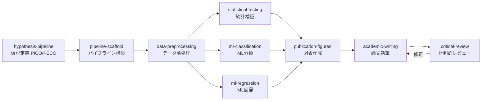

| Step | スキル | 役割 | 主要出力 |
|---|---|---|---|
| 1 | `hypothesis-pipeline` | PICO/PECO フレームワークで仮説定義 | `hypothesis.json` |
| 2 | `pipeline-scaffold` | StepLogger 付きパイプライン骨格構築 | `pipeline_summary.json` |
| 3 | `data-preprocessing` | 欠損値補完・エンコーディング・スケーリング | クリーンな DataFrame |
| 4a | `statistical-testing` | t 検定・ANOVA・Fisher 正確検定・多重比較補正 | `statistical_tests.csv` |
| 4b | `ml-classification` | 複数モデル比較 (LR/RF/SVM/XGBoost)、StratifiedKFold CV | `classification_metrics.csv` |
| 4c | `ml-regression` | マルチターゲット回帰 (Ridge/Lasso/RF/GB) | `model_metrics.csv` |
| 5 | `publication-figures` | Nature/Science レベルの図表 (300 DPI) | `figures/*.png` |
| 6 | `academic-writing` | IMRaD 形式の論文草稿 | `manuscript/manuscript.md` |
| 7 | `critical-review` | 5 パスレビュー（構造→論理→データ→文章→修正） | `manuscript/manuscript_revised.md` |

<details><summary>トリガープロンプト例</summary>

```
「○○が△△に与える影響について仮説を立てて、統計的に検証して論文化して」
「PICO フレームワークで研究計画を立てて、データ解析パイプラインを構築して」
```

</details>

<details><summary>期待される成果物</summary>

```
project/
├── results/
│   ├── hypothesis.json
│   ├── pipeline_summary.json
│   ├── preprocessed_data.csv
│   ├── statistical_tests.csv
│   ├── classification_metrics.csv
│   └── model_metrics.csv
├── figures/
│   ├── roc_curves.png
│   ├── confusion_matrices.png
│   └── volcano_plot.png
└── manuscript/
    ├── manuscript.md
    └── manuscript_revised.md
```

</details>

# 2. 創薬パイプライン

> **目的**: ターゲット同定からリード化合物の ADMET 最適化までの創薬プロセス

**適用シナリオ**
- 新規創薬ターゲットのプロファイリング
- バーチャルスクリーニング
- ドラッグリポジショニング候補の探索

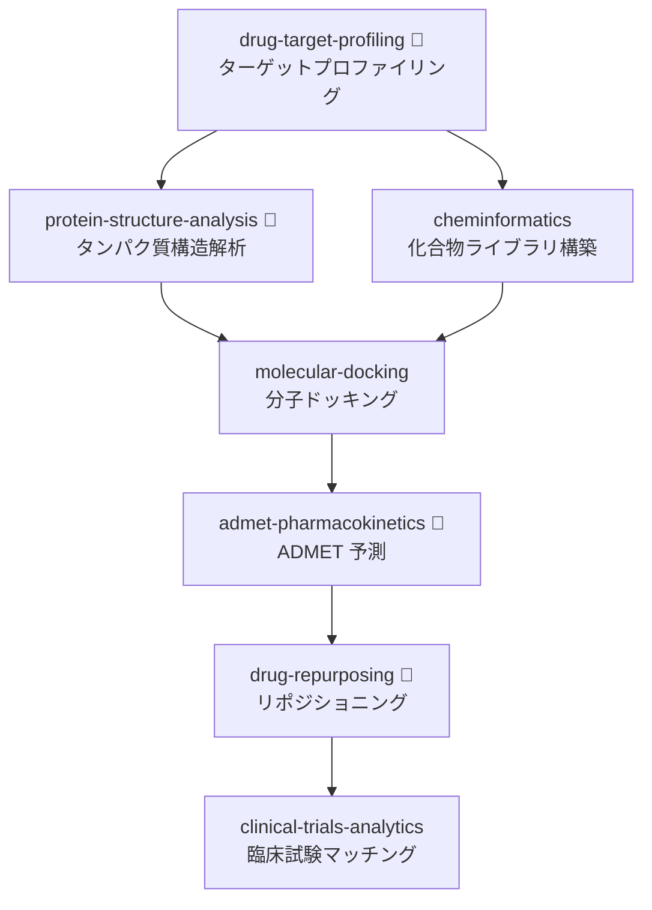

| Step | スキル | 役割 | TU ツール | 主要出力 |
|---|---|---|---|---|
| 1 | `drug-target-profiling` | 9 パス戦略でターゲット情報収集 | `dgidb` | `target_profile.json` |
| 2a | `protein-structure-analysis` | PDB/AlphaFold 構造検索、結合部位検出 | `proteinsplus` | 構造ファイル |
| 2b | `cheminformatics` | SMILES → 記述子 → Lipinski/PAINS フィルタ | — | `molecular_properties.csv` |
| 3 | `molecular-docking` | DiffDock/Vina/GNINA バーチャルスクリーニング | — | `docking_results.csv` |
| 4 | `admet-pharmacokinetics` | 5 ステップ ADMET プロファイル | `pubchem` | `admet_profile.json` |
| 5 | `drug-repurposing` | 7 戦略リポジショニング | `pharos` | 候補リスト |
| 6 | `clinical-trials-analytics` | ClinicalTrials.gov API v2 マッチング | — | 試験マッチング結果 |

<details><summary>トリガープロンプト例 / 期待される成果物</summary>

```
「EGFR をターゲットとした創薬パイプラインを実行して」
「この化合物ライブラリに対してバーチャルスクリーニングとADMET予測をして」
```

```
project/
├── results/
│   ├── target_profile.json
│   ├── molecular_properties.csv
│   ├── docking_results.csv
│   └── admet_profile.json
└── figures/
    ├── similarity_heatmap.png
    └── docking_poses.png
```

</details>

# 3. シングルセル・空間オミクスパイプライン

> **目的**: scRNA-seq から空間トランスクリプトミクスまでの統合解析

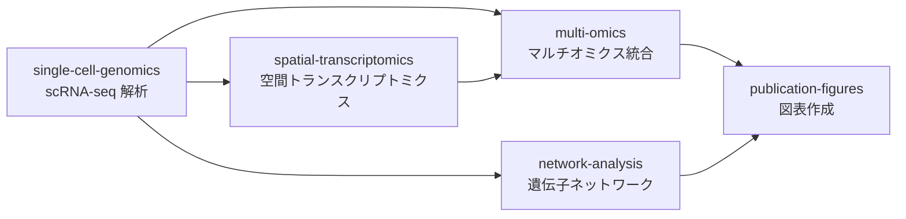

| Step | スキル | 役割 | 主要出力 |
|---|---|---|---|
| 1 | `single-cell-genomics` | QC → 正規化 → PCA/UMAP/Leiden → DEG → RNA velocity | `adata.h5ad` |
| 2a | `spatial-transcriptomics` | Visium/MERFISH 空間可変遺伝子検出 | 空間発現マップ |
| 2b | `multi-omics` | MOFA+ / WNN / DIABLO 統合 | 統合 embedding |
| 3 | `network-analysis` | GRN 推定 (GENIE3/SCENIC) | `centrality_measures.csv` |
| 4 | `publication-figures` | マルチパネル UMAP, Spatial map | `figures/*.png` |

# 4. 精密医療パイプライン

> **目的**: バリアント解釈から治療推奨までの臨床ゲノミクスワークフロー

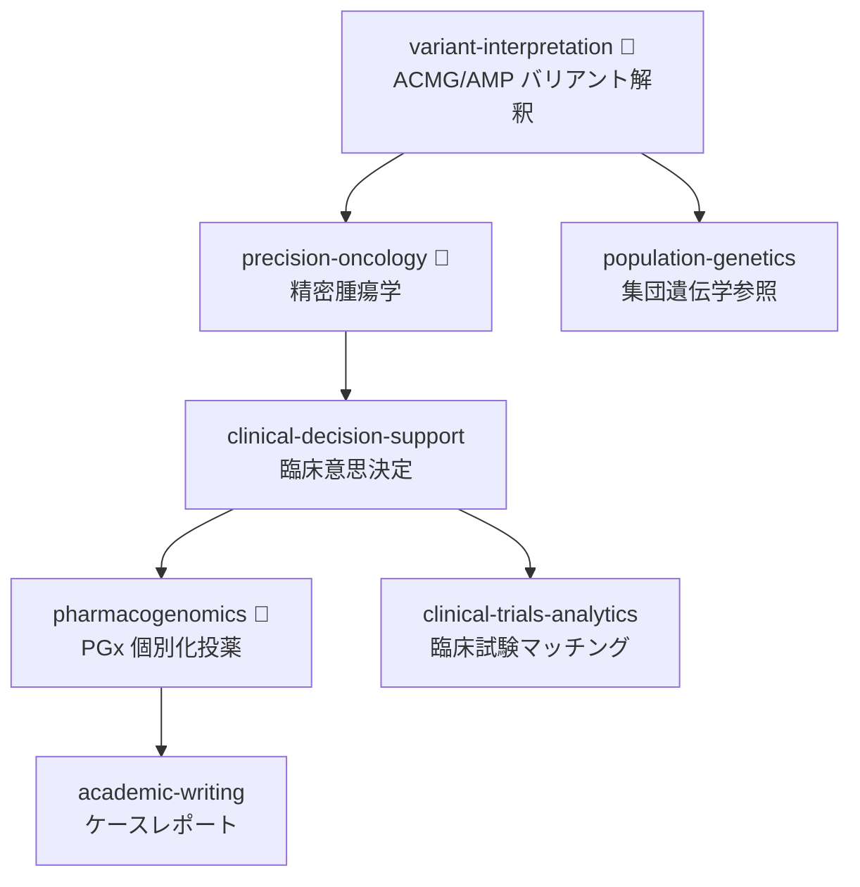

| Step | スキル | 役割 | TU ツール |
|---|---|---|---|
| 1 | `variant-interpretation` | ACMG/AMP 28 基準分類 | `clinvar` |
| 2 | `precision-oncology` | TMB/MSI 評価、CIViC/OncoKB Tier 分類 | `oncokb` |
| 3 | `clinical-decision-support` | GRADE エビデンス評価、治療推奨 | — |
| 4 | `pharmacogenomics` | Star アレル → CPIC 投与量レコメンデーション | `fda_pharmacogenomic_biomarkers` |
| 5 | `clinical-trials-analytics` | 適格基準マッチング | — |

# 5. 疫学・コホートパイプライン

> **目的**: 大規模コホートデータを用いた疫学研究と因果推論

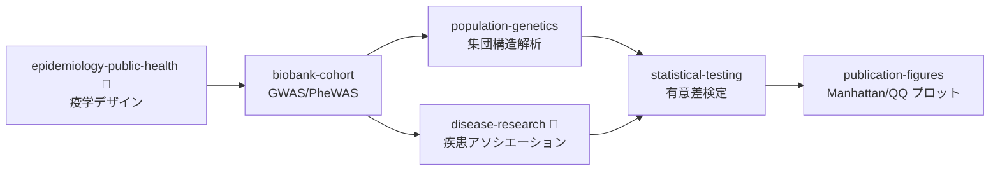

| Step | スキル | 役割 | TU ツール |
|---|---|---|---|
| 1 | `epidemiology-public-health` | コホート/症例対照研究デザイン | — |
| 2 | `biobank-cohort` | GWAS サマリー統計処理、PheWAS | — |
| 3a | `population-genetics` | PCA/ADMIXTURE 集団構造 | — |
| 3b | `disease-research` | GWAS Catalog/DisGeNET 疾患アソシエーション | `disgenet` |
| 4 | `statistical-testing` | Bonferroni/BH 多重比較補正 | — |
| 5 | `publication-figures` | Manhattan プロット、QQ プロット | — |

# 6. エビデンス合成パイプライン

> **目的**: PRISMA 2020 準拠のシステマティックレビュー・メタ解析・論文出版

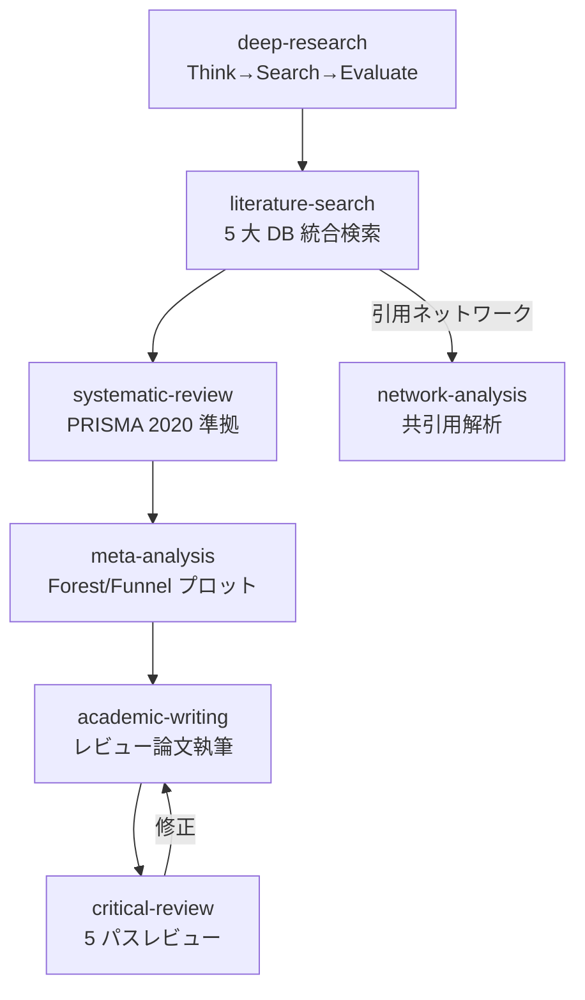

| Step | スキル | 役割 | 主要出力 |
|---|---|---|---|
| 1 | `deep-research` | Think→Search→Evaluate→Synthesize (最大 15 ラウンド) | エビデンス要約 |
| 2 | `literature-search` | PubMed/Semantic Scholar/OpenAlex 統合 (29 TU ツール) | `pubmed_search.csv` |
| 3 | `systematic-review` | PICO → スクリーニング → RoB 2/ROBINS-I → PRISMA | `prisma_flow.mmd` |
| 4 | `meta-analysis` | 固定/ランダム効果モデル、I²/τ²、Egger/Begg | `forest_plot.png` |
| 5 | `academic-writing` | IMRaD / レビュー形式草稿 | `manuscript.md` |

# 7. 疾患研究パイプライン

> **目的**: 疾患関連遺伝子の同定からネットワーク解析、治療候補探索まで

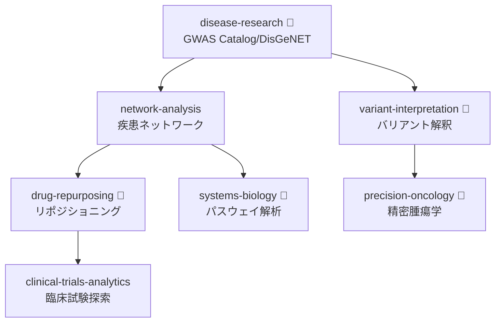

# 8. 機械学習解析パイプライン

> **目的**: データ前処理から ML モデル構築、説明可能性の確保まで

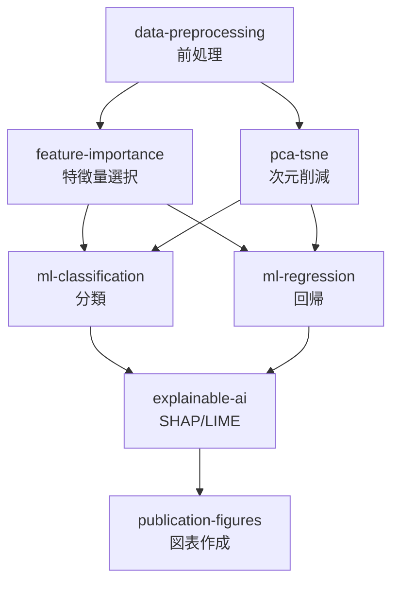

| Step | スキル | 役割 | 主要出力 |
|---|---|---|---|
| 1 | `data-preprocessing` | 欠損値・外れ値・スケーリング | クリーンな DataFrame |
| 1b | `pca-tsne` | PCA/t-SNE/UMAP 次元削減 | embedding 座標 |
| 2 | `feature-importance` | Tree MDI + Permutation + PDP | `feature_importance.csv` |
| 3a | `ml-classification` | LR/RF/SVM/XGBoost、ROC/PR 曲線 | `classification_metrics.csv` |
| 3b | `ml-regression` | Ridge/Lasso/RF/GB/ET、R² 比較 | `model_metrics.csv` |
| 4 | `explainable-ai` | SHAP + LIME + 反実仮想説明 + 公平性監査 | `xai_report.json` |

# 9. 環境・生態学パイプライン

> **目的**: 生物多様性評価から種分布モデリング、時系列トレンド解析まで

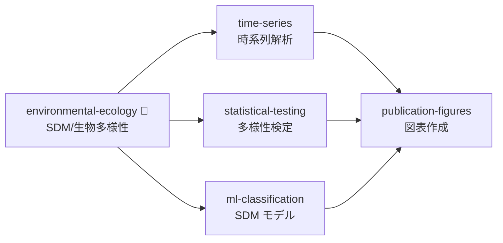

# 10. 計算材料科学パイプライン

> **目的**: 結晶構造解析からバンド構造計算、高スループットスクリーニングまで

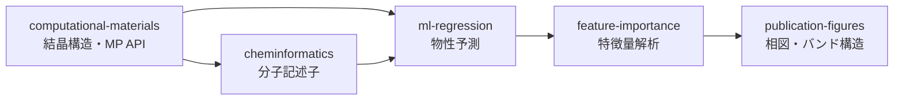

# 11. 医薬品安全性パイプライン

> **目的**: FAERS シグナル検出から規制対応までのファーマコビジランスワークフロー

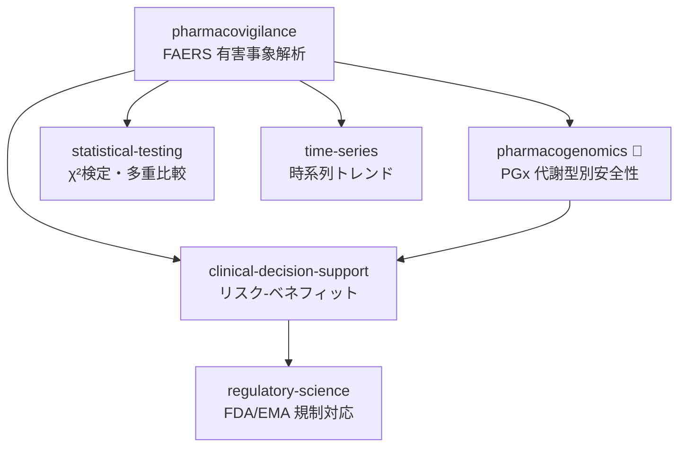

# 12. システム生物学パイプライン

> **目的**: GRN 推定、FBA、マルチオミクス統合のシステムレベル解析

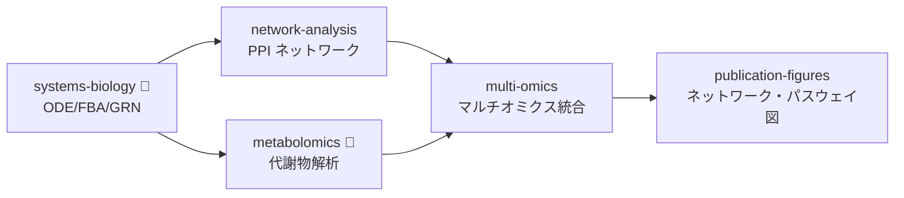

# 13. がんゲノミクスパイプライン

> **目的**: がんゲノムデータベース横断プロファイリングから機能依存性解析まで

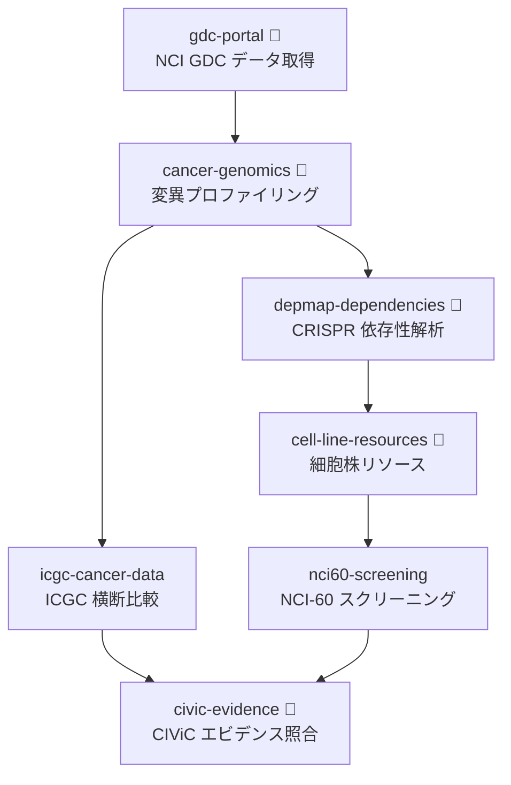

# 14. ゲノム・エピゲノム解析パイプライン

> **目的**: WGS/WES バリアント検出から CRISPR 機能検証設計まで

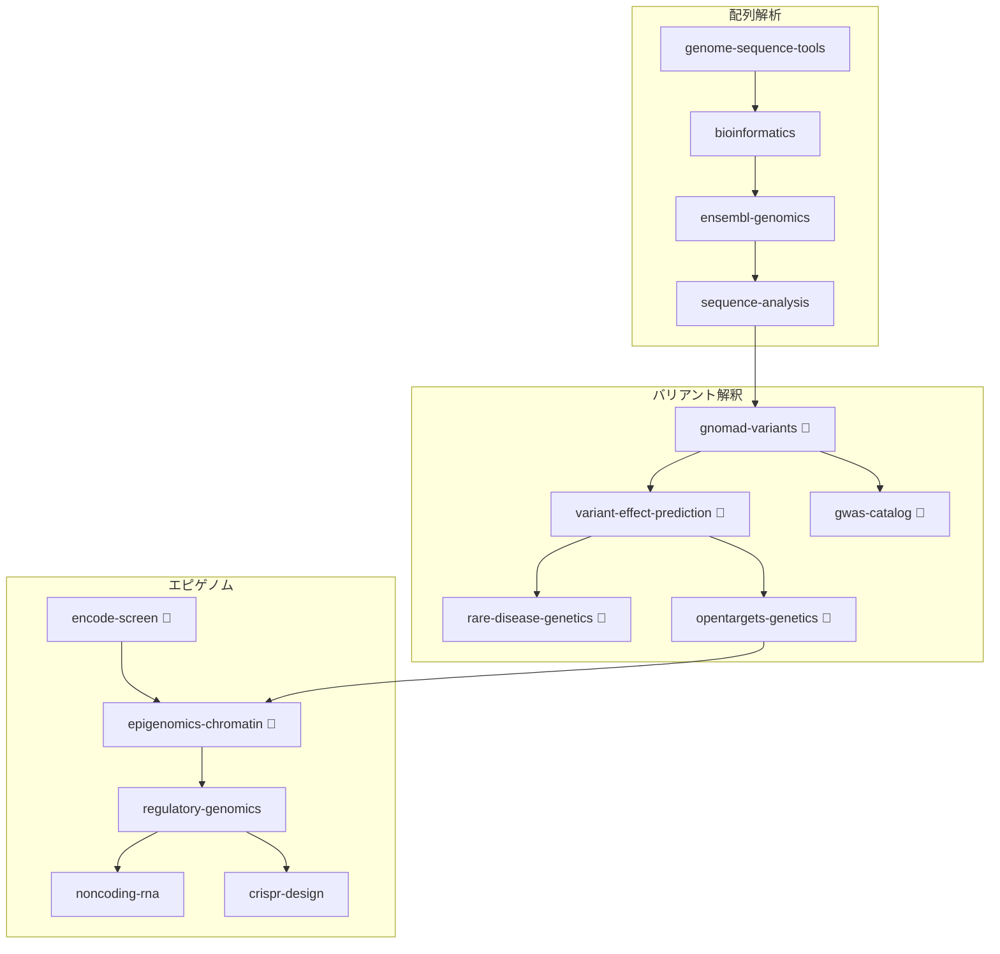

:::note info
**16 スキル** を連鎖する大規模パイプラインです。チェックポイント戦略（後述）の適用を推奨します。
:::

# 15. トランスクリプトミクス・アトラスパイプライン

> **目的**: CellxGene/HCA アトラス統合、バルク発現解析、摂動応答解析

```mermaid
graph TD
    subgraph アトラス統合
        A[cellxgene-census 🔧] --> B[human-cell-atlas 🔧]
        B --> C[gpu-singlecell]
        C --> D[scvi-integration]
        D --> E[scatac-signac]
        E --> F[spatial-multiomics]
        F --> G[squidpy-advanced]
    end
    subgraph バルク発現
        H[geo-expression 🔧] --> I[arrayexpress-expression 🔧]
        I --> J[gtex-tissue-expression 🔧]
        J --> K[gene-expression-transcriptomics]
        K --> L[expression-comparison]
        L --> M[perturbation-analysis]
    end
```

# 16. プロテオミクス・構造生物学パイプライン

> **目的**: 質量分析プロテオミクスから de novo タンパク質設計まで

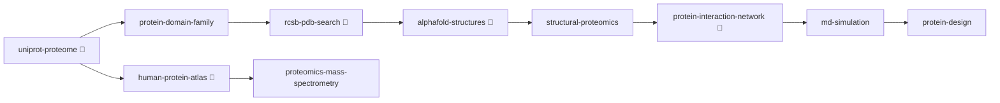

# 17. メタボロミクス・脂質・糖鎖パイプライン

> **目的**: 代謝物 DB 照合からフラックス解析、リピドミクス・グライコミクスまで

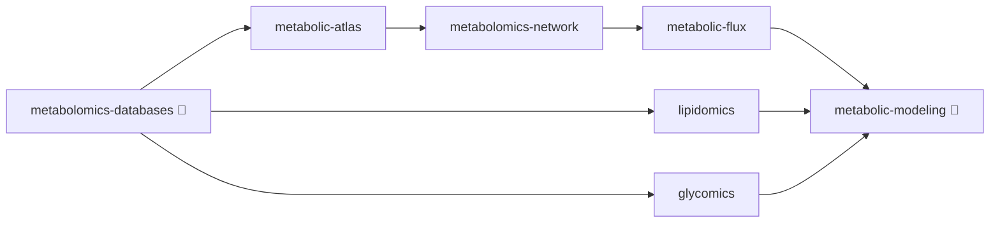

# 18. マイクロバイオーム・進化・多様性パイプライン

> **目的**: 16S/ショットガンメタゲノム、MAG 再構成、系統解析

```mermaid
graph TD
    subgraph メタゲノム解析
        A[microbiome-metagenomics 🔧] --> B[rrna-taxonomy]
        A --> C[metagenome-assembled-genomes]
        C --> D[phylogenetics]
        D --> E[model-organism-db 🔧]
    end
    subgraph 生態・多様性
        F[marine-ecology 🔧]
        G[plant-biology]
        H[parasite-genomics]
        I[paleobiology 🔧]
    end
    subgraph 環境データ
        J[environmental-geodata]
        K[geospatial-analysis]
        L[toxicology-env]
    end
    D --> F
    D --> G
    D --> H
    E --> I
    F --> J
    J --> K
    K --> L
```

# 19. パスウェイ・ナレッジグラフパイプライン

> **目的**: 遺伝子 ID 標準化からパスウェイ富化、KG 構築、ネットワーク可視化まで


# 20. 化合物スクリーニング・薬理パイプライン

> **目的**: バーチャルスクリーニングから臨床薬理評価まで

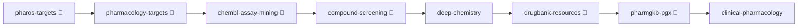

# 21. 臨床情報学・ヘルスケア AI パイプライン

> **目的**: EHR 標準化から NLP 抽出、生存解析、免疫インフォマティクスまで

```mermaid
graph TD
    subgraph 臨床データ AI
        A[clinical-standards 🔧] --> B[clinical-nlp]
        B --> C[clinical-reporting]
        C --> D[healthcare-ai]
        D --> E[survival-clinical]
        E --> F[public-health-data 🔧]
    end
    subgraph 医用画像・生体信号
        G[medical-imaging] --> H[radiology-ai]
        I[biosignal-processing] --> J[neuroscience-electrophysiology]
    end
    subgraph 感染症・免疫
        K[infectious-disease] --> L[immunoinformatics 🔧]
        L --> M[clingen-curation 🔧]
    end
    H --> D
    J --> D
    M --> C
```

# 22. 高度 ML・AI パイプライン

> **目的**: AutoML から深層学習、因果推論、GNN、連合学習までの先端 AI 手法

```mermaid
graph TD
    subgraph モデル最適化
        A[automl] --> B[neural-architecture-search]
        B --> C[deep-learning]
        C --> D[transfer-learning]
        D --> E[multi-task-learning]
        E --> F[ensemble-methods]
        F --> G[uncertainty-quantification]
    end
    subgraph 因果・特殊手法
        H[causal-inference] --> I[causal-ml]
        J[active-learning] --> K[semi-supervised-learning]
        L[reinforcement-learning]
        M[graph-neural-networks]
        N[anomaly-detection]
        O[federated-learning]
    end
    G --> N
    I --> M
    K --> C
```

:::note info
**15 スキル** を含む最大規模のAIパイプラインです。目的に応じてサブセットを選択してください。
:::

# 23. 実験計画・統計基盤パイプライン

> **目的**: データプロファイリングから DOE、ベイズ統計、適応的実験設計まで

```mermaid
graph LR
    A[data-profiling] --> B[eda-correlation]
    B --> C[missing-data-analysis]
    C --> D[data-simulation]
    D --> E[statistical-simulation]
    E --> F[bayesian-statistics]
    F --> G[doe]
    G --> H[adaptive-experiments]
```

# 24. 科学的可視化・ダッシュボードパイプライン

> **目的**: 3D 可視化、Streamlit/Dash ダッシュボード、プレゼンテーション設計

```mermaid
graph LR
    A[advanced-imaging] --> B[image-analysis]
    B --> C[spectral-signal]
    C --> D[advanced-visualization]
    D --> E[interactive-dashboard]
    D --> F[scientific-schematics]
    F --> G[presentation-design]
```

# 25. 学術出版ワークフローパイプライン

> **目的**: 文献管理から論文投稿、査読対応、グラント申請まで

```mermaid
graph TD
    subgraph 文献・引用
        A[research-methodology] --> B[text-mining-nlp]
        B --> C[semantic-scholar 🔧]
        C --> D[citation-checker]
        D --> E[crossref-metadata 🔧]
    end
    subgraph 論文品質
        E --> F[latex-formatter]
        F --> G[paper-quality]
        G --> H[supplementary-generator]
        H --> I[reproducible-reporting]
    end
    subgraph 投稿・申請
        I --> J[data-submission]
        J --> K[preprint-archive]
        G --> L[peer-review-response]
        L --> M[revision-tracker]
        A --> N[grant-writing]
    end
```

# 26. ラボ自動化・運用・計算基盤パイプライン

> **目的**: 液体ハンドリングロボット制御から運用モニタリング、量子計算まで

```mermaid
graph TD
    subgraph ラボ運用
        A[lab-automation] --> B[lab-data-management]
        B --> C[process-optimization]
        C --> D[streaming-analytics]
        D --> E[model-monitoring]
    end
    subgraph 計算基盤
        F[symbolic-mathematics] --> G[quantum-computing]
        H[materials-characterization]
        I[time-series-forecasting]
    end
    E --> I
    C --> H
```

# II. クロスドメインパイプライン（A–O）

:::note info
複数のドメインパイプラインを組み合わせた高度なワークフローです。構成元のパイプライン番号を `P5+7+2` のように示します。
:::

# A. ゲノム創薬統合パイプライン (P5+7+2)

```mermaid
graph TD
    subgraph 疫学・コホート
        A[biobank-cohort<br/>GWAS] --> B[population-genetics]
    end
    subgraph 疾患研究
        B --> C[disease-research 🔧]
        C --> D[network-analysis]
    end
    subgraph 創薬
        D --> E[drug-target-profiling 🔧]
        E --> F[molecular-docking]
        F --> G[admet-pharmacokinetics 🔧]
    end
```

> **シナリオ**: UK Biobank の GWAS → 疾患関連遺伝子同定 → ネットワーク解析で創薬ターゲット → バーチャルスクリーニングで候補化合物評価

# B. AI 駆動臨床意思決定パイプライン (P4+8+11)

```mermaid
graph TD
    subgraph ML 解析
        A[data-preprocessing] --> B[ml-classification]
        B --> C[explainable-ai]
    end
    subgraph 精密医療
        C --> D[clinical-decision-support]
        D --> E[pharmacogenomics 🔧]
    end
    subgraph 安全性
        E --> F[pharmacovigilance]
        F --> G[regulatory-science]
    end
```

> **シナリオ**: AI 予後予測 → SHAP 説明可能性 → 治療推奨 → 個別化投薬 → 安全性監視

# C. 研究自動化パイプライン (P1+6)

```mermaid
graph TD
    subgraph 仮説構築
        A[deep-research] --> B[hypothesis-pipeline]
    end
    subgraph 解析実行
        B --> C[pipeline-scaffold] --> D[data-preprocessing] --> E[statistical-testing]
    end
    subgraph 出版
        E --> F[publication-figures] --> G[academic-writing] --> H[systematic-review]
    end
```

> **シナリオ**: 文献調査 → 仮説構築 → 解析パイプライン自動構築 → 検証 → 論文化

# D. マルチオミクス疾患解明パイプライン (P3+7+12)

```mermaid
graph TD
    subgraph シングルセル
        A[single-cell-genomics] --> B[spatial-transcriptomics]
    end
    subgraph 疾患解明
        A --> C[disease-research 🔧]
        B --> D[systems-biology 🔧]
    end
    subgraph 統合解析
        C --> E[multi-omics]
        D --> E
        E --> F[network-analysis]
    end
```

# E. 個別化薬物療法パイプライン (P2+4+11)

```mermaid
graph TD
    subgraph ゲノム解析
        A[variant-interpretation 🔧] --> B[pharmacogenomics 🔧]
    end
    subgraph 創薬
        A --> C[drug-target-profiling 🔧]
        C --> D[admet-pharmacokinetics 🔧]
    end
    subgraph 臨床適用
        B --> E[clinical-decision-support]
        D --> E
        E --> F[pharmacovigilance]
    end
```

# F. バイオインフォマティクス完全パイプライン (P3+5+12+14+1)

:::note warn
**最も網羅的なパイプライン** — 5 つのドメインパイプラインを統合。チェックポイント戦略を推奨。
:::

```mermaid
graph TD
    subgraph データ生成
        A[bioinformatics] --> B[single-cell-genomics]
        A --> C[biobank-cohort]
    end
    subgraph 解析
        B --> D[multi-omics]
        C --> E[population-genetics]
        D --> F[systems-biology 🔧]
        E --> F
    end
    subgraph 出版
        F --> G[hypothesis-pipeline]
        G --> H[academic-writing]
        H --> I[critical-review]
    end
```

# G. がん精密医療 End-to-End パイプライン (P13+20+4+21)

```mermaid
graph TD
    subgraph がんゲノミクス
        A[gdc-portal 🔧] --> B[cancer-genomics 🔧]
        B --> C[depmap-dependencies 🔧]
        B --> D[civic-evidence 🔧]
    end
    subgraph 化合物スクリーニング
        C --> E[pharos-targets 🔧]
        E --> F[compound-screening 🔧]
        F --> G[deep-chemistry]
    end
    subgraph 精密医療・臨床
        D --> H[precision-oncology 🔧]
        G --> H
        H --> I[clinical-decision-support]
        I --> J[healthcare-ai]
        J --> K[survival-clinical]
    end
```

# H. マルチオミクス縦断統合パイプライン (P14+15+16+19)

> ゲノム → エピゲノム → トランスクリプトーム → プロテオーム → パスウェイの全層を縦断統合

```mermaid
graph TD
    subgraph ゲノム・エピゲノム層
        A[genome-sequence-tools] --> B[bioinformatics]
        B --> C[variant-effect-prediction 🔧]
        C --> D[epigenomics-chromatin 🔧]
        D --> E[regulatory-genomics]
    end
    subgraph トランスクリプトーム層
        E --> F[cellxgene-census 🔧]
        F --> G[scvi-integration]
        G --> H[expression-comparison]
    end
    subgraph プロテオーム層
        H --> I[uniprot-proteome 🔧]
        I --> J[alphafold-structures 🔧]
        J --> K[protein-interaction-network 🔧]
    end
    subgraph パスウェイ統合
        K --> L[pathway-enrichment]
        L --> M[reactome-pathways 🔧]
        M --> N[network-visualization]
    end
```

# I. 環境メタボ・マイクロバイオーム One Health パイプライン (P9+18+17)

```mermaid
graph TD
    subgraph 環境・生態学
        A[environmental-ecology 🔧] --> B[environmental-geodata]
        B --> C[geospatial-analysis]
    end
    subgraph マイクロバイオーム
        C --> D[microbiome-metagenomics 🔧]
        D --> E[metagenome-assembled-genomes]
        E --> F[phylogenetics]
    end
    subgraph メタボロミクス
        D --> G[metabolomics-databases 🔧]
        G --> H[metabolomics-network]
        H --> I[metabolic-modeling 🔧]
        F --> I
    end
    subgraph One Health 統合
        C --> J[toxicology-env]
        I --> J
        J --> K[publication-figures]
    end
```

# J. AI 駆動マテリアルズインフォマティクスパイプライン (P10+22+23+24+26)

```mermaid
graph TD
    subgraph 計算材料科学
        A[computational-materials] --> B[cheminformatics]
    end
    subgraph 高度 ML/AI
        B --> C[automl]
        C --> D[graph-neural-networks]
        D --> E[uncertainty-quantification]
        E --> F[active-learning]
    end
    subgraph 実験計画
        F --> G[doe]
        G --> H[bayesian-statistics]
        H --> I[adaptive-experiments]
        I -->|再探索| A
    end
```

# K. 研究ライフサイクル完全自動化パイプライン (P26+24+25+23)

> ラボ実験 → データプロファイリング → 可視化 → 論文投稿 → グラント申請

```mermaid
graph TD
    subgraph ラボ運用
        A[lab-automation] --> B[lab-data-management]
        B --> C[streaming-analytics]
        C --> D[model-monitoring]
    end
    subgraph 可視化・解析
        D --> E[data-profiling]
        E --> F[advanced-visualization]
        F --> G[interactive-dashboard]
        F --> H[scientific-schematics]
    end
    subgraph 出版・申請
        G --> I[reproducible-reporting]
        H --> J[paper-quality]
        I --> K[latex-formatter]
        J --> K
        K --> L[peer-review-response]
        K --> M[grant-writing]
    end
```

# L. AI 駆動エビデンス合成パイプライン (P6+8+22+25)

```mermaid
graph TD
    subgraph 文献探索
        A[deep-research] --> B[literature-search]
        B --> C[text-mining-nlp]
    end
    subgraph AI エビデンス評価
        C --> D[deep-learning]
        D --> E[transfer-learning]
        E --> F[automl]
    end
    subgraph 合成・レポート
        F --> G[meta-analysis]
        G --> H[explainable-ai]
        H --> I[systematic-review]
        I --> J[academic-writing]
    end
```

# M. がんマルチレイヤーゲノム創薬パイプライン (P13+14+20)

```mermaid
graph TD
    subgraph がんゲノミクス
        A[gdc-portal 🔧] --> B[cancer-genomics 🔧]
        B --> C[icgc-cancer-data]
    end
    subgraph ゲノム・エピゲノム層
        C --> D[ensembl-genomics]
        D --> E[variant-effect-prediction 🔧]
        E --> F[epigenomics-chromatin 🔧]
        F --> G[gwas-catalog 🔧]
    end
    subgraph 化合物ターゲティング
        G --> H[pharos-targets 🔧]
        H --> I[chembl-assay-mining 🔧]
        I --> J[compound-screening 🔧]
    end
```

# N. 臨床→規制→出版バリューチェーンパイプライン (P21+11+25)

```mermaid
graph TD
    subgraph 臨床情報学
        A[clinical-standards 🔧] --> B[clinical-nlp]
        B --> C[clinical-reporting]
        C --> D[healthcare-ai]
    end
    subgraph 安全性・規制
        D --> E[pharmacovigilance]
        E --> F[regulatory-science]
    end
    subgraph 学術出版
        F --> G[reproducible-reporting]
        G --> H[paper-quality]
        H --> I[latex-formatter]
        I --> J[peer-review-response]
    end
```

# O. シングルセルプロテオーム統合パイプライン (P3+16+17+12)

```mermaid
graph TD
    subgraph シングルセル層
        A[single-cell-genomics] --> B[spatial-transcriptomics]
    end
    subgraph プロテオーム層
        B --> C[proteomics-mass-spectrometry]
        C --> D[structural-proteomics]
        D --> E[alphafold-structures 🔧]
    end
    subgraph メタボローム・統合
        E --> F[metabolomics-databases 🔧]
        F --> G[metabolic-modeling 🔧]
        G --> H[systems-biology 🔧]
        H --> I[multi-omics]
    end
```

# III. インダストリーパイプライン（①–⑤）

:::note info
特定の産業セクターに特化した実務ワークフローです。
:::

# ①. 製薬企業レギュラトリーパイプライン

> 創薬前段 → 臨床開発 → 規制申請（CTD）

```mermaid
graph TD
    subgraph 創薬前段
        A[drug-target-profiling 🔧] --> B[molecular-docking]
        B --> C[admet-pharmacokinetics 🔧]
    end
    subgraph 臨床開発
        C --> D[clinical-trials-analytics]
        D --> E[pharmacovigilance]
    end
    subgraph 規制申請
        E --> F[regulatory-science]
        F --> G[reproducible-reporting]
        G --> H[paper-quality]
    end
```

# ②. 農業バイオテクノロジーパイプライン

> 土壌環境 → マイクロバイオーム → 植物ゲノム編集 → 圃場最適化

```mermaid
graph TD
    subgraph 土壌・環境
        A[environmental-ecology 🔧] --> B[microbiome-metagenomics 🔧]
        B --> C[geospatial-analysis]
    end
    subgraph 植物ゲノム
        C --> D[plant-biology]
        D --> E[crispr-design]
        E --> F[gene-expression-transcriptomics]
    end
    subgraph 最適化
        F --> G[doe]
        G --> H[publication-figures]
    end
```

# ③. 臨床検査室ワークフロー

> NGS QC → ACMG 分類 → PGx → 臨床レポート (HL7/FHIR)

```mermaid
graph TD
    A[genome-sequence-tools] --> B[variant-interpretation 🔧]
    B --> C[pharmacogenomics 🔧]
    C --> D[clinical-decision-support]
    D --> E[clinical-standards 🔧]
    E --> F[clinical-nlp]
    F --> G[clinical-reporting]
```

# ④. 食品安全・毒性評価パイプライン

> 食品微生物検査 → 残留物質分析 → 毒性評価 → 規制適合性

```mermaid
graph TD
    A[microbiome-metagenomics 🔧] --> B[rrna-taxonomy]
    B --> C[metabolomics-databases 🔧]
    C --> D[metabolomics-network]
    D --> E[toxicology-env]
    E --> F[data-profiling]
    F --> G[regulatory-science]
    G --> H[publication-figures]
```

# ⑤. 法医・公衆衛生パイプライン

> 個人識別 → 感染症疫学 → 伝播経路推定 → サーベイランス

```mermaid
graph TD
    A[variant-interpretation 🔧] --> B[population-genetics]
    B --> C[infectious-disease]
    C --> D[phylogenetics]
    D --> E[immunoinformatics 🔧]
    E --> F[epidemiology-public-health 🔧]
    F --> G[public-health-data 🔧]
    G --> H[biobank-cohort]
```

# IV. メソドロジーパイプライン（α–δ）

:::note info
対象ドメインに依存しない、分析手法中心のワークフローです。
:::

# α. ベイズ推論ワークフロー

```mermaid
graph TD
    A[data-preprocessing] --> B[bayesian-statistics]
    B --> C[statistical-simulation]
    C --> D[uncertainty-quantification]
    D --> E[doe]
    E --> F[adaptive-experiments]
    F -->|再推定| B
```

> **シナリオ**: 事前知識を組み込んだベイズモデル → MCMC 事後分布 → 不確実性に基づく逐次実験設計

# β. 因果推論パイプライン

```mermaid
graph TD
    A[data-preprocessing] --> B[missing-data-analysis]
    B --> C[causal-inference]
    C --> D[causal-ml]
    D --> E[explainable-ai]
    E --> F[statistical-testing]
    F --> G[publication-figures]
```

> **シナリオ**: DAG 因果構造 → 傾向スコア交絡調整 → CATE 因果効果推定 → SHAP 因果寄与 → 感度分析

# γ. 時系列予測パイプライン

```mermaid
graph TD
    A[data-preprocessing] --> B[time-series]
    B --> C[time-series-forecasting]
    C --> D[anomaly-detection]
    D --> E[streaming-analytics]
    E --> F[model-monitoring]
    F -->|再学習| C
```

> **シナリオ**: 時系列分解 → Prophet/LSTM 予測 → 異常検知 → リアルタイム推論 → ドリフト監視

# δ. テキストマイニング・NLP パイプライン

```mermaid
graph TD
    A[deep-research] --> B[literature-search]
    B --> C[text-mining-nlp]
    C --> D[biomedical-pubtator]
    D --> E[clinical-nlp]
    E --> F[semantic-scholar 🔧]
    F --> G[citation-checker]
```

> **シナリオ**: 包括文献検索 → NER エンティティ抽出 → PubTator 注釈 → 引用ネットワーク → 引用検証

# V. パイプライン設計ガイドライン

# 構築の原則

| 原則 | 説明 |
|---|---|
| **スキル連鎖** | 上流スキルの出力 (CSV/JSON) を下流スキルの入力として引き渡す |
| **並列可能性** | 独立したスキル（ステップ番号 a/b/c）は並行して実行可能 |
| **成果物の一貫性** | `results/` と `figures/` ディレクトリに統一的に出力 |
| **トレーサビリティ** | `pipeline-scaffold` の StepLogger で全ステップをログ記録 |

# パイプライン選択フローチャート

```mermaid
graph TD
    Q1{何を解析する?}
    Q1 -->|遺伝子・バリアント| Q2{臨床 or 基礎研究?}
    Q1 -->|化合物・薬物| Q5{創薬 or 薬理?}
    Q1 -->|文献・エビデンス| P6[6. エビデンス合成]
    Q1 -->|有害事象・安全性| P11[11. 医薬品安全性]
    Q1 -->|環境・生態| Q8{微生物 or 環境?}
    Q1 -->|材料・物性| P10[10. 計算材料科学]
    Q1 -->|ネットワーク・パスウェイ| Q7{DB統合 or システム?}
    Q1 -->|表形式データ| Q6{ML手法は?}
    Q1 -->|タンパク質・構造| P16[16. プロテオミクス]
    Q1 -->|代謝物・脂質| P17[17. メタボロミクス]
    Q1 -->|臨床データ・EHR| P21[21. 臨床情報学]
    Q1 -->|実験設計・統計| P23[23. 実験計画・統計]
    Q1 -->|可視化・ダッシュボード| P24[24. 科学的可視化]
    Q1 -->|論文・グラント| P25[25. 学術出版]
    Q1 -->|ラボ運用・自動化| P26[26. ラボ自動化]
    Q2 -->|臨床| Q3{がんゲノム?}
    Q2 -->|基礎研究| Q4{シングルセル?}
    Q3 -->|Yes| P4[4. 精密医療]
    Q3 -->|No| P5[5. 疫学・コホート]
    Q4 -->|Yes| Q9{アトラス規模?}
    Q4 -->|No| P7[7. 疾患研究]
    Q5 -->|創薬スクリーニング| P2[2. 創薬パイプライン]
    Q5 -->|化合物探索| P20[20. 化合物スクリーニング]
    Q6 -->|基本 ML| P8[8. ML 解析]
    Q6 -->|高度/深層| P22[22. 高度 ML・AI]
    Q7 -->|DB統合| P19[19. パスウェイ・KG]
    Q7 -->|システム| P12[12. システム生物学]
    Q8 -->|微生物| P18[18. マイクロバイオーム]
    Q8 -->|環境| P9[9. 環境・生態学]
    Q9 -->|大規模アトラス| P15[15. トランスクリプトミクス]
    Q9 -->|通常規模| P3[3. シングルセル]
    Q1 -->|がんデータ| P13[13. がんゲノミクス]
    Q1 -->|ゲノム配列・エピゲノム| P14[14. ゲノム・エピゲノム]
```

# よく使うスキル組み合わせ（ショートレシピ）

| レシピ | スキル連鎖 | 用途 |
|---|---|---|
| **クイック解析** | `data-preprocessing` → `statistical-testing` → `publication-figures` | 基本統計解析と可視化 |
| **文献レビュー** | `deep-research` → `literature-search` → `academic-writing` | 文献調査と要約 |
| **バリアントレポート** | `variant-interpretation` → `precision-oncology` → `clinical-decision-support` | 臨床ゲノムレポート |
| **予測モデル構築** | `data-preprocessing` → `ml-classification` → `explainable-ai` | 説明可能 ML |
| **ネットワーク解析** | `disease-research` → `network-analysis` → `publication-figures` | 疾患遺伝子ネットワーク |
| **薬物安全性** | `pharmacovigilance` → `pharmacogenomics` → `regulatory-science` | 安全性 → 規制報告 |
| **代謝解析** | `metabolomics` → `systems-biology` → `network-analysis` | パスウェイ解析 |
| **GWAS レポート** | `biobank-cohort` → `population-genetics` → `publication-figures` | GWAS 可視化 |
| **構造ベース創薬** | `alphafold-structures` → `molecular-docking` → `admet-pharmacokinetics` | AlphaFold → ドッキング |
| **シングルセルアトラス** | `cellxgene-census` → `scvi-integration` → `spatial-transcriptomics` | CellxGene → 空間 |
| **がん変異レポート** | `cancer-genomics` → `precision-oncology` → `clinical-reporting` | がん臨床レポート |
| **マイクロバイオーム** | `microbiome-metagenomics` → `metagenome-assembled-genomes` → `phylogenetics` | 微生物系統解析 |
| **材料スクリーニング** | `computational-materials` → `cheminformatics` → `ml-regression` | 材料物性 ML 予測 |
| **因果推論** | `causal-inference` → `causal-ml` → `explainable-ai` | 因果効果推定 |

# ToolUniverse 連携スキル一覧

:::note info
パイプライン設計時に ToolUniverse ツールを活用する場合は、以下のスキルを経由してください。
:::

| TU ツールキー | スキル | 機能 |
|---|---|---|
| `oncokb` | `precision-oncology` | がん変異のアクショナビリティ |
| `clinvar` | `variant-interpretation` | バリアント臨床的意義 |
| `disgenet` | `disease-research` | 疾患-遺伝子アソシエーション |
| `pharos` | `drug-repurposing` | ドラッグリポジショニング |
| `pubchem` | `admet-pharmacokinetics` | 化合物情報・ADMET |
| `dgidb` | `drug-target-profiling` | 薬物-遺伝子相互作用 |
| `proteinsplus` | `protein-structure-analysis` | タンパク質構造解析 |
| `gbif` | `environmental-ecology` | 生物多様性データ |
| `fda_pharmacogenomic_biomarkers` | `pharmacogenomics` | FDA PGx バイオマーカー |
| `bigg_models` | `systems-biology` | 代謝モデル |
| `cosmic` | `cancer-genomics` | がん体細胞変異 |
| `cbioportal` | `cancer-genomics` | がんゲノムポータル |
| `gdc` | `gdc-portal` | NCI GDC データベース |
| `depmap` | `depmap-dependencies` | DepMap CRISPR 依存性 |
| `orphanet` | `rare-disease-genetics` | 希少疾患データベース |
| `chipatlas` | `epigenomics-chromatin` | ChIP-Atlas エピゲノム |
| `complex_portal` | `systems-biology` | タンパク質複合体 |
| `wikipathways` | `systems-biology` | パスウェイ情報 |
| `cellxgene_census` | `cellxgene-census` | CZ CELLxGENE Census |
| `mgnify` | `microbiome-metagenomics` | MGnify メタゲノム |
| `zinc` | `compound-screening` | ZINC 化合物ライブラリ |
| `iedb` | `immunoinformatics` | 免疫エピトープ DB |
| `imgt` | `immunoinformatics` | IMGT 免疫遺伝学 |
| `sabdab` | `immunoinformatics` | SAbDab 抗体構造 |

# 大規模パイプラインのエラーハンドリング

:::note alert
9 スキル以上を連鎖する大規模パイプラインでは、以下のリカバリー戦略を適用してください。
:::

## チェックポイント戦略

```python
from pathlib import Path
import json

def checkpoint(step_name: str, data, output_dir="results"):
    """Save checkpoint and return path for downstream consumption."""
    out = Path(output_dir)
    out.mkdir(parents=True, exist_ok=True)
    path = out / f"checkpoint_{step_name}.json"
    with open(path, "w") as f:
        json.dump(data, f, indent=2, default=str)
    print(f"  ✔ Checkpoint saved: {path}")
    return path

def load_checkpoint(step_name: str, output_dir="results"):
    """Load checkpoint if exists, return None otherwise."""
    path = Path(output_dir) / f"checkpoint_{step_name}.json"
    if path.exists():
        with open(path) as f:
            print(f"  ↩ Resuming from checkpoint: {path}")
            return json.load(f)
    return None
```

## フォールバック戦略

| 障害パターン | 対策 |
|---|---|
| TU API タイムアウト | リトライ 3 回 → ローカルキャッシュフォールバック |
| 上流スキル出力なし | チェックポイントファイル確認 → サンプルデータで続行 |
| メモリ不足 | チャンク処理 + 中間ファイル保存 |
| 依存パッケージ不在 | `try/except ImportError` → インストール指示表示 |

## ロギング標準

```python
from datetime import datetime

def log_step(step_num, skill_name, status, details=""):
    """Standardized pipeline step logging."""
    timestamp = datetime.now().isoformat()
    log_entry = f"[{timestamp}] Step {step_num} | {skill_name} | {status}"
    if details:
        log_entry += f" | {details}"
    print(log_entry)
    with open("results/pipeline_log.txt", "a") as f:
        f.write(log_entry + "\n")
```

# 共有スキルのカスタマイズ

<details><summary>publication-figures のパイプライン別設定</summary>

| パイプライン | カスタマイズ |
|---|---|
| 1. 仮説検証 | `volcano_plot`, `kaplan_meier` 中心。P 値アノテーション必須 |
| 8. ML/XAI | `SHAP summary` 中心。カラーマップは viridis 推奨 |
| 9. 環境・生態学 | `taxonomy barplot`。種名はイタリック |
| 21. 臨床情報学 | `survival curves`, `forest plot`。患者数 (N) 表記必須 |

</details>

<details><summary>statistical-testing のパイプライン別設定</summary>

| パイプライン | 推奨統計手法 |
|---|---|
| 1. 仮説検証 | ANOVA, Tukey HSD, Cohen's d |
| 3. ゲノム/トランスクリプトーム | Wald test, FDR (BH 補正) |
| 9. 環境・生態学 | PERMANOVA, ANOSIM, Shannon/Simpson |
| 23. 実験計画 | 検出力分析, ブートストラップ CI |

</details>

<details><summary>data-preprocessing のパイプライン別設定</summary>

| パイプライン | 前処理の重点 |
|---|---|
| 1. 仮説検証 | 外れ値検出 (IQR/Z-score), KNN/MICE 補完 |
| 8. ML/XAI | エンコーディング, StandardScaler |
| 17. メタボロミクス | ピーク正規化, バッチ効果補正, ログ変換 |
| 21. 臨床情報学 | PHI 除去, ICD/CPT 標準化 |

</details>

# おわりに

SATORI の 190 スキルは、単体でも強力ですが、**パイプラインとして連鎖** することで真価を発揮します。

- まずは **ショートレシピ**（3 スキル組み合わせ）から試してみてください
- 慣れてきたら **クロスドメインパイプライン** で複数領域を横断
- **パイプライン選択フローチャート** で最適なパイプラインを見つけられます

:::note info
**関連ドキュメント**: [SATORI 逆引き辞典](SATORI_REVERSE_INDEX.md) — スキル名・TU キー・成果物パスからの逆引き検索
:::
