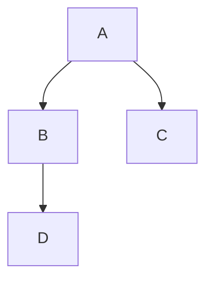

# Qiita 技術記事テンプレート

> 対象: Qiita (qiita.com) 技術記事
> 構成: YAML Frontmatter → はじめに → 本編 → まとめ → 参考資料
> 特徴: Qiita 独自記法（:::note / :::note warn）、Mermaid / PlantUML ダイアグラム、\<details\> 折りたたみ

---

## YAML Frontmatter

```yaml
---
title: '[記事タイトル]'
tags:
  - [タグ1]
  - [タグ2]
  - [タグ3]
  - [タグ4]            # 任意
  - [タグ5]            # 任意
private: false
updated_at: 'YYYY-MM-DDT00:00:00+09:00'
id: null
organization_url_name: null
slide: false
ignorePublish: false
---
```

### Frontmatter ルール

| フィールド | 規約 |
|---|---|
| `title` | 記事のタイトル |
| `tags` | 最大 5 個。記事内容に合ったタグを自由に選択 |
| `private` | 下書き中は `true`、公開時に `false` |
| `slide` | 常に `false` |
| ファイル名 | `qiita-[ハイフン区切り英語テーマ].md` |

---

## セクション構成

```
## はじめに                       ← 背景・動機・記事のゴール
## 環境                           ← テーブル（OS, 言語, ライブラリ）※任意
## [本編セクション 1]           ← 記事の主要内容
  ### ...
## [本編セクション 2]
  ...
## [本編セクション N]
## まとめ                         ← 要点の整理
## 参考資料                       ← リンクリスト
```

※ セクションの分け方・数・名前は記事内容に応じて自由に設計する。

---

## 書式規約

### 図のファイル名

```
figures/Fig{N}_{snake_case_description}.png
```
- N = 通し番号（1 始まり）、300 DPI

### 図の参照

```markdown

```

### 結果テーブル

ベストの行を **太字** で強調する。

### ソースコード（任意）

長いコードは `<details>` 折りたたみで配置する。

---

## Qiita Markdown 記法リファレンス

> 参照: [Markdown記法 チートシート — Qiita公式](https://qiita.com/Qiita/items/c686397e4a0f4f11683d)
> 準拠: GitHub Flavored Markdown + Qiita 独自拡張

---

### Note — 補足説明（Qiita 独自）

`:::note` と `:::` で囲む。`info`（省略可）/ `warn` / `alert` の 3 種。

```markdown
:::note info
インフォメーション（青色）。info は省略可能。
:::

:::note warn
注意事項・限界（黄色）。
:::

:::note alert
重大な警告（赤色）。
:::
```

**Note 内で使用可能な Markdown:**
リスト、強調（`**太字**`）、打ち消し線、コードスパン、リンク、画像、コードブロック。
※ 見出し (`#`) やテーブルは Note 内では使用不可。

---

### Code — コードの挿入

#### コードブロック（ファイル名指定可）

バッククオート 3 つ、またはチルダ 3 つで囲む。**言語名:ファイル名** でファイル名表示可能。

````markdown
```python:analysis.py
import pandas as pd
df = pd.read_csv("data.csv")
```
````

#### Diff + シンタックスハイライト

言語名の前に `diff_` を付けると Diff と構文ハイライトを同時に使用可能。

````markdown
```diff_python
- old_value = 42
+ new_value = 100
```
````

#### コードスパン（インライン）

`` `コード` `` でインライン表示。CSS カラー値（`#ffce44`, `rgb(255,0,0)` 等）を書くと横に色が表示される。

#### 言語指定一覧（よく使うもの）

| 言語 | 指定 | 備考 |
|---|---|---|
| Python | ` ```python ` | ` ```python:filename.py ` でファイル名付き |
| Bash | ` ```bash ` | |
| JSON | ` ```json ` | |
| YAML | ` ```yaml ` | |
| Markdown | ` ```markdown ` | |
| 数式 | ` ```math ` | LaTeX 形式の数式ブロック |
| Mermaid | ` ```mermaid ` | ダイアグラム |
| PlantUML | ` ```plantuml ` | ダイアグラム |
| Diff | ` ```diff ` | `diff_python` 等で言語併用可 |
| なし | ` ``` ` | プレーンテキスト |

---

### 数式 — LaTeX 形式

#### ブロック数式（推奨: ` ```math ` ）

````markdown
```math
\left( \sum_{k=1}^n a_k b_k \right)^{2} \leq
\left( \sum_{k=1}^n a_k^2 \right)
\left( \sum_{k=1}^n b_k^2 \right)
```
````

※ `$$...$$` でも可能だが、`\{` 等のエスケープが必要になるため ` ```math ` を推奨。

#### インライン数式（推奨: `` $`...`$ `` ）

```markdown
x^2 + y^2 = 1 をインライン表示すると $`x^2 + y^2 = 1`$ になります。
```

※ `$...$` でも可能だが、Markdown 構文との衝突（`_` 等）でエスケープが必要になるため `` $`...`$ `` を推奨。

---

### Details — 折りたたみ

`<details>` タグで囲む。`open` 属性で展開状態にできる。
**重要: HTML タグの下には空行が必要。**

```markdown
<details><summary>クリックで展開</summary>

（↑ この空行が必須）

折りたたまれるコンテンツ

</details>
```

展開状態にする場合:

```markdown
<details open><summary>展開済み</summary>

コンテンツ

</details>
```

---

### リンクカード（Qiita 独自）

URL を独立した行に書き、前後に空行を入れるとリンクカード表示になる。

```markdown
（空行）
https://qiita.com/Qiita/items/c686397e4a0f4f11683d
（空行）
```

---

### 脚注

本文中に `[^識別子]` で脚注リンクを挿入し、同じ記事内に `[^識別子]: 内容` で注釈を定義。
番号は記事表示時の登場順で自動付与される。

```markdown
本文テキスト[^note1]。別のテキスト[^note2]。

[^note1]: 最初の脚注です。
[^note2]: 二番目の脚注です。
```

---

### 画像

```markdown

```

HTML タグでサイズ調整も可能:

```markdown

```

---

### テーブル

```markdown
| Left align | Right align | Center align |
|:-----------|------------:|:------------:|
| left       | right       | center       |
```

テーブル内で `|` を使う場合は `\|` でエスケープ。
`<table>` + `<caption>` でキャプション付き HTML テーブルも使用可能。

---

### チェックボックス

順序なしリストの後に `[ ]` / `[x]` でチェックボックスを生成。

```markdown
- [ ] 未完了タスク
- [x] 完了タスク
```

---

### テキスト装飾

| 記法 | 表示 | 注意 |
|---|---|---|
| `*斜体*` or `_斜体_` | *斜体* | 前後に半角スペース or 改行必要 |
| `**太字**` or `__太字__` | **太字** | 前後に半角スペース or 改行必要 |
| `~~打ち消し~~` | ~~打ち消し~~ | 前後に半角スペース or 改行必要 |

---

### 見出しと目次

```markdown
# H1（記事タイトル用 — 通常 1 つだけ）
## H2（主要セクション）
### H3（サブセクション）
```

- `#` とテキストの間に**半角スペース必須**
- 目次 (TOC) は見出しから自動生成され、右側に自動挿入される
- `##` を主要セクション、`###` をサブセクションに統一すると見栄えが良い

---

### 絵文字

`:emoji_name:` で絵文字を埋め込める。

```markdown
:thumbsup: :rocket: :warning:
```

参照: [Emoji Cheat Sheet](http://www.emoji-cheat-sheet.com/)

---

### ダイアグラム

#### Mermaid

````markdown

````

**制限事項:**
- コードブロックあたり **2,000 文字以内**
- フローチャートの Chain (`&`) は **10 個以下**
- Interaction 機能（クリックイベント）は無効

#### PlantUML

````markdown
```plantuml
Bob->Alice : Hello!
```
````

---

### 引用

```markdown
> 引用テキスト
> 複数行の場合は各行に `>` が必要
> 
> > ネストされた引用
```

※ 引用の上下には空行が必要。

---

### 水平線

```markdown
---
```

`***`、`---`、`___` のいずれでも可。

---

### コンテンツ埋め込み

以下のサービスの埋め込みタグが利用可能:
X（旧 Twitter）、CodeSandbox、CodePen、GitHub、GitHub Gist、
YouTube、Figma、Speaker Deck、SlideShare、Google Slide、
Docswell、Asciinema、StackBlitz、blueprintUE、Claude Artifacts

---

### コマンド補完（エディタ内）

`/` コマンドで記法テンプレートを挿入可能:

| コマンド | 説明 |
|---|---|
| `/codeblock` | コードブロック挿入 |
| `/info` | :::note info 挿入 |
| `/warn` | :::note warn 挿入 |
| `/alert` | :::note alert 挿入 |
| `/details` | 折りたたみ挿入 |
| `/table` | テーブル挿入 |
| `/reference` | 脚注リンク挿入 |
| `/footnote` | 脚注内容挿入 |
| `/commentout` | コメントアウト挿入 |
